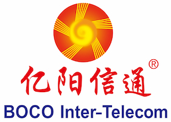

# Harbor Adopters
Below is a list of adopters of Harbor in **production environments** that have
publicly shared the details of their usage as well as the benefits provided by
Harbor that their business relies on. There are some unreferenceable users that
are leveraging Harbor that are not yet able to share details of their usage
publicly at this time.

There are many additional adopters of Harbor in the evaluating phase that will
be added to this list as they transition to production deployments.

&nbsp; &nbsp; &nbsp;
&nbsp; &nbsp; &nbsp; &nbsp;
&nbsp; &nbsp; &nbsp; &nbsp;
&nbsp; &nbsp; &nbsp; &nbsp;
&nbsp; &nbsp; &nbsp; &nbsp;   
&nbsp; &nbsp; &nbsp;
&nbsp; &nbsp; &nbsp; &nbsp;
&nbsp; &nbsp; &nbsp; &nbsp;
&nbsp; &nbsp; &nbsp; &nbsp;
&nbsp; &nbsp; &nbsp; &nbsp;   
&nbsp; &nbsp; &nbsp; &nbsp;
&nbsp; &nbsp; &nbsp; &nbsp;
&nbsp; &nbsp; &nbsp; &nbsp;
&nbsp; &nbsp; &nbsp; &nbsp;
&nbsp; &nbsp; &nbsp; &nbsp;
&nbsp; &nbsp; &nbsp; &nbsp;
&nbsp; &nbsp; &nbsp; &nbsp;
&nbsp; &nbsp; &nbsp; &nbsp;
&nbsp; &nbsp; &nbsp; &nbsp;
&nbsp; &nbsp; &nbsp; &nbsp;
  
&nbsp; &nbsp; &nbsp; &nbsp;
&nbsp; &nbsp; &nbsp; &nbsp;
&nbsp; &nbsp; &nbsp; &nbsp;
&nbsp; &nbsp; &nbsp; &nbsp;
&nbsp; &nbsp; &nbsp; &nbsp;

## Success Stories
**JD.com:** Harbor is the registry service of JD.com’s JDOS
platform. Harbor has been used for over 2 years in production with tens of
thousands of nodes and managing millions of container images.

**China Mobile:** Harbor has been used in production for more than a year,
serving images to a container environment with over 1,000 nodes and about 20,000 images.

**360 Total Security:** Harbor is used to distribute images and manage access
to project images at 360 Total Security. The image replication function is
heavily leveraged in their environment. Harbor supports approximately 800
compute nodes in production environments across different regions and manages
about 20,000 container images.

**Slamtec:** Harbor is being used in external production systems as well as
internal dev/test environments. All services are deployed using container
images stored and managed by Harbor, making Harbor an important part of
Slamtec's CI/CD workflow.

**Bingo Cloud:** Bingo cloud OS uses Harbor as their ECR (Elastic Container
Registry) component. Harbor allows them to have project-based image management
in private cloud environment of large enterprises. Harbor has been deployed in
some large state-owned or province-owned enterprises.

**Union Pay:** Union Pay adopts Harbor to manage container images for more than
200 nodes. Harbor enforces RBAC and vulnerability scanning on images used in
the production environment.

**Minsheng Life Insurance:** Harbor is used to build a private image registry.
It manages base images of all application services and the container images
created in project development. Harbor is integrated with the container cloud
platform through its RESTful API. Harbor supports about 40 nodes in a cluster
and manages more than 3,000 images.

**Priority Payment Systems:** Harbor has been an integral component in our
CI/CD pipeline for more than a year housing hundreds of images for various
environments.

**AWN:** Utilizes Harbor as a secure image repository for all of internal
container-based workloads. Harbor provides developers and sysadmins a secure
and easy-to-use repository. AWN leverages the image vulnerability scanning
feature within Harbor before deploying images into production.

**Allegis:** Harbor is used at Allegis as a secure private registry to store
and scan customized container images for different business applications, like
ELK stack, as part of their CI/CD pipeline.
