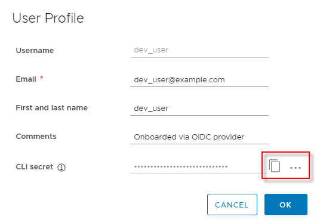
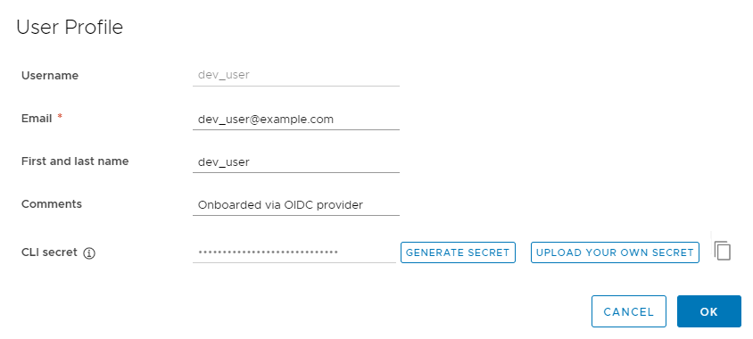

If you select OpenID Connect (OIDC) authentication, users log in to the Harbor interface via an OIDC single sign-on (SSO) provider, such as Okta, KeyCloak, or dex. In this case, you do not create user accounts in Harbor.

---
**Notice**

You can change the authentication mode from database to OIDC only if no local users have been added to the database. If there is at least one user other than `admin` in the Harbor database, you cannot change the authentication mode.

---

Because the users are managed by the OIDC provider, self-registration, creating users, deleting users, changing passwords, and resetting passwords are not supported in OIDC authentication mode.

### Configure Your OIDC Provider

You must configure your OIDC provider so that you can use it with Harbor. For precise information about how to perform these configurations, see the documentation for your OIDC provider.

- Set up the users and groups which will use the OIDC provider to log in to Harbor. You do not need to assign any specific OIDC roles to users or groups as these do not get mapped to Harbor roles.
- The URL of the OIDC provider endpoint, known as the Authorization Server in OAuth terminology, must serve the well-known URI for its configuration document. For more information about the configuration document, see the [OpenID documentation](https://openid.net/specs/openid-connect-discovery-1_0.html#ProviderConfigurationRequest).
- To manage users by using OIDC groups, create a custom group claim which contains all of the user groups that you want to register in Harbor. The group claim must be mapped in the ID token which is sent to Harbor when users log in. You can enable the `memberof` feature on the OIDC provider. With the `memberof` feature, the OIDC user entity's `memberof` attribute is updated when the group entity's `member` attribute is updated, for example by adding or removing an OIDC user from the OIDC group.
- Register Harbor as a client application with the OIDC provider. Associate Harbor's callback URI to the client application as a `redirectURI`. This is the address to which the OIDC provider sends ID tokens.

### Configure an OIDC Provider in Harbor

Before configuring an OIDC provider in Harbor, make sure that your provider is configured correctly according to the preceding section.

1. Log in to the Harbor interface as an account with Harbor system administrator privilege.
1. Under **Administration**, go to **Configuration** and select the **Authentication** tab.
1. Use the **Auth Mode** drop-down menu to select **OIDC**.

   
1. Enter information about your OIDC provider.   

   - **OIDC Provider Name**: The name of the OIDC provider.
   - **OIDC Provider Endpoint**: The URL of the endpoint of the OIDC provider.
   - **OIDC Client ID**: The client ID with which Harbor is registered as  client application with the OIDC provider.
   - **OIDC Client Secret**: The secret for the Harbor client application.
   - **Group Claim Name**: The name of a custom group claim that you have configured in your OIDC provider, that includes the groups to add to Harbor.
   - **OIDC Scope**: A comma-separated string listing the scopes to be used during authentication. 
   
       The OIDC scope must contain `openid` and usually also contains `profile` and `email`. To obtain refresh tokens it should also contain `offline_access`. If you are using OIDC groups, a scope must identify the group claim. Check with your OIDC provider administrator for precise details of how to identify the group claim scope, as this differs from vendor to vendor.
       
       
1. Uncheck **Verify Certificate** if the OIDC Provider uses a self-signed or untrusted certificate.
1. Verify that the Redirect URI that you configured in your OIDC provider is the same as the one displayed at the bottom of the page. 
      
     
1. Click **Test OIDC Server** to make sure that your configuration is correct.
1. Click **Save** to complete the configuration.

### Log in to Harbor via an OIDC Provider

When the Harbor system administrator has configured Harbor to authenticate via OIDC a **Login via OIDC Provider** button appears on the Harbor login page.  

**NOTE:** When Harbor is configured authentication via OIDC, the **Username** and **Password** fields are reserved for the local Harbor system administrator to log in.
    
1. As a Harbor user, click the **Login via OIDC Provider** button.
 
   This redirects you to the OIDC Provider for authentication.  
1. If this is the first time that you are logging in to Harbor with OIDC, specify a user name for Harbor to associate with your OIDC username.

   
    
   This is the user name by which you are identified in Harbor, which is used when adding you to projects, assigning roles, and so on. If the username is already taken, you are prompted to choose another one.
1. After the OIDC provider has authenticated you, you are redirected back to Harbor.

### Using OIDC from the Docker or Helm CLI

After you have authenticated via OIDC and logged in to the Harbor interface for the first time, you can use the Docker or Helm CLI to access Harbor.

The Docker or Helm CLI cannot handle redirection for OIDC, so Harbor provides a CLI secret for use when logging in from Docker or Helm. This is only available when Harbor uses OIDC authentication.  

1. Log in to Harbor with an OIDC user account.
1. Click your username at the top of the screen and select **User Profile**.

   
1. Click the clipboard icon to copy the CLI secret associated with your account.

   
1. Optionally click the **...** icon in your user profile to display buttons for automatically generating or manually creating a new CLI secret.

    

   A user can only have one CLI secret, so when a new secret is generated or create, the old one becomes invalid.
1. If you generated a new CLI secret, click the clipboard icon to copy it.

You can now use your CLI secret as the password when logging in to Harbor from the Docker or Helm CLI.

<pre>
docker login -u testuser -p <i>cli_secret</i> jt-test.local.goharbor.io
</pre>

---
**Notice**

The CLI secret is associated with the OIDC ID token. Harbor will try to refresh the ID token using the access token after the ID token expires, so the CLI secret will always be valid. However, if the OIDC Provider does not provide a refresh token or the refresh fails, the CLI secret becomes invalid. In this case, log out and log back in to Harbor via your OIDC provider so that Harbor can get a new ID token. The CLI secret will then work again.

---

