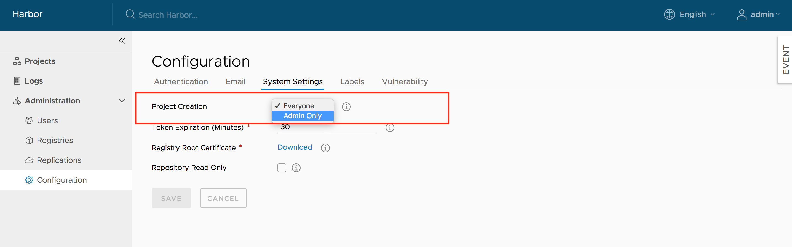

You can configure Harbor to connect to an email server, set the registry in read-only mode, and configure Harbor so that only system administrators can create projects.

## Configure an Email Server

You can configure Harbor to connect to an email server. The email server is only used to send out responses to users who request to reset their password.


## Make the Registry Read Only

You can set Harbor to read-only mode. In read-only mode, Harbor allows `docker pull` but prevents `docker push` and the deletion of repositories and tags.


If it set to true, deleting repositories, tags and pushing images are not permitted.


```sh
docker push 10.117.169.182/demo/ubuntu:14.04
The push refers to a repository [10.117.169.182/demo/ubuntu]
0271b8eebde3: Preparing 
denied: The system is in read only mode. Any modification is prohibited.
```

## Set Who Can Create Projects

Use the **Project Creation** drop-down menu to set which users can create projects. Select **Everyone** to allow all users to create projects. Select **Admin Only** to allow only users with the Harbor system administrator role to create projects.


