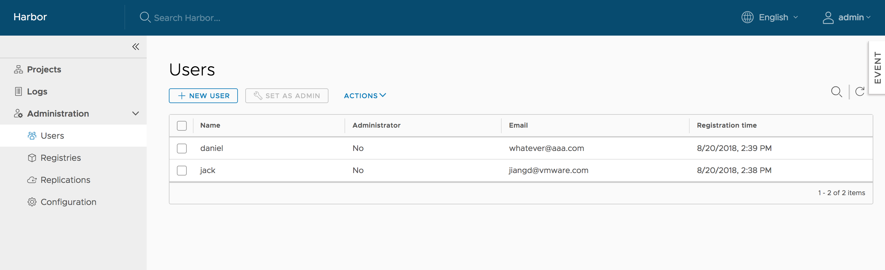

Harbor manages images through projects. You provide access to these images to users by including the users in projects and assigning one of the following roles to them.

* **Limited Guest**: A Limited Guest does not have full read privileges for a project. They can pull images but cannot push, and they cannot see logs or the other members of a project. For example, you can create limited guests for users from different organizations who share access to a project.
* **Guest**: Guest has read-only privilege for a specified project. They can pull and retag images, but cannot push.
* **Developer**: Developer has read and write privileges for a project.
* **Master**: Master has elevated permissions beyond those of 'Developer' including the ability to scan images, view replications jobs, and delete images and helm charts.
* **ProjectAdmin**: When creating a new project, you will be assigned the "ProjectAdmin" role to the project. Besides read-write privileges, the "ProjectAdmin" also has some management privileges, such as adding and removing members, starting a vulnerability scan.

Besides the above roles, there are two system-level roles:

* **Harbor system administrator**: "Harbor system administrator" has the most privileges. In addition to the privileges mentioned above, "Harbor system administrator" can also list all projects, set an ordinary user as administrator, delete users and set vulnerability scan policy for all images. The public project "library" is also owned by the administrator.
* **Anonymous**: When a user is not logged in, the user is considered as an "Anonymous" user. An anonymous user has no access to private projects and has read-only access to public projects.

For full details of the permissions of the different roles, see [User Permissions By Role](../user-permissions-by-role.md).

If you run Harbor in database authentication mode, you create user accounts directly in the Harbor interface. For information about how to create local user accounts, see [Create User Accounts in Database Mode](../create-users-db.md).

If you run Harbor in LDAP/AD or OIDC authentication mode, you create and manage user accounts in your LDAP/AD or OIDC provider. Harbor obtains the users from the LDAP/AD or OIDC server and displays them in the **Users** tab of the Harbor interface.

## Assigning the Harbor System Administrator Role

Harbor system administrators can assign the Harbor system administrator role to other users by selecting usernames and clicking **Set as Administrator** in the **Users** tab.

To delete users, select a user and click `DELETE`. Deleting users is only supported under database authentication mode.
