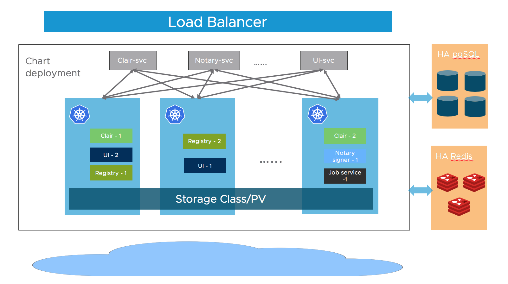

You can deploy Harbor on Kubernetes via Helm to make it highly available. In this way, if one of the nodes on which Harbor is running becomes unavailable, users do not experience interruptions of service. 

The Helm chart for Harbor is maintained at https://github.com/goharbor/harbor-helm.

## Prerequisites

- Kubernetes cluster 1.10+
- Helm 2.8.0+
- High available ingress controller (Harbor does not manage the external endpoint)
- High available PostgreSQL database (Harbor does not handle the deployment of HA of database)
- High available Redis (Harbor does not handle the deployment of HA of Redis)
- PVC that can be shared across nodes or external object storage

## Architecture

Most of Harbor's components are stateless now. So we can simply increase the replica of the pods to make sure the components are distributed to multiple worker nodes, and leverage the "Service" mechanism of K8S to ensure the connectivity across pods.

As for storage layer, it is expected that the user provide high available PostgreSQL, Redis cluster for application data and PVCs or object storage for storing images and charts.



## Download Chart

Download Harbor helm chart:

```bash
helm repo add harbor https://helm.goharbor.io
helm fetch harbor/harbor --untar
```

## Configuration

Configure the followings items in `values.yaml`, you can also set them as parameters via `--set` flag during running `helm install`:

- **Ingress rule**
   Configure the `expose.ingress.hosts.core` and `expose.ingress.hosts.notary`.
- **External URL**
   Configure the `externalURL`.
- **External PostgreSQL**
   Set the `database.type` to `external` and fill the information in `database.external` section.

   Four empty databases should be created manually for `Harbor core`, `Clair`, `Notary server` and `Notary signer` and configure them in the section. Harbor will create tables automatically when starting up.
- **External Redis**
   Set the `redis.type` to `external` and fill the information in `redis.external` section.

   As the Redis client used by Harbor's upstream projects doesn't support `Sentinel`, Harbor can only work with a single entry point Redis. You can refer to this [guide](https://community.pivotal.io/s/article/How-to-setup-HAProxy-and-Redis-Sentinel-for-automatic-failover-between-Redis-Master-and-Slave-servers) to setup a HAProxy before the Redis to expose a single entry point.
- **Storage**
   By default, a default `StorageClass` is needed in the K8S cluster to provision volumes to store images, charts and job logs.

   If you want to specify the `StorageClass`, set `persistence.persistentVolumeClaim.registry.storageClass`, `persistence.persistentVolumeClaim.chartmuseum.storageClass` and `persistence.persistentVolumeClaim.jobservice.storageClass`.

   If you use `StorageClass`, for both default or specified one, set `persistence.persistentVolumeClaim.registry.accessMode`, `persistence.persistentVolumeClaim.chartmuseum.accessMode` and `persistence.persistentVolumeClaim.jobservice.accessMode` as `ReadWriteMany`, and make sure that the persistent volumes must can be shared cross different nodes.

   You can also use the existing PVCs to store data, set `persistence.persistentVolumeClaim.registry.existingClaim`, `persistence.persistentVolumeClaim.chartmuseum.existingClaim` and `persistence.persistentVolumeClaim.jobservice.existingClaim`.

   If you have no PVCs that can be shared across nodes, you can use external object storage to store images and charts and store the job logs in database. Set the `persistence.imageChartStorage.type` to the value you want to use and fill the corresponding section and set `jobservice.jobLogger` to `database`.

- **Replica**
   Set `portal.replicas`, `core.replicas`, `jobservice.replicas`, `registry.replicas`, `chartmuseum.replicas`, `clair.replicas`, `notary.server.replicas` and `notary.signer.replicas` to `n`(`n`>=2).

## Installation

Install the Harbor helm chart with a release name `my-release`:  

Helm 2:

```bash
helm install --name my-release .
```

Helm 3:

```bash
helm install my-release .
```
