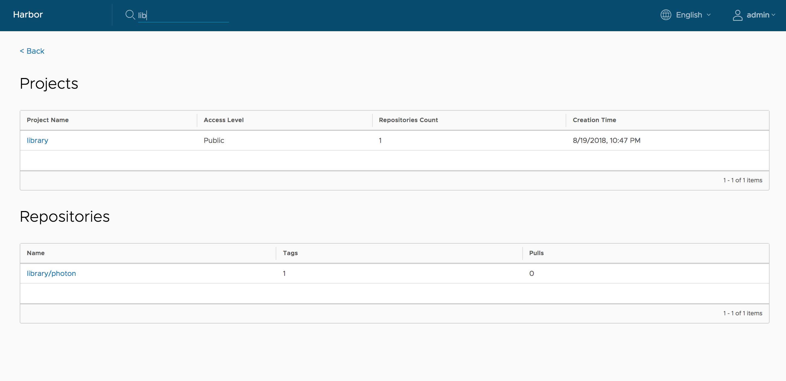

A project in Harbor contains all repositories of an application. Images cannot be pushed to Harbor before a project is created. Role-Based Access Control (RBAC) is applied to projects, so that only users with the appropriate roles can perform certain operations. 

There are two types of project in Harbor:

* **Public**: Any user can pull images from this project. This is a convenient way for you to share repositories with others.
* **Private**: Only users who are members of the project can pull images

You create different projects to which you assign users so that they can push and pull image repositories. You also configure project-specific settings. When you first deploy Harbor, a default public project named `library` is created. 

## Prerequisites

Log in to Harbor with a Harbor administrator or project administrator account.

## Procedure

1. Go to **Projects** and click **New Project**.
1. Provide a name for the project.
1. (Optional) Check the **Public** check box to make the project public.

    If you set the project to **Public**, any user can pull images from this project. If you leave the project set to **Private**, only users who are members of the project can pull images. You can toggle projects from public to private, or the reverse, at any moment after you create the project.

    

5. Click **OK**.

After the project is created, you can browse repositories, members, logs, replication and configuration using the navigation tab.

There are two views to show repositories, list view and card view, you can switch between them by clicking the corresponding icon.

Project properties can be changed by clicking "Configuration".

* To make all repositories under the project accessible to everyone, select the `Public` checkbox.

* To prevent un-signed images under the project from being pulled, select the `Enable content trust` checkbox. For more information about content trust, see [Implementing Content Trust](../implementing-content-trust.md).

 

## Searching Projects and Repositories
Entering a keyword in the search field at the top lists all matching projects and repositories. The search result includes both public and private repositories you have access to.

## What to Do Next

[Assign Users to a Project](../add-users.md)

