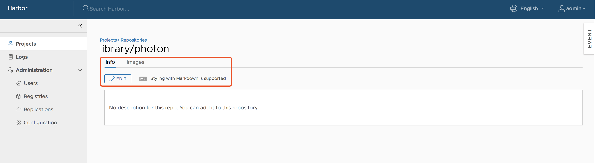

Harbor optionally supports HTTP connections, however the Docker client always attempts to connect to registries by first using HTTPS. If Harbor is configured for HTTP, you must configure your Docker client so that it can connect to insecure registries. In your Docker client is not configured for insecure registries, you will see the following error when you attempt to pull or push images to Harbor: 

<pre>
Error response from daemon: Get https://<i>myregistrydomain.com</i>/v1/users/: dial tcp <i>myregistrydomain.com</i>:443 getsockopt: connection refused.
</pre>

For information about how to add insecure registries to your Docker client, see [Connecting to Harbor via HTTP](../install-config/run-installer-script.md#connect_http).

You also see this error if Harbor uses HTTPS with an unknown CA certificate. In this case, obtain the registry's CA certificate, and copy it to <code>/etc/docker/certs.d/<i>myregistrydomain.com</i>/ca.crt</code>.


Harbor only supports the Registry V2 API. You must use Docker client 1.6.0 or higher when pushing and pulling images.


## Pulling Images

If the project that the image belongs to is private, you must sign in first:

```sh
docker login <harbor_address>
```

You can now pull an image:

```sh 
docker pull <harbor_address>/library/ubuntu:14.04
```


You cannot pull an unsigned image if you have enabled content trust.


## Pushing Images

Before you can push an image to Harbor, you must create a corresponding project in the Harbor interface. For information about how to create a project, see [Create Projects](../create-projects.md).

First, log in from Docker client:

```sh
docker login <harbor_address>
```

Tag the image:

```sh
docker tag ubuntu:14.04 <harbor_address>/demo/ubuntu:14.04
```

Push the image:

```sh
docker push <harbor_address>/demo/ubuntu:14.04
```

## Add Descriptions to Repositories

After pushing an image, the project administrator can add information to describe the repository.

Go into the repository and select the **Info** tab, and click the **Edit** button. Enter a description and click **Save** to save the description.



## Download the Harbor Certificate

Users can click the **Registry Certificate** button to download the registry certificate.


## Deleting Repositories

Deleting repositories involves two steps.

First, you delete a repository in the Harbor interface. This is soft deletion. You can delete the entire repository or just one of its tags. After the soft deletion, the repository is no longer managed by Harbor, however, the repository files remain in the Harbor storage.



If both tag A and tag B refer to the same image, after deleting tag A, B will also get deleted. if you enabled content trust, you need to use notary command line tool to delete the tag's signature before you delete an image.


Next, delete the repository files by running [garbage collection](../administration/garbage-collection.md) in the Harbor interface. 

## Pulling Images from Harbor in Kubernetes
Kubernetes users can easily deploy pods with images stored in Harbor. The settings are similar to those of any other private registry. There are two issues to be aware of:

1. When your Harbor instance is hosting HTTP and the certificate is self-signed, you must modify `daemon.json` on each work node of your cluster. For information, see https://docs.docker.com/registry/insecure/#deploy-a-plain-http-registry.
2. If your pod references an image under a private project, you must create a secret with the credentials of a user who has permission to pull images from the project. For information, see https://kubernetes.io/docs/tasks/configure-pod-container/pull-image-private-registry/.

## Configure Notary Content Trust

Make sure that `https` is enabled in `harbor.yml` and the attributes `ssl_cert` and `ssl_cert_key` point to valid certificates. For more information about generating a HTTPS certificate, see [Configure HTTPS Access to Harbor](../install-config/configure-https.md).

### Copy the Root Certificate

If Harbor instance is hosted at 192.168.0.5, ff you are using a self-signed certificate, copy the Harbor CA root cert to `/etc/docker/certs.d/192.168.0.5/` and `~/.docker/tls/192.168.0.5:4443/` on the machine on which you run the Docker client.

### Enable Docker Content Trust

You can enable content trust by setting the following environment variables on the machine on which you run the Docker client.

```sh
export DOCKER_CONTENT_TRUST=1
export DOCKER_CONTENT_TRUST_SERVER=https://192.168.0.5:4443
```

### Set Alias for Notary (optional)

By default the local directory for storing meta files for the Notary client is different from the one for the Docker client. To simplify the use of the Notary client to manipulate the keys/meta files that are generated by Docker content trust, you can set an alias.

```sh
alias notary="notary -s https://192.168.0.5:4443 -d ~/.docker/trust --tlscacert /etc/docker/certs.d/192.168.0.5/ca.crt"
```
