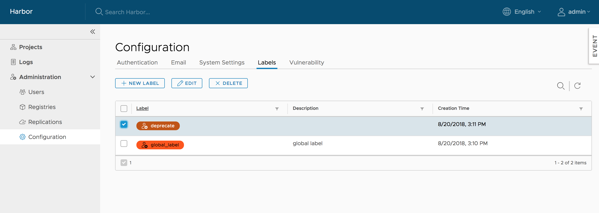

Harbor provides two kinds of labels to isolate different kinds of resources:

* **Global Level Label**: Managed by Harbor system administrators and used to manage the images of the whole system. They can be added to images under any projects.
* **Project Level Label**: Managed by project administrators under a project and can only be added to the images of the project.

## Managing Global Labels
The Harbor system administrators can list, create, update and delete the global level labels under `Administration->Configuration->Labels`:

## Managing Project-Level Labels
The project administrators and Harbor system administrators can list, create, update and delete the project level labels under `Labels` tab of the project detail page:

## Adding and Removing Labels to and from Images
Users who have Harbor system administrator, project administrator or project developer role can click the `ADD LABELS` button to add labels to or remove labels from images. The label list contains both globel level labels(come first) and project level labels:

## Filtering Images by Label
The images can be filtered by labels:

