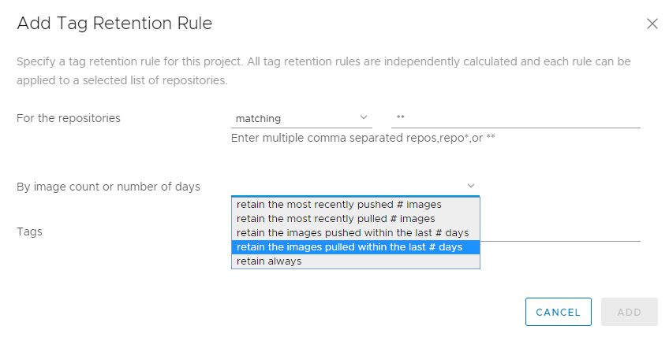
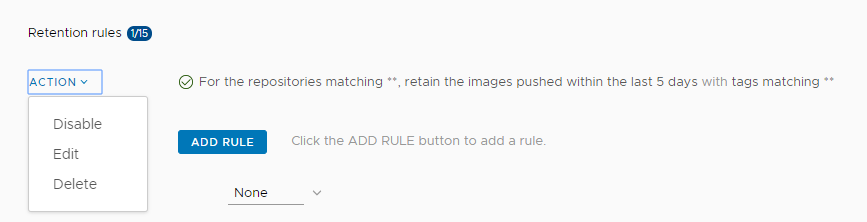

[Back to table of contents](../index.md)

----------

# Create Tag Retention Rules

A repository can rapidly accumulate a large number of image tags, many of which might not be required after a given time or once they have been superseded by a subsequent image build. These excess tags can obviously consume large quantities of storage capacity. As a Harbor system administrator, you can define rules that govern how many tags of a given repository to retain, or for how long to retain certain tags. 

## How Tag Retention Rules Work

You define tag retention rules on repositories, not on projects. This allows for greater granularity when defining your retention rules. As the name suggests, when you define a retention rule for a repository, you are identifying which tags to retain. You do not define rules to explicitly remove tags. Rather, when you set a rule, any tags in a repository that are not identified as being eligible for retention are discarded. 

A tag retention rule has 3 filters that are applied sequentially, as described in the following table.

|Order|Filter|Description|
|---|---|---|
|First|Repository or repositories|Identify the repository or repositories on which to apply the rule. You can identify repositories that either have a certain name or name fragment, or that do not have that name or name fragment. Wild cards (for example `*repo`, `repo*`, and `**`) are permitted. The repository filter is applied first to mark the repositories to which to apply the retention rule. The identified repositories are earmarked for further matching based on the tag criteria. No action is taken on the nonspecified repositories at this stage.|
|Second|Quantity to retain|Set which tags to retain either by specifying a maximum number of tags, or by specifying a maximum period for which to retain tags.|
|Third|Tags to retain|Identify the tag or tags on which to apply the rule. You can identify tags that either have a certain name or name fragment, or that do not have that name or name fragment. Wild cards (for example `*tag`, `tag*`, and `**`) are permitted.|

For information about how the `**` wildcard is applied, see https://github.com/bmatcuk/doublestar#patterns.

### Example 1

- You have 5 repositories in a project, repositories A to E.
  - Repository A has 100 image tags, all of which have been pulled in the last week.
  - Repositories B to E each have 6 images, none of which have been pulled in the last month.
- You set the repository filter to `**`, meaning that all repositories in the project are included.
- You set the retention policy to retain the 10 most recently pulled images in each repository.
- You set the tag filter to `**`, meaning that all tags in the repository are included.

In this example the rule retains the 10 most recently pulled images in repository A, and all 6 of the images in each of the 4 repositories B to E. So, a total of 34 image tags are retained in the project. In other words, the rule does not treat all of the images in repositories A to E as a single pool from which to choose the 10 most recent images. So, even if the 11th to 100th tags in repository A have been pulled more recently than any of the tags in repositories B to E, all of the tags in repositories B to E are retained, because each of those repositories has fewer than 10 tags.

### Example 2

This example uses the same project and repositories as example 1, but sets the retention policy to retain the images in each repository that have been pulled in the last 7 days.

In this case, all of the images in repository A are retained because they have been pulled in the last 7 days. None of the images in repositories B to E are retained, because none of them has been pulled in the last week. In this example, 100 images are retained, as opposed to 34 images in example 1.

### Tag Retention Rules and Native Docker Tag Deletion

**WARNING**: Due to native Docker tag deletion behavior, there is an issue with the current retention policy implementation. If you have multiple tags that refer to the same SHA digest, and if a subset of these tags are marked for deletion by a configured retention policy, all of the remaining tags would also be deleted. This violates the retention policy, so in this case all of the tags are retained. This issue will be addressed in a future update release, so that tag retention policies can delete tags without deleting the digest and other shared tags.

For example, you have following tags, listed according to their push time, and all of them refer to the same SHA digest:

- `harbor-1.8`, pushed 8/14/2019 12:00am
- `harbor-release`, pushed 8/14/2019 03:00am
- `harbor-nightly`, pushed 8/14/2019 06:00am
- `harbor-latest`, pushed 8/14/2019 09:00am

You configure a retention policy to retain the two latest tags that match `harbor-*`, so that `harbor-rc` and `harbor-latest` are deleted. However, since all tags refer to the same SHA digest, this policy would also delete the tags `harbor-1.8` and `harbor-release`, so all tags are retained.

## Combining Rules on a Repository

You can define up to 15 rules per project. You can apply multiple rules to a repository or set of repositories. When you apply multiple rules to a repository, they are applied with `OR` logic rather than with `AND` logic. In this way, there is no prioritization of application of the rules on a given repository. Rules run concurrently in the background, and the resulting sets from each rule are combined at the end of the run.

### Example 3

This example uses the same project and repositories as examples 1 and 2, but sets two rules:

- Rule 1: Retain all of the images in each repository that have been pulled in the last 7 days.
- Rule 2: Retain a maximum number of 10 images in each repository.

For repository A, rule 1 retains all of the images because they have all been pulled in the last week. Rule 2 retains the 10 most recently pulled images. So, since the two rules are applied with an `OR` relationship, all 100 images are retained in repository A.

For repositories B-E, rule 1 will retain 0 images as no images are pulled in the last week. Rule 2 will retain all 6 images because 6 < 10. So, since the two rules are applied with an `OR` relationship, for repositories B-E, each repository will keep all 6 images.

In this example, all of the images are retained.

### Example 4

This example uses a different repository to the previous examples.

- You have a repository that has 12 tags:

  |Production|Release Candidate|Release|
  |---|---|---|
  |`2.1-your_repo-prod`|`2.1-your_repo-rc`|`2.1-your_repo-release`|
  |`2.2-your_repo-prod`|`2.2-your_repo-rc`|`2.2-your_repo-release`|
  |`3.1-your_repo-prod`|`3.1-your_repo-rc`|`3.1-your_repo-release`|
  |`4.4-your_repo-prod`|`4.4-your_repo-rc`|`4.4-your_repo-release`| 

- You define three tag retention rules on this repository:
  - Retain the 10 most recently pushed image tags that start with `2`.
  - Retain the 10 most recently pushed image tags that end with `-prod`.
  - Retain all tags that do not include `2.1-your_repo-prod`.

In this example, the rules are applied to the following 7 tags:

- `2.1-your_repo-rc`
- `2.1-your_repo-release`
- `2.2-your_repo-prod`
- `2.2-your_repo-rc`
- `2.2-your_repo-release`
- `3.1-your_repo-prod`
- `4.4-your_repo-prod`

## How Tag Retention Rules Interact with Project Quotas

The Harbor system administrator can set a maximum on the number of tags that a project can contain and the amount of storage that it can consume. For information about project quotas, see [Configure Project Quotas](../administration/configure_project_quotas.md). 

If you set a quota on a project, this quota cannot be exceeded. The quota is applied to a project even if you set a retention rule that would exceed it. In other words, you cannot use retention rules to bypass quotas.

## Configure Tag Retention Rules

1. Log in to the Harbor interface with an account that has at least project administrator privileges.
1. Go to **Projects**, select a project, and select **Tag Retention**.

   
1. Click **Add Rule** to add a rule.
1. In the **Repositories** drop-down menu, select **matching** or **excluding**.
  
1. In the **Repositories** text box, identify the repositories on which to apply the rule.
  
   You can define the repositories on which to apply the rule by entering the following information:
  
   - A repository name, for example `my_repo_1`.
   - A comma-separated list of repository names, for example `my_repo_1,my_repo_2,your_repo_3`.
   - A partial repository name with wildcards, for example `my_*`, `*_3`, or `*_repo_*`.
   - `**` to apply the rule to all of the repositories in the project. 
  
   If you selected **matching**, the rule is applied to the repositories you identified. If you selected **excluding**, the rule is applied to all of the repositories in the project except for the ones that you identified.
1. In the **By image count or number of days** drop-down menu, define how many tags to retain or the period to retain tags.
  
  
   |Option|Description|
   |---|---|
   |**retain the most recently pushed # images**|Enter the maximum number of images to retain, keeping the ones that have been pushed most recently. There is no maximum age for an image.|
   |**retain the most recently pulled # images**|Enter the maximum number of images to retain, keeping only the ones that have been pulled recently. There is no maximum age for an image.|
   |**retain the images pushed within the last # days**|Enter the number of days to retain images, keeping only the ones that have been pushed during this period. There is no maximum number of images.|
   |**retain the images pulled within the last # days**|Enter the number of days to retain images, keeping only the ones that have been pulled during this period. There is no maximum number of images.|
   |**retain always**|Always retain the images identified by this rule.| 

1. In the **Tags** drop-down menu, select **matching** or **excluding**.
1. In the **Tags** text box, identify the tags on which to apply the rule.
  
   You can define the tags on which to apply the rule by entering the following information:
  
   - A tag name, for example `my_tag_1`.
   - A comma-separated list of tag names, for example `my_tag_1,my_tag_2,your_tag_3`.
   - A partial tag name with wildcards, for example `my_*`, `*_3`, or `*_tag_*`.
   - `**` to apply the rule to all of the tags in the project. 
  
   If you selected **matching**, the rule is applied to the tags you identified. If you selected **excluding**, the rule is applied to all of the tags in the repository except for the ones that you identified.
1. Click **Add** to save the rule.
1. (Optional) Click **Add Rule** to add more rules, up to a maximum of 15 per project.
1. (Optional) Under Schedule, click **Edit** and select how often to run the rule.

   
   
   If you select **Custom**, enter a cron job command to schedule the rule. 
  
   **NOTE**: If you define multiple rules, the schedule is applied to all of the rules. You cannot schedule different rules to run at different times. 
1. Click **Dry Run** to test the rule or rules that you have defined.
1. Click **Run Now** to run the rule immediately.

**WARNING**: You cannot revert a rule after you run it. It is strongly recommended to perform a dry run before you run rules. 

To modify an existing rule, use the **Action** drop-down menu next to a rule to disable, edit, or delete that rule. 

----------

[Back to table of contents](../index.md)
