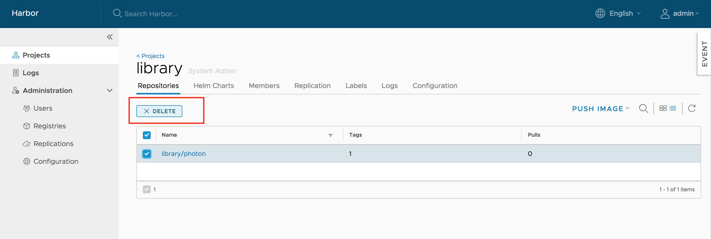

[Back to table of contents](../_index.md)

----------

# Pulling and Pushing Images in the Docker Client

**NOTE**: Harbor only supports the Registry V2 API. You must use Docker client 1.6.0 or higher.  

Harbor optionally supports HTTP connections, however the Docker client always attempts to connect to registries by first using HTTPS. If Harbor is configured for HTTP, you must configure your Docker client so that it can connect to insecure registries. In your Docker client is not configured for insecure registries, you will see the following error when you attempt to pull or push images to Harbor: 

<pre>
Error response from daemon: Get https://<i>myregistrydomain.com</i>/v1/users/: dial tcp <i>myregistrydomain.com</i>:443 getsockopt: connection refused.
</pre>

For information about how to add insecure registries to your Docker client, see [Connecting to Harbor via HTTP](installation_guide.md#connect_http) in the *Harbor Installation and Configuration Guide*.

You also see this error if Harbor uses HTTPS with an unknown CA certificate. In this case, obtain the registry's CA certificate, and copy it to <code>/etc/docker/certs.d/<i>myregistrydomain.com</i>/ca.crt</code>.   

## Pulling Images  
If the project that the image belongs to is private, you should sign in first:  

```
sh
$ docker login 10.117.169.182  
```

You can now pull the image:  

```
sh 
$ docker pull 10.117.169.182/library/ubuntu:14.04  
```

**Note**: Replace "10.117.169.182" with the IP address or domain name of your Harbor node. You cannot pull an unsigned image if you enabled content trust.

## Pushing Images  
Before pushing an image, you must create a corresponding project on Harbor web UI. 

First, log in from Docker client:  

```
sh
$ docker login 10.117.169.182  
```

Tag the image:  

```
sh
$ docker tag ubuntu:14.04 10.117.169.182/demo/ubuntu:14.04  
```

Push the image:

```
sh
$ docker push 10.117.169.182/demo/ubuntu:14.04  
```

**Note: Replace "10.117.169.182" with the IP address or domain name of your Harbor node.**

##  Add Descriptions to Repositories

After pushing an image, an Information can be added by project admin to describe this repository.

Go into the repository and select the "Info" tab, and click the "EDIT" button.  An textarea will appear and enter description here. Click "SAVE" button to save this information.


## Download the Harbor Certificate

Users  can click the "registry certificate" link to download the registry certificate.


##  Deleting Repositories  

Repository deletion runs in two steps.  

First, delete a repository in Harbor's UI. This is soft deletion. You can delete the entire repository or just a tag of it. After the soft deletion, 
the repository is no longer managed in Harbor, however, the files of the repository still remain in Harbor's storage.  




**CAUTION: If both tag A and tag B refer to the same image, after deleting tag A, B will also get deleted. if you enabled content trust, you need to use notary command line tool to delete the tag's signature before you delete an image.**  

Next, delete the actual files of the repository using the [garbage collection](#online-garbage-collection) in Harbor's UI. 


## Pulling Images from Harbor in Kubernetes
Kubernetes users can easily deploy pods with images stored in Harbor.  The settings are similar to that of another private registry. There are two major issues:

1. When your Harbor instance is hosting http and the certificate is self signed.  You need to modify daemon.json on each work node of your cluster, for details please refer to: https://docs.docker.com/registry/insecure/#deploy-a-plain-http-registry
2. If your pod references an image under private project, you need to create a secret with the credentials of user who has permission to pull image from this project, for details refer to: https://kubernetes.io/docs/tasks/configure-pod-container/pull-image-private-registry/

## Configure Notary Content Trust

In harbor.yml, make sure https is enabled, and the attributes `ssl_cert` and `ssl_cert_key` are pointed to valid certificates. For more information about generating https certificate please refer to: [Configuring HTTPS for Harbor](configure_https.md)

### Copy Root Certificate

Suppose the Harbor instance is hosted on a machine `192.168.0.5`
If you are using a self-signed certificate, make sure to copy the CA root cert to `/etc/docker/certs.d/192.168.0.5/` and `~/.docker/tls/192.168.0.5:4443/`

### Enable Docker Content Trust

It can be done via setting environment variables:

```
export DOCKER_CONTENT_TRUST=1
export DOCKER_CONTENT_TRUST_SERVER=https://192.168.0.5:4443
```

### Set alias for notary (optional)

Because by default the local directory for storing meta files for notary client is different from docker client. If you want to use notary client to manipulate the keys/meta files generated by Docker Content Trust, please set the alias to reduce the effort:

```
alias notary="notary -s https://192.168.0.5:4443 -d ~/.docker/trust --tlscacert  /etc/docker/certs.d/192.168.0.5/ca.crt"

```

----------

[Back to table of contents](../_index.md)