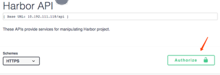

[Back to table of contents](../index.md)

----------

# Using the API Explorer

Harbor integrated swagger UI from 1.8. That means all apis can be invoked through UI. Normally, user have 2 ways to navigate to API Explorer. 

1. User can login harbor, and click the "API EXPLORER" button.All apis will be invoked with current user authorization.                         
  

2. User can navigate to swagger page by ip address by router "devcenter". For example: https://10.192.111.118/devcenter. After go to the page, need to click "authorize" button to give basic authentication to all apis. All apis will be invoked with the authorized user authorization. 

----------

[Back to table of contents](../index.md)

