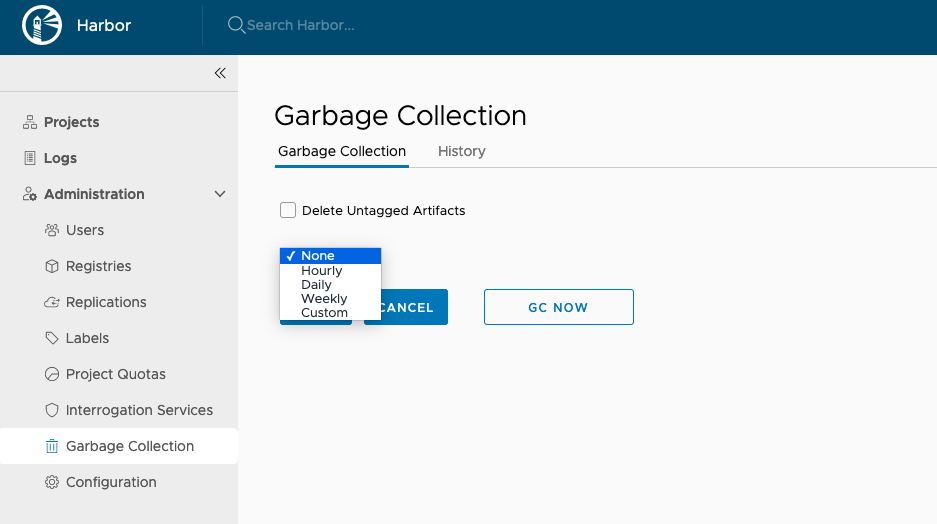

When you delete images from Harbor, space is not automatically freed up. You must run garbage collection to free up space by removing blobs that are no longer referenced by a manifest from the file system.  

## Run Garbage Collection

1. Log in to the Harbor interface with an account that has Harbor system administrator privileges.
1. Expand **Administration**, select **Garbage Collection**, and then click the **Garbage Collection** tab.

    

1. To delete untagged artifacts, select the **Delete Untagged Artifacts** check box. 
1. To run garbage collection, click **GC Now**.

When you run garbage collection, Harbor goes into read-only mode. All modifications to the registry are prohibited.

To avoid triggering the garbage collection process too frequently, the availability of the **GC Now** button is restricted. Garbage collection can be only run once per minute.

## Schedule Garbage Collection

1. Expand **Administration**, select **Garbage Collection**, and then click the **Garbage Collection** tab.
1. Click **Edit**, and then use the drop-down menu to select how often to run garbage collection.

    

    * **None**: No garbage collection is scheduled.
    * **Hourly**: Run garbage collection at the beginning of every hour.
    * **Daily**: Run garbage collection at midnight every day.
    * **Weekly**: Run garbage collection at midnight every Saturday.
    * **Custom**: Run garbage collection according to a `cron` job.
    
1. To delete untagged artifacts, select the check box **Delete Untagged Artifacts**.    
1. Click **Save**.
1. To view records of the 10 most recent garbage collection runs, click the **History** tab.

    

1. To view the logs related to a particular garbage collection job, click the icon in the **Logs** column.
