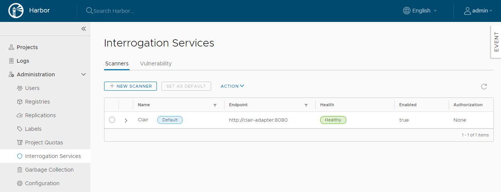
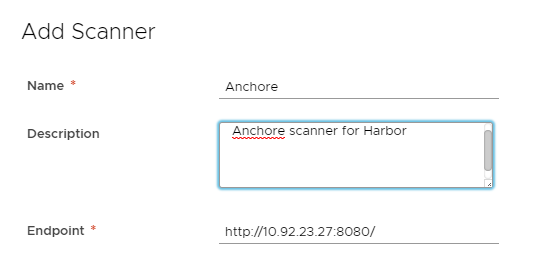

To connect Harbor to additional vulnerability scanners, you must install and configure an instance of the additional scanner according to the scanner vendor's requirements. The scanner must expose an API endpoint to allow Harbor to trigger the scan process or get reports. You can deploy multiple different scanners, and multiple instances of the same type of scanner.

1. Log in to the Harbor interface with an account that has Harbor system administrator privileges.
1. Expand **Administration**, and select **Interrogation Services**.
   
1. Click the **New Scanner** button.
1. Enter the information to identify the scanner.
   - A unique name for this scanner instance, to display in the Harbor interface.
   - An optional description of this scanner instance.
   - The address of the API endpoint that the scanner exposes to Harbor.
     
1. Select how to connect to the scanner from the **Authorization** drop-down menu.
   
   - **None**: The scanner allows all connections without any security.
   - **Basic**: Enter a username and password for an account that can connect to the scanner.
   - **Bearer**: Paste the contents of a bearer token in the **Token** text box.
   - **APIKey**: Paste the contents of an API key for the scanner in the **APIKey** text box.
1. Optionally select **Skip certificate verification** if the scanner uses a self-signed or untrusted certificate.
1. Optionally select **Use internal registry address** if the scanner should connect to Harbor using an internal network address rather than its external URL.

   **NOTE**: To use this option, the scanner must be deployed in a network that allows the scanner to reach Harbor via Harbor's internal network.

1. Click **Test Connection** to make sure that Harbor can connect successfully to the scanner.
   
1. Click **Add** to connect Harbor to the scanner.
1. Optionally repeat the procedure to add more scanners.
1. If you configure multiple scanners, select one and click **Set as Default** to designate it as the default scanner.

## Vulnerability Metadata

Vulnerability scanners depend on the vulnerability metadata to complete the analysis process. After the first initial installation, the vulnerability scanner automatically starts to update the metadata database from different vulnerability repositories. The database update might take a while, based on the data size and network connection.

Depending on the scanner that you use, once the database is ready, the timestamp of the last update is shown in the **Interrogation Services** > **Vulnerability** tab. Currently, only Clair and Anchore provide timestamp information.

Until the database has been fully populated, the timestamp is replaced by a warning symbol. When the database is ready, you can scan images individually or scan all images across all projects.

If your Harbor instance is not connected to the external internet, you must manually update the vulnerability metadata. For information about how to update Clair manually, see [Import Vulnerability Data to an Offline Harbor instance](import-vulnerability-data.md).
