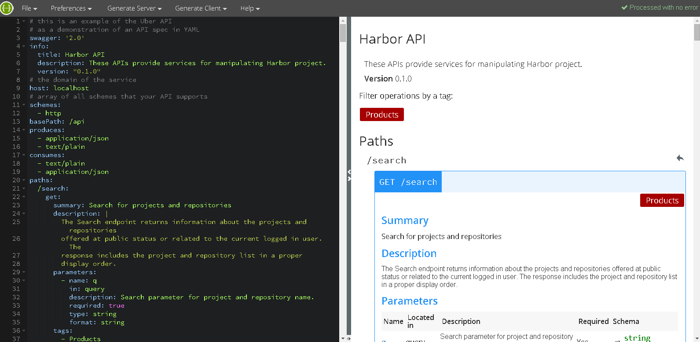

# View and test Harbor REST API via Swagger
A Swagger file is provided for viewing and testing Harbor REST API. First, you should get the source code of Harbor:
```sh
   git clone git@github.com:vmware/harbor.git
```
### Viewing Harbor REST API
* Open the file **swagger.yaml** under the _docs_ directory in Harbor project;
* Paste all its content into the online Swagger Editor at http://editor.swagger.io. The descriptions of Harbor API will be shown on the right pane of the page.



### Testing Harbor REST API
From time to time, you may need to mannually test Harbor REST API. You can deploy the Swagger file into Harbor's service node. 

**Caution:** When using Swagger to send REST requests to Harbor, you may alter the data of Harbor accidentally. For this reason, it is NOT recommended using Swagger against a production Harbor instance.

* Change the directory to _docs_ in Harbor project.
```sh
  cd docs
```
* Edit the script file _prepare-swagger.sh_ under the _docs_ directory.
```sh
  vi prepare-swagger.sh
```
* Change the SCHEME to the protocol scheme of your Harbor server.
```sh
  SCHEME=<HARBOR_SERVER_SCHEME>
```
* Change the SERVER_IP to the IP address of your Harbor server.
```sh
  SERVER_ID=<HARBOR_SERVER_DOMAIN>
```
* Run the shell script. It downloads a Swagger package and extracts files into the _static_ directory in Harbor project.
```sh
   ./prepare-swagger.sh
```
* Change the directory to _Deploy_
```sh
  cd ../Deploy
```
* Edit the _docker-compose.yml_ file.
```sh
  vi docker-compose.yml
```
* Add two lines to the file _docker-compose.yml_ under the section _ui.volumes_.
```docker
...
ui:
  ... 
  volumes:
    - ./config/ui/app.conf:/etc/ui/app.conf
    - ./config/ui/private_key.pem:/etc/ui/private_key.pem
    ## add two lines as below ##
    - ../static/vendors/swagger-ui-2.1.4/dist:/go/bin/static/vendors/swagger
    - ../static/resources/yaml/swagger.yaml:/go/bin/static/resources/yaml/swagger.yaml
    ...
```
* Rebuild Harbor project
```docker
    docker-compose build
```
* Clean up the previous running version. NOTE: The command does not remove your existing data.
```docker
   docker-compose rm
```
* Start the new Harbor build
```docker
   docker-compose up
```
* Because a session ID is usually required by Harbor API, **you should log in first from a browser.**
* Open another tab in the same browser so that the session is shared between tabs.
* Enter the URL of the Swagger page in Harbor as below. The ```<HARBOR_SERVER>``` should be replaced by the IP address or the hostname of the Harbor server.
```
  http://<HARBOR_SERVER>/static/vendors/swagger/index.html
```
* You should see a Swagger UI page with Harbor API _swagger.yaml_ file loaded in the same domain, **be aware that your REST request submitted by Swagger may change the data of Harbor**.


