# Expand the Hard Disk of Virtual Appliance

If you install Harbor with OVA, the persistent data(such as images and database) is stored in a hard disk which is mounted on directory "/data", and the default size is 60GB. As more and more images are pushed into it, the capacity may not meet your requirements.  

You can check the space on Harbor web UI by clicking on **Projects**:


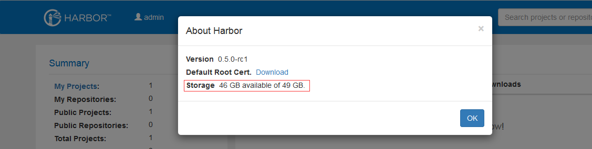

If your free space is running out, you can expand the size of the hard disk by the following steps:  

1. Add New Hard Disk to VM  

    (1) Log in vSphere web client. Power off Harbor's virtual appliance.  
    (2) Right click on the VM and select "Edit Settings".  
    (3) Select "New Hard Disk", and click "OK".  
	
    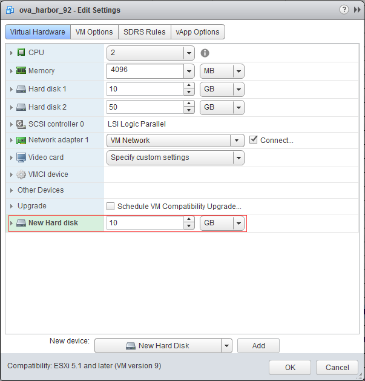
		
    We add a 10GB new hard disk to show the operations.  
	
    (4) Power on the VM.  

2. Expand Hard Disk using LVM  

	Login from the console of the virtual appliance and run the following commands:  

	(1) Check the current size of "/data":  
	```sh
	df -h /data
	```
	
	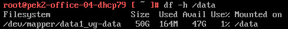
	
	(2) Find the new hard disk, e.g. "/dev/sdc". Replace all "/dev/sdc" with your disk in the following commands.  
	```sh
	fdisk -l
	```
	
	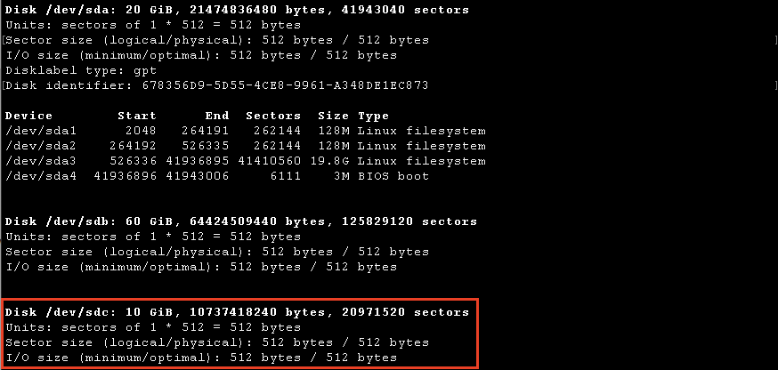
	
	(3) Create new physical volume:  
	```sh
	pvcreate /dev/sdc
	```
	
	(4) Check the volume group:  
	```sh
	vgdisplay
	```
	
	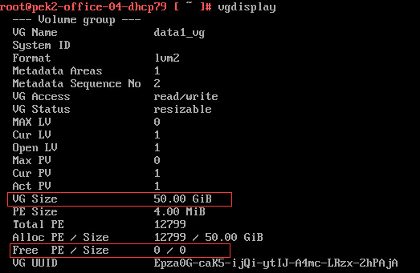
	
	(5) Expand the volume group:
	```sh
	vgextend data1_vg /dev/sdc
	```
	
	(6) Check the volume group again:  
	```sh
	vgdisplay
	```
	
	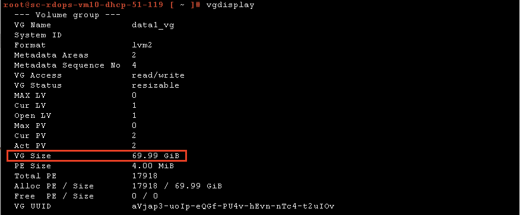
	
	(7) Check the logical volume:
	```sh
	lvdisplay
	```
	
	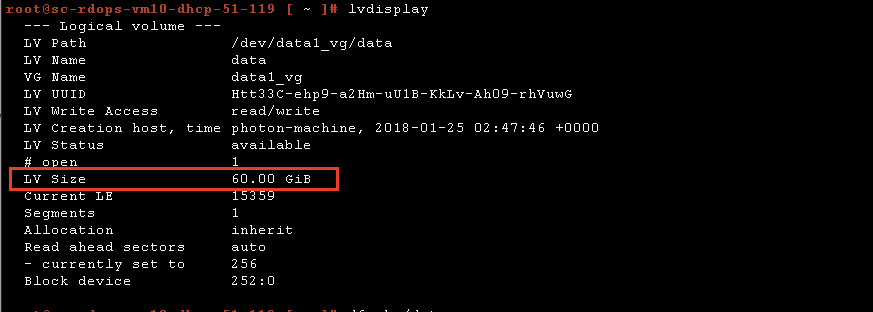
	
	(8) Resize the logical volume:  
	```sh
	lvresize -l +100%FREE /dev/data1_vg/data
	```
	
	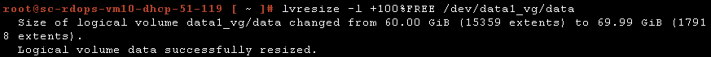
	
	(9) Check the logical volume again, note the change of "LV Size":
	```sh
	lvdisplay
	```
	
	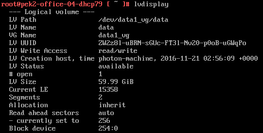
	
	(10) Resize the file system:
	```sh
	resize2fs /dev/data1_vg/data
	```
	
	(11) Check the size "/data" again:
	```sh
	df -h /data
	```
	
	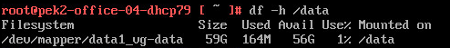
	
	You can also check the size on Harbor web UI:
	
	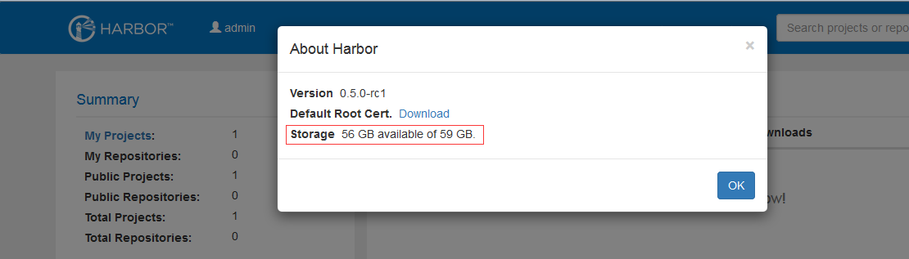

After that, your disk should be expanded successfully. If you want to add more hard disks, do the steps again.