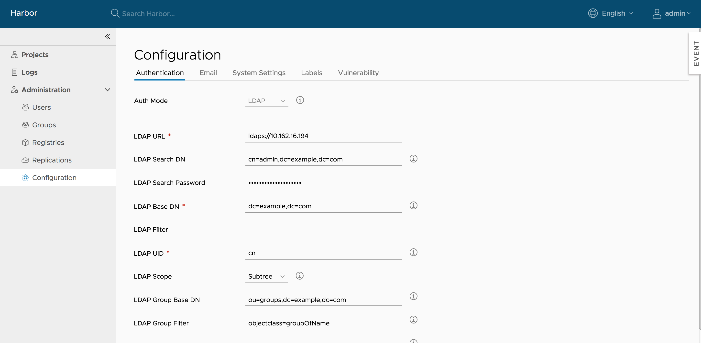
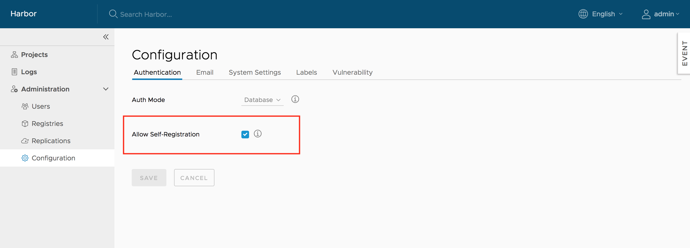
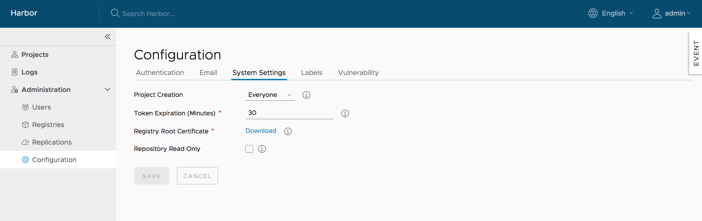
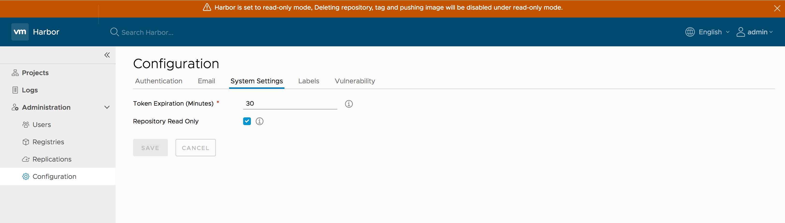

# Administrator options  


### Managing registry  
You can list, add, edit and delete registries under `Administration->Registries`. Only registries which are not referenced by any rules can be deleted.  


### Managing replication  


### Managing authentication
You can change authentication mode between **Database**(default) and **LDAP** before any user is added, when there is at least one user(besides admin) in Harbor, you cannot change the authentication mode.  

When using LDAP mode, user's self-registration is disabled. The parameters of LDAP server must be filled in. For more information, refer to [User account](#user-account).   


When using OIDC mode, user will login Harbor via OIDC based SSO.  A client has to be registered on the OIDC provider and Harbor's callback URI needs to be associated to that client as a redirectURI.


The settings of this auth mode:
* OIDC Provider Name: The name of the OIDC Provider.
* OIDC Provider Endpoint: The URL of the endpoint of the OIDC provider(a.k.a the Authorization Server in OAuth's terminology), 
which must service the "well-known" URI for its configuration, more details please refer to https://openid.net/specs/openid-connect-discovery-1_0.html#ProviderConfigurationRequest
* OIDC Client ID: The ID of client configured on OIDC Provider.
* OIDC Client Secret: The secret for this client.
* OIDC Scope: The scope values to be used during the authentication.  It is the comma separated string, which must contain `openid`.  
Normally it should also contain `profile` and `email`.  For getting the refresh token it should also contain `offline_access`.  Please check with the administrator of the OIDC Provider.
* Verify Certificate: Whether to check the certificate when accessing the OIDC Provider. if you are running the OIDC Provider with self-signed
certificate, make sure this value is set to false.


### Managing project creation
Use the **Project Creation** drop-down menu to set which users can create projects. Select **Everyone** to allow all users to create projects. Select **Admin Only** to allow only users with the Administrator role to create projects.  


### Managing self-registration
You can manage whether a user can sign up for a new account. This option is not available if you use LDAP authentication.  


### Managing email settings
You can change Harbor's email settings, the mail server is used to send out responses to users who request to reset their password.  


### Managing registry read only
You can change Harbor's registry read only settings, read only mode will allow 'docker pull' while preventing 'docker push' and the deletion of repository and tag.


If it set to true, deleting repository, tag and pushing image will be disabled. 



```
$ docker push 10.117.169.182/demo/ubuntu:14.04  
The push refers to a repository [10.117.169.182/demo/ubuntu]
0271b8eebde3: Preparing 
denied: The system is in read only mode. Any modification is prohibited.  
```
### Managing role by LDAP group

If auth_mode is ldap_auth, you can manage project role by LDAP/AD group. please refer [manage role by ldap group guide](manage_role_by_ldap_group.md).