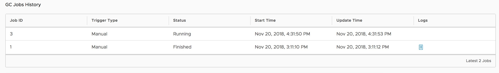

# Garbage Collection

When you delete images from Harbor, space is not automatically freed up. You must run garbage collection to free up space by removing blobs that are no longer referenced by a manifest from the file system.  

### Run Garbage Collection

1. Log in to the Harbor interface with an account that has Harbor system administrator privileges.
1. Expand **Administration**, and select **Garbage Collection**. 
1. Select the **'Garbage Collection'** tab.
  
1. To run garbage collection immediately, click **GC Now**.

When you run garbage collection, Harbor goes into read-only mode. All modifications to the registry are prohibited.

To avoid triggering the garbage collection process too frequently, the availability of the **GC Now** button is restricted. Garbage collection can be only run once per minute.

### Schedule Garbage Collection

1. Expand **Administration**, and select **Garbage Collection**. 
1. Select the **'Garbage Collection'** tab.
1. Use the drop down-menu to select how often to run garbage collection.
   
   * **None**: No garbage collection is scheduled.
   * **Hourly**: Run garbage collection at the beginning of every hour.
   * **Daily**: Run garbage collection at midnight every day.
   * **Weekly**: Run garbage collection at midnight every Saturday.
   * **Custom**: Run garbage collection according to a `cron` job.
1. Click **Save**.
1. Select the **History** tab to view records of the 10 most recent garbage collection runs.
   
1. Click on the **Logs** link to view the related logs.