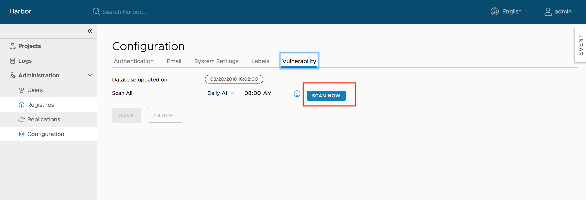

# Scan All Images

In addition to scanning individual images in projects, you can run global scans on all of the images in a Harbor instance, across all projects.

1. Log in to the Harbor interface with an account that has Harbor system administrator privileges.
1. Expand **Administration**, and select **Interrogation Services**. 
1. Select the **Vulnerability** tab and click **Scan Now** to scan all of the images in all projects.

   
   
Scanning requires intensive resource consumption. If scanning is in progress, the **Scan Now** button is unavailable.
