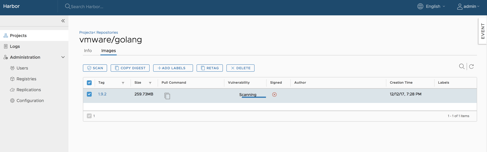
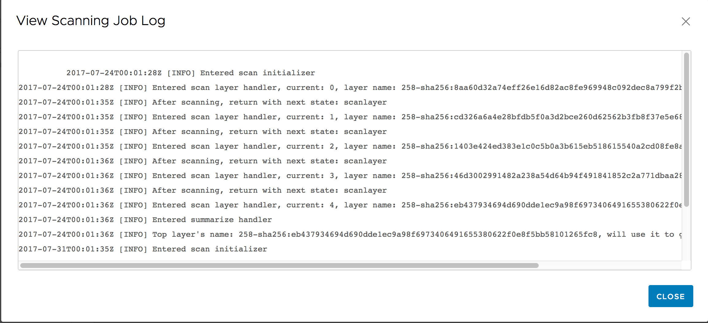
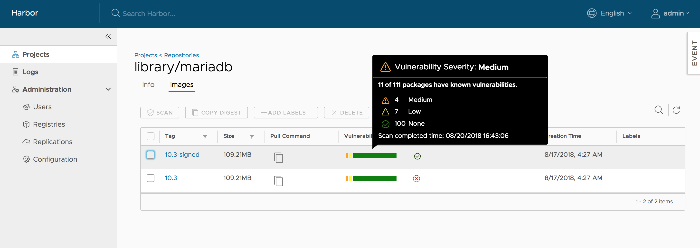
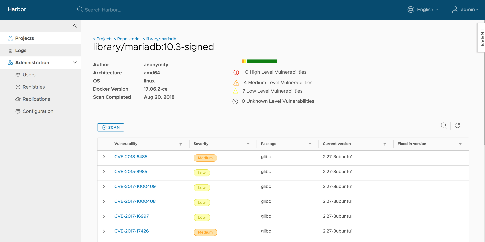

# Scan an Individual Image

Enter your project, select the repository. For each tag there will be an 'Vulnerability' column to display vulnerability scanning status and related information. You can select the image and click the "SCAN" button to trigger the vulnerability scan process. 

**NOTES: Only the users with 'Project Admin' role have the privilege to launch the analysis process.**

The analysis process may have the following status that are indicated in the 'Vulnerability' column:
* **Not Scanned:** The tag has never been scanned.
* **Queued:** The scanning task is scheduled but not executed yet.
* **Scanning:** The scanning process is in progress.
* **Error:** The scanning process failed to complete.
* **Complete:** The scanning process was successfully completed.

For the **'Not Scanned'** and **'Queued'** statuses, a text label with status information is shown. For the **'Scanning'**, a progress bar will be displayed.
If an error occurred, you can click on the **'View Log'** link to view the related logs.

If the process was successfully completed, a result bar is created. The width of the different colored sections indicates the percentage of features with vulnerabilities for a particular severity level.
* **Red:** **High** level of vulnerabilities
* **Orange:** **Medium** level of vulnerabilities
* **Yellow:** **Low** level of vulnerabilities
* **Grey:** **Unknown** level of vulnerabilities
* **Green:** **No** vulnerabilities

Move the cursor over the bar, a tooltip with summary report will be displayed. Besides showing the total number of features with vulnerabilities and the total number of features in the scanned image tag, the report also lists the counts of features with vulnerabilities of different severity levels. The completion time of the last analysis process is shown at the bottom of the tooltip.

Click on the tag name link, the detail page will be opened. Besides the information about the tag, all the vulnerabilities found in the last analysis process will be listed with the related information. You can order or filter the list by columns.

**NOTES: You can initiate the vulnerability analysis for a tag at anytime you want as long as the status is not 'Queued' or 'Scanning'.** 