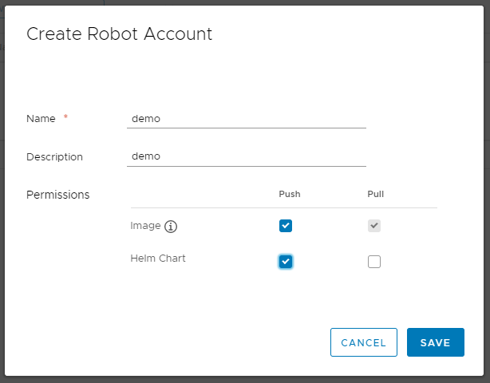

# Create Robot Accounts

Robot Accounts are accounts created by project admins that are intended for automated operations. They have the following limitations:

1, Robot Accounts cannot login Harbor portal
2, Robot Accounts can only perform operations by using the Docker and Helm CLIs.

### Add a Robot Account
If you are a project admin, you can create a Robot Account by clicking "New Robot Account" in the `Robot Accounts` tab of a project, and enter a name, a description, and grant permission to the account to push and pull images and Helm charts.




> **NOTE:** The name will become `robot$<accountname>` and will be used to distinguish a robot account from a normal harbor user.


As Harbor doesn't store your account token, please make sure to copy it in the pop up dialog after creating, otherwise, there is no way to get it from Harbor.

### Configure duration of robot account
If you are a system admin, you can configure the robot account token duration in days. 


### Authenticate with a robot account
To authenticate with a Robot Account, use `docker login` as below,

```
docker login harbor.io
Username: robot$accountname
Password: Thepasswordgeneratedbyprojectadmin
```

### Disable a robot account
If you are a project admin, you can disable a Robot Account by clicking "Disable Account" in the `Robot Accounts` tab of a project.


### Delete a robot account
If you are a project admin, you can delete a Robot Account by clicking "Delete" in the `Robot Accounts` tab of a project.
