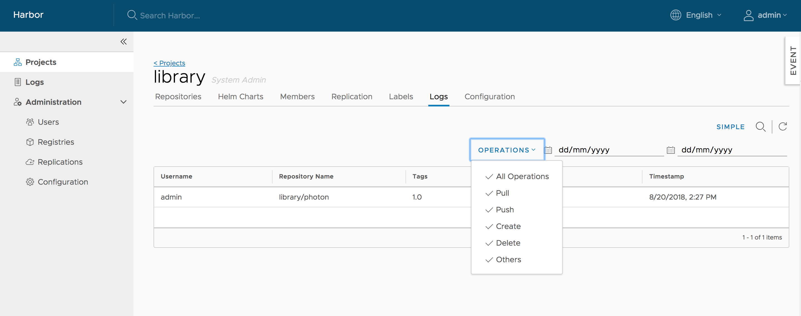
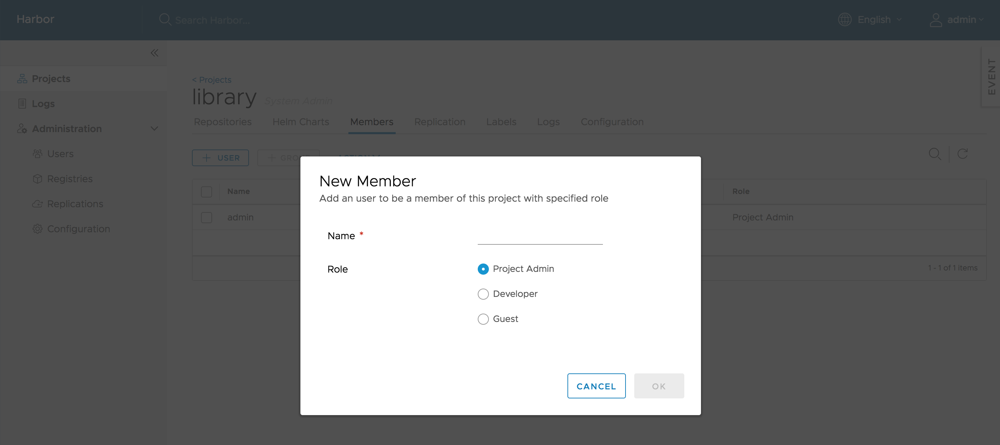
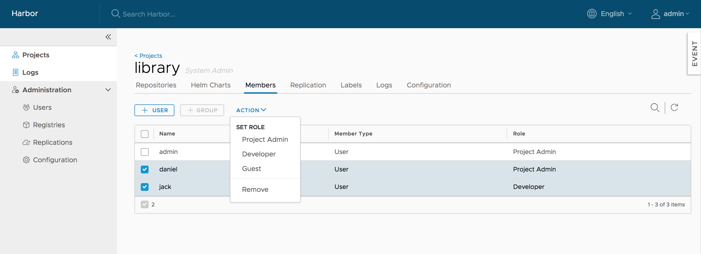

# Managing projects
A project in Harbor contains all repositories of an application. No images can be pushed to Harbor before the project is created. RBAC is applied to a project. There are two types of projects in Harbor:  

* **Public**: All users have the read privilege to a public project, it's convenient for you to share some repositories with others in this way.
* **Private**: A private project can only be accessed by users with proper privileges.  

You can create a project after you signed in. Check on the "Access Level" checkbox will make this project public.  

  

After the project is created, you can browse repositories, members, logs, replication and configuration using the navigation tab.

There are two views to show repositories, list view and card view, you can switch between them by clicking the corresponding icon.

All logs can be listed by clicking "Logs". You can apply a filter by username, or operations and dates under "Advanced Search".  

  

Project properties can be changed by clicking "Configuration".

* To make all repositories under the project accessible to everyone, select the `Public` checkbox.

* To prevent un-signed images under the project from being pulled, select the `Enable content trust` checkbox.

* To prevent vulnerable images under the project from being pulled, select the `Prevent vulnerable images from running` checkbox and change the severity level of vulnerabilities. Images cannot be pulled if their level equals to or higher than the currently selected level.

* To activate an immediate vulnerability scan on new images that are pushed to the project, select the `Automatically scan images on push` checkbox.

 

## Managing members of a project  
### Adding members  
You can add members with different roles to an existing project. You can add a LDAP/AD user to project members under LDAP/AD authentication mode. 

### Updating and removing members
You can check one or more members, then click `ACTION`, choose one role to batch switch checked members' roles or remove them from the project.

## Searching projects and repositories
Entering a keyword in the search field at the top lists all matching projects and repositories. The search result includes both public and private repositories you have access to.  

## Build history

Build history make it easy to see the contents of a container image, find the code which bulids an image, or locate the image for a source repository.

In Harbor portal, enter your project, select the repository, click on the link of tag name you'd like to see its build history, the detail page will be opened. Then switch to `Build History` tab, you can see the build history information.

