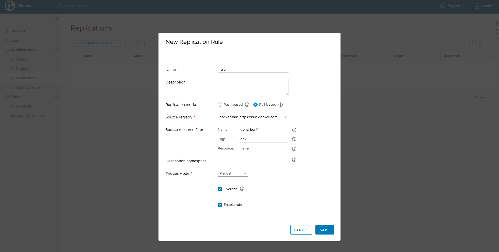
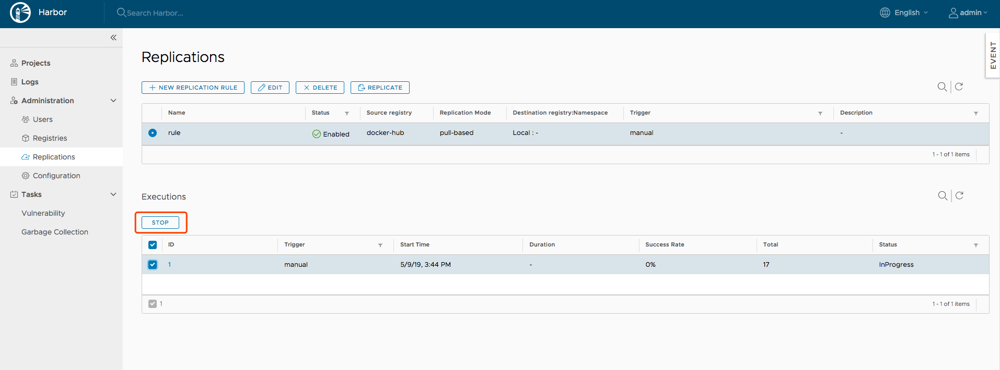

# Replicating Resources  
Replication allows users to replicate resources (images/charts) between Harbor and non-Harbor registries in both pull or push mode. 

Once the system administrator has set a rule, all resources that match the defined [filter](#resource-filter) patterns will be replicated to the destination registry when the [triggering condition](#trigger-mode) is matched. Each resource will start a task to run. If the namespace does not exist on the destination registry, a new namespace will be created automatically. If it already exists and the user configured in the policy has no write privilege to it, the process will fail. The member information will not be replicated.  

There may be a bit of delay during replication based on the situation of the network. If a replication task fails, it will be re-scheduled a few minutes later and retried times.  

**Note:** Due to API changes, replication between different versions of Harbor is not supported.

### Creating replication endpoints

To replicate image repositories from one instance of Harbor to another Harbor or non-Harbor registry, you first create replication endpoints.

1. Go to **Registries** and click the **+ New Endpoint** button.

   
1. For **Provider**, use the drop-down menu to select the type of registry to set up as a replication endpoint.

   The endpoint can be another Harbor instance, or a non-Harbor registry. Currently, the following non-Harbor registries are supported:

   - Docker Hub
   - Docker registry
   - AWS Elastic Container Registry
   - Azure Container Registry
   - Ali Cloud Container Registry
   - Google Container Registry
   - Huawei SWR
   - Helm Hub

   

1. Enter a suitable name and description for the new replication endpoint.
1. Enter the full URL of the registry to set up as a replication endpoint.

   For example, to replicate to another Harbor instance, enter https://harbor_instance_address:443. The registry must exist and be running before you create the endpoint.
1. Enter the Access ID and Access Secret for the endpoint registry instance.

   Use an account that has the appropriate privileges on that registry, or an account that has write permission on the corresponding project in a Harbor  registry.
   
   **NOTES**: 
    - AWS ECR adapters should use access keys, not a username and password. The access key should have sufficient permissions, such as storage permission.
    - Google GCR adapters should use the entire JSON key generated in the service account. The namespace should start with the project ID.
1. Optionally, select the **Verify Remote Cert** check box.

    Deselect the check box if the remote registry uses a self-signed or untrusted certificate.
1. Click **Test Connection**.
1. When you have successfully tested the connection, click **OK**.

### Creating a replication rule
Login as a system administrator user, click `NEW REPLICATION RULE` under `Administration->Replications` and fill in the necessary fields. You can choose different replication modes, [resource filters](#resource-filter) and [trigger modes](#trigger-mode) according to the different requirements. If there is no endpoint available in the list, follow the instructions in the [Creating replication endpoints](#creating-replication-endpoints) to create one. Click `SAVE` to create a replication rule.  

#### Resource filter
Three resource filters are supported:
* **Name**: Filter resources according to the name.
* **Tag**: Filter resources according to the tag.
* **Resource**: Filter images according to the resource type.

The terms supported in the pattern used by name filter and tag filter are as follows:
* **\***: Matches any sequence of non-separator characters `/`.
* **\*\***: Matches any sequence of characters, including path separators `/`.
* **?**: Matches any single non-separator character `/`.
* **{alt1,...}**: Matches a sequence of characters if one of the comma-separated alternatives matches.

**Note:** `library` must be added if you want to replicate the official images of Docker Hub. For example, `library/hello-world` matches the official hello-world images.  

Pattern | String(Match or not)
---------- | -------
`library/*`      | `library/hello-world`(Y)  `library/my/hello-world`(N)
`library/**`     | `library/hello-world`(Y)  `library/my/hello-world`(Y)
`{library,goharbor}/**` | `library/hello-world`(Y)  `goharbor/harbor-core`(Y)  `google/hello-world`(N)
`1.?`      | `1.0`(Y)  `1.01`(N)

#### Trigger mode
* **Manual**: Replicate the resources manually when needed. **Note**: The deletion operations are not replicated. 
* **Scheduled**: Replicate the resources periodically. **Note**: The deletion operations are not replicated. 
* **Event Based**: When a new resource is pushed to the project, it is replicated to the remote registry immediately. Same to the deletion operation if the `Delete remote resources when locally deleted` checkbox is selected.

### Starting a replication manually
Select a replication rule and click `REPLICATE`, the resources which the rule is applied to will be replicated from the source registry to the destination immediately.  

### Listing and stopping replication executions
Click a rule, the execution records which belong to this rule will be listed. Each record represents the summary of one execution of the rule. Click `STOP` to stop the executions which are in progress.  

### Listing tasks
Click the ID of one execution, you can get the execution summary and the task list. Click the log icon can get the detail information for the replication progress.  
**Note**: The count of `IN PROGRESS` status in the summary includes both `Pending` and `In Progress` tasks.  

### Deleting the replication rule
Select the replication rule and click `DELETE` to delete it. Only rules which have no in progress executions can be deleted.  

