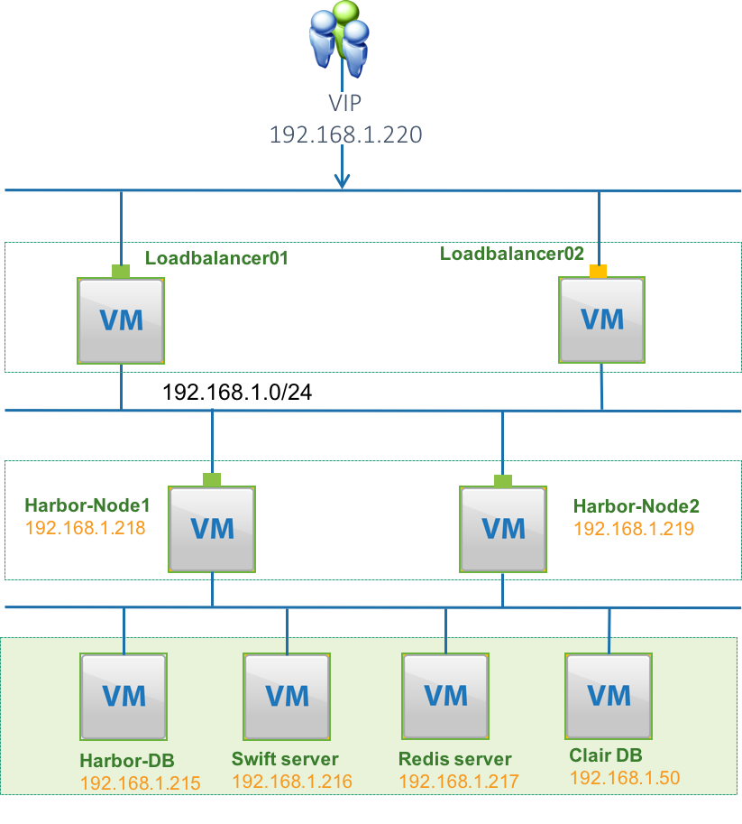

# Harbor High Availability Guide 

## Abstract 

This guide describes how to install and configure Harbor for high availability. It supplements the Installation Guides and assumes that you are familiar with the material in those guides. 

**Important!** 

This guide was last updated as of the Harbor 1.4 release. It will not apply to releases before 1.4. We advise that you read this at your own discretion when planning on your Harbor high availability implementation.  

This guide is intended as advice only. It doesn't support Notary(Content trust functionality) for now. 

## Contents 

**Notices** 

Notices take these forms: 

**Note!**: A comment with additional information that explains a part of the text. 

**Important!**: Something you must be aware of before proceeding. 

**Tip!**: An extra but helpful piece of practical advice. 

**Caution!**: Helpful information that prevents the user from making mistakes. 

**Warning!**: Critical information about the risk of data loss or security issues. 

## Harbor High Availability Introduction 

This document discusses some common methods of implementing highly available systems, with an emphasis on the core Harbor services and other open source services that are closely aligned with Harbor. 

You will need to address high availability concerns for any applications software that you run on your Harbor environment. The important thing is to make sure that your services are redundant and available. How you achieve that is up to you. 

### Stateless service 
To make a stateless service highly available, you need to provide redundant instances and load balance them. Harbor services that are stateless include: 
 - Adminserver
 - UI
 - Registry
 - Logs
 - Jobservice
 - Clair
 - Proxy 

### Stateful service 

Stateful services are more difficult to manage. Providing additional instances and load balancing does not solve the problem. Harbor services that are stateful include the follow services:
 - Harbor database(MariaDB)
 - Clair database(PostgresSQL)
 - Notary database(MariaDB)
 - Redis
Making those services highly available can depend the high available implementation for each application. 

## High Availability Architecture 

Again, this architecture is for advice only. 

As seen in the figure, components involved in the architecture are: 
 
**VIP**: Virtual IP. The Harbor user will access Harbor through this virtual IP address. This VIP will only active on one load balancer node at the same time. It will automatically switch to the other node if the active loadbalancer node is down. 

**LoadBalancer 01 and 02**: They together compose as a group which avoid single point failure of load balancer nodes. Keepalived is installed on both load balancer nodes. The two Keepalived instance will form a VRRP group to provide the VIP and ensure the VIP only shows on one node at the same time. The LVS component in Keepalived is responsible for balance the requests between different Harbor servers according to the routing algorithm.  

**Harbor server 1..n**: These are the running Harbor instances. They are in active-active mode. User can setup multiple nodes according to their workload. 

**Harbor DB cluster**: The MariaDB is used by Harbor to store user authentication information, image metadata information and so on. User should follow its best practice to make it HA protected. 

**Clair DB cluster**: The PostgreSQL is used by Clair to store the vulnerability data which will be used by scanning the images. User should follow it's best practice to make it HA protected 

**Shared Storage**: The shared storage is used for storing Docker Volumes used by Harbor. Images pushed by users are actually stored in this shared storage. The shared storage makes sure that multiple Harbor instances have consistent storage backend. Shared Storages can be Swift, NFS, S3, azure, GCS Ceph or OSS. User should follow its best practice to make it HA protected. 

**Redis**: The purpose of having Redis is to store UI session data and store the registry metadata cache. When one Harbor instance fails or the load balancer routes a user request to another Harbor instance, any Harbor instance can query the Redis to retrieve session information to make sure the end-user has a continued session. User should follow the best practice of Redis to make it HA protected.  

From the above high availability architecture, we can see that we don't setup LB per stateless services. Instead we group those stateless service as a group. The communicate between each services are protected by host based docker network with isolation. **Please Note!** As the component communicate with each other through rest API. You can always define the group granularity according to your use scenarios. 

### Limitation 

Currently Harbor doesn’t support Notary in HA scenario. Which means Content trust functionality is not supported in this HA setup. 

## Setup 

Follow the setup instruction in this section we build a Harbor high availability deployment as the follow figure shows. You can setup more Harbor nodes if needed. 



### Prerequisites 

 - 1> MariaDB cluster(Harbor-DB,192.168.1.215, currently Harbor use MariaDB 10.2.10) 
 - 2> Shared Storage (Swift Server. 192.168.1.216. **Important!** The shared storage is replaceable you can choose other shared storage, just need to make sure the storage you used is supported by registry https://docs.docker.com/registry/storage-drivers) 
 - 3> Redis cluster(192.168.1.217)
 - 4> PostgreSQL (Clair DB 192.168.1.50. Note! The PostgreSQL is optional, it only needed when you use the vulnerability scanning function, currently harbor use PostgreSQL 9.6.5) 

**Important!** Item 1,2,3,4 are considered external components to Harbor. Before configuring Harbor HA, we assume these components are present and all of them are HA protected. Otherwise, any of these components can be a single point of failure. 

**Tips!**

If you are only setting up the HA for POC purpose. You can use docker to run MariaDB, Redis and PostgreSQL in one OS with follow command. 
```
#> docker run --name redis-server -p 6379:6379 -d redis 
#> docker run -d --restart=always -e MYSQL_ROOT_PASSWORD=root123 -v /data/database:/var/lib/mysql:z -p 3306:3306 --name mariadb vmware/mariadb-photon:10.2.10 
#> docker run -d -e POSTGRES_PASSWORD="password" -p 5432:5432 postgres:9.6 
```
 - 5> 2 VMs for Load balancer cluster. 
 - 6> n VMs for Harbor stateless services (n >=2), in this example we will set up 2 Harbor nodes.     
 - 7> n+1 static IPs (1 for VIP and the other n IPs will be used by Harbor stateless servers)  

### Load balancer setup 

Here we will use Ubuntu16.04 LTS as the Load balancer cluster server. You can choose other Linux OS if needed. 


#### On Loadbalancer01: 

 - 1> install the Keepalived application.

```
    #> apt-get install keepalived curl
```

 - 2> Config Keepalived

Save the configuration file sample 
https://github.com/vmware/harbor/blob/master/make/ha/sample/active_active/keepalived_active_active.conf 

to  

```/etc/keepalived/keepalived.conf```

    
**Important!**:  

You need to change the **<change_to_VIP_address>** to the real IP address.(There are two place.) 

Change **harbor_node1_IP** (Two places) and **harbor_node2_IP** (Two places)to the real harbor nodes IPs. 

If you have more than two nodes then please add more real_server definitions in the keepalived.conf 

 - 3> Save the server [health check](https://github.com/vmware/harbor/blob/master/make/ha/sample/active_active/check.sh) script to ```/usr/local/bin/check.sh```
 
 run ```chmod +x /usr/local/bin/check.sh``` to give the file execute privilege.

 - 4> Enable ip forward
 
```
add the follow two lines to /etc/sysctl.conf

net.ipv4.ip_forward = 1
net.ipv4.ip_nonlocal_bind = 1

run the follow command to apply the change.

#>sysctl -p

```

 - 5> Restart the Keepalived service to make the change take affect.  

```
#>systemctl restart keepalived
```

#### On Loadbalancer02: 

Follow the same steps 1 to 5 as Loadbalancer01 list, only change the ```priority``` to 20 in the /etc/keepalived/keepalived.conf in step 2.  The higher number will get the VIP address.  

#### Harbor node 1 setup 
 - 1> Download harbor offline package from GitHub to you home directory 
 - 2> Extract the harbor-offline-installer-v.x.x.x.tgz You will get a folder ```harbor``` in the current directory 
 - 3> cd to ```harbor``` directory 
 - 4> Edit the ```harbor.cfg``` file 
 - 5> Edit the hostname = reg.mydomain.com , change reg.mydomain.com to your FQDN or VIP(eg. 192.168.111.220)
 - 6> Edit the ```db_host``` to point to the external db host IP/FQDN (eg. 192.168.1.215)
 - 7> Edit the ```db_password``` to the password of the external DB 
 - 8> Edit the ```db_user``` to the user of the external DB
 - 9> Edit the ```db_port``` to the port of the external DB
 - 10> Edit the ```redis_url``` to the redis server or cluster address (eg. 192.168.1.217:6379)
 - 11> Edit the ```clair_db_host```, ```clair_db_port```, ```clair_db_username```, ```clair_db_password```, ```clair_db``` 
 - 12> Edit the ```registry_storage_provider_name``` and its related settings ```registry_storage_provider_config``` 
You can find the configure examples for all kinds of storages at https://docs.docker.com/registry/configuration/#storage .  
For example if you use swift as the storage backend then you need to set the follow:

```
registry_storage_provider_name = swift
registry_storage_provider_config = username: yourusername,password: yourpass,authurl: http://192.168.1.217/identity/v3,tenant: admin,domain: default,region: RegionOne,container: docker_images
```

**Important!**

If you set ```filesystem``` for the ```registry_storage_provider_name``` you must make sure the registry directory ```/data/registry``` mount to a shared storage like NFS,Ceph, etc. You need to create the /data/registry directory first and change it's owner to 10000:10000 as registry will run as userID 10000 and groupID 10000. 

 - 13> Import Harbor database schema to your external MariaDB 
```
    Copy the ~/harbor/ha/registry.sql file to a machine that has MariaDB client installed 
    #> mysql -u your_db_username -p -h your_db_ip < registry.sql 
```
 -  14> (Optional) If you enable https, you need to prepare the certificate and key and copy them to ```/data/cert/``` directory(you need to create that folder if it not exist). 
 
 ```
 #>mkdir -p /data/cert
 #>cp server.crt /data/cert/
 #>cp server.key /data/cert/
 #>mkdir /data/ca_download
 #>cp ca.crt /data/ca_download/
 ```

If you want keep your own filename for the certificate, you need to modify the ssl_cert and ssl_cert_key properties in harbor.cfg. If you use a certificate that signed by a private CA then you need to put your CA file to the /data/ca_download/ca.crt

 -  15> Start the Harbor on the first node by run 
```
#>./install.sh --ha 
```
**Note!** 

If you want to use vulnerability scanning functionality. Then use the follow command instead

```
          #>./install.sh --ha --with-clair 
```

 - 16> Change iptables 

**Important!**

You need to change 192.168.1.220 to your VIP address before issue the follow command, if you just use http for Harbor, then you don't need run the second command.

```
#>iptables -t nat -A PREROUTING -p tcp -d 192.168.1.220 --dport 80 -j REDIRECT
#>iptables -t nat -A PREROUTING -p tcp -d 192.168.1.220 --dport 443 -j REDIRECT

```

 - 17> Zip the harbor directory 

```
#> tar -cvf harbor_ha.tar ~/harbor 
```

- 18> Copy the harbor_ha.tar to harbor_node2 

#### Harbor node 2…n setup 

 - 1> mv the harbor_ha.tar to your home directory on harbor_node2 
 - 2> Untar the harbor_ha.tar, you will get a “harbor” folder in your home directory. 
 - 3> Create certificate folder

 ```
 #> mkdir -p /data/cert
 #> mkdir -p /data/ca_download
 ```

 - 3> Start Harbor 
```
#> cd harbor  
#> ./install.sh --ha  
```
**Note!** 

If you enable vulnerability scanning then use 

```
#> ./install.sh --ha --with-clair 
```

 - 4> Change iptables

**Important!**

You need to change 192.168.1.220 to your VIP address before issue the follow command, if you just use http for Harbor, then you don't need to run the second command.

```
#>iptables -t nat -A PREROUTING -p tcp -d 192.168.1.220 --dport 80 -j REDIRECT
#>iptables -t nat -A PREROUTING -p tcp -d 192.168.1.220 --dport 443 -j REDIRECT
 
``` 

If you want to setup more harbor node, repeat step 1 to 4. The Keepalived configuration will also need to update in both loadbalancer servers.  

Now you can access harbor by http(s)://VIP 

## Known issue

1>https://github.com/vmware/harbor/issues/3919

Workaround:

 - For all Harbor servers, mount the /data/job_logs directory to a folder on NFS server.
 - Make sure the folder on the NFS server has read/write permission for UID:GroupID 10000:10000 
 - Restart jobservices container by ```docker harbor-jobservice restart``` on all Harbor servers.
