# Deploying Harbor from OVA

**Prerequisites**

- Download the build of the OVA installer from the **[official release](https://github.com/vmware/harbor/releases)** page. 
- Import the appliance to a vCenter Server instance. Deploying the appliance directly on an ESXi host is not supported. 
- The system requirements are as follows:
   - vCenter Server 6.0 or 6.5.
   - ESXi 6.0 or 6.5 for all hosts.
   - 2 vCPUs or more.
   - 8GB RAM or more.
   - At least 80GB free disk space on the datastore.
- Ensure that vCenter user has the following privileges:
   - Datastore > Allocate space
   - Datastore > Low level file Operations
   - Folder > Create Folder
   - Folder > Delete Folder
   - Network > Assign network
   - Resource > Assign virtual machine to resource pool
   - Virtual machine > Configuration > Add new disk
   - Virtual Machine > Configuration > Add existing disk
   - Virtual Machine > Configuration > Add or remove device
   - Virtual Machine > Configuration > Change CPU count
   - Virtual Machine > Configuration > Change resource
   - Virtual Machine > Configuration > Memory
   - Virtual Machine > Configuration > Modify device settings
   - Virtual Machine > Configuration > Remove disk
   - Virtual Machine > Configuration > Rename
   - Virtual Machine > Configuration > Settings
   - Virtual machine > Configuration > Advanced
   - Virtual Machine > Interaction > Power off
   - Virtual Machine > Interaction > Power on
   - Virtual Machine > Inventory > Create from existing
   - Virtual Machine > Inventory > Create new
   - Virtual Machine > Inventory > Remove
   - Virtual Machine > Provisioning > Clone virtual machine
   - Virtual Machine > Provisioning > Customize
   - Virtual Machine > Provisioning > Read customization specifications
   - vApp > Import
   - Profile-driven storage -> Profile-driven storage view
- Ensure that all vCenter Server instances and ESXi hosts in the environment in which you are deploying the appliance have network time protocol (NTP) running. Running NTP prevents problems arising from clock skew between Harbor and its clients.
- Use the Flex-based vSphere Web Client to deploy the appliance. You cannot deploy Harbor OVA file from the HTML5 vSphere Client or from the legacy Windows client.

**Procedure**
1. In the vSphere Web Client, right-click a host in the vCenter Server inventory, select **Deploy OVF template**
   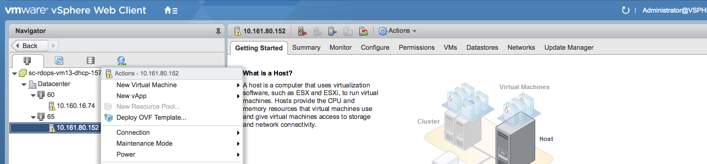
2. Select template: navigate to the OVA file or input the URL of the ova file in URL field.
   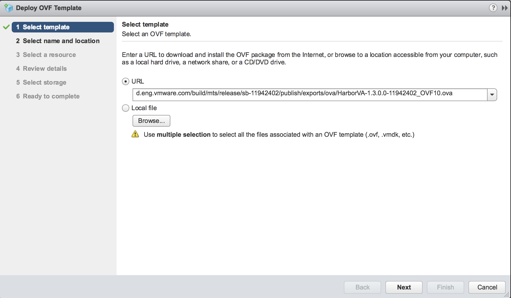
3. Follow the installer prompts to perform basic configuration of the appliance and to select the vSphere resources for it to use. 
    - Accept or modify the appliance name.
    - Select the destination datacenter or folder:
    
    - Select the destination host, cluster, or resource pool:
    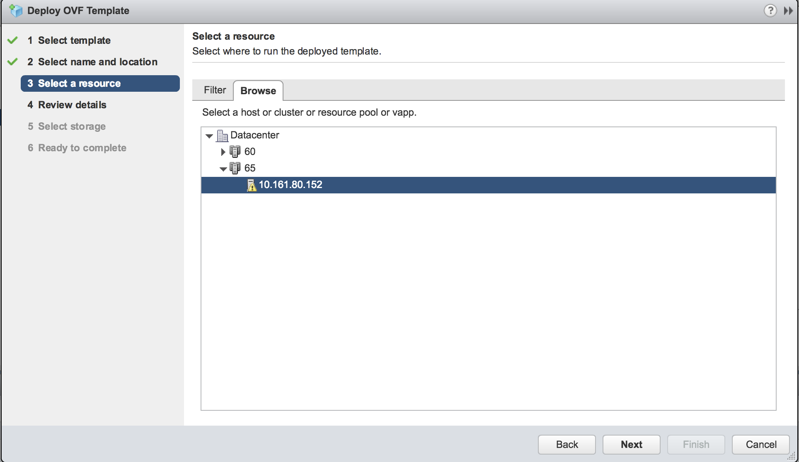
    - Select the disk format and the destination datastore:
    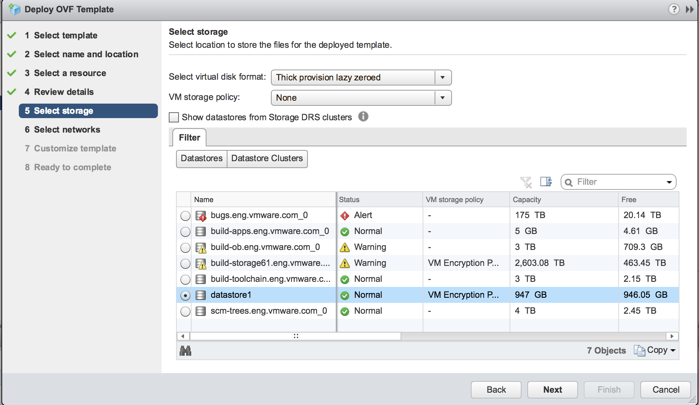
    - Select the network that the appliance connects to:
    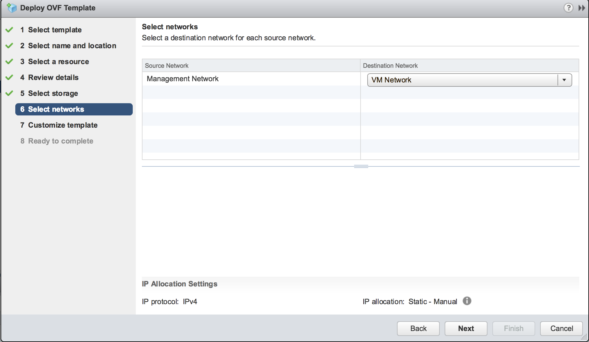

4. On the **Customize template** page, configure Harbor’s SSL certificates. There are two options for SSL: auto-generated certificate and customized certificate.
    - Auto-generated certificate. Leave blank the fields of CA Certificate, Server Certificate and Server Key. Go to Step 5.
    - Customized certificate. If you need to customize Harbor CA Certificate, Server Certificate and Server Key, copy and paste in the content of those files into the corresponding text boxes. Remember to include all content of the files. Because the Harbor OVA is launched with Full Qualified Domain Name (FQDN), the certificate should be generated with FQDN of the host. The host should be configured with the same FQDN in Step 7.
    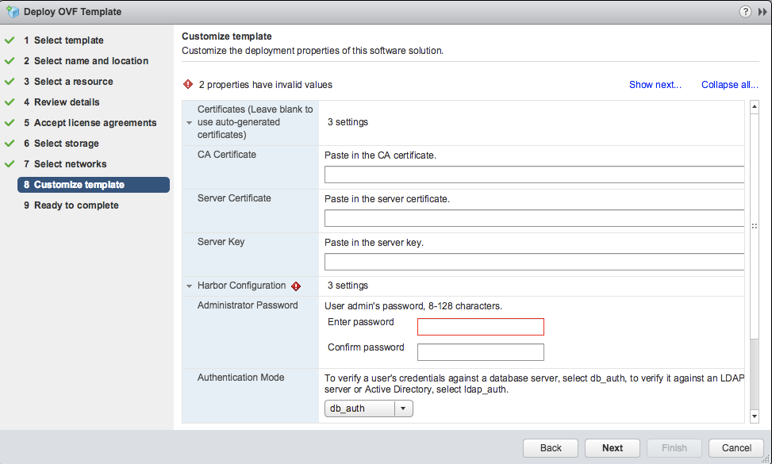

5. In the section of Harbor Configuration, select the Authentication Mode and set the Administrator Password. If Authentication Mode is set to ldap_auth, LDAP configuration in the next section is required. **Note:** The ldap_auth mode is for both LDAP server and Active Directory.
    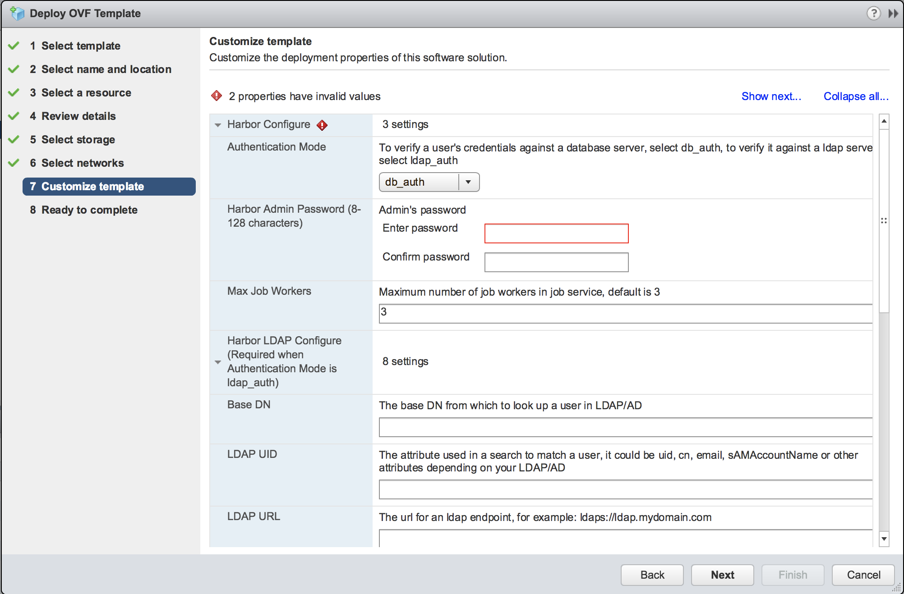
    If the Authentication Mode is set to ldap_auth, you need to configure Harbor's LDAP settings:
    - LDAP Base DN: The base DN to look up users.
    - LDAP UID: The attribute to match a user, such as uid, cn, email or other attributes.
    - LDAP URL: The URL for LDAP endpoint.
    - Search DN: The user's DN who has the permission to search the LDAP server.
    - Search DN Password: The password for search DN.
    - Search Filter: The filter to search users.
    - Search Scope: The scope to search users.
    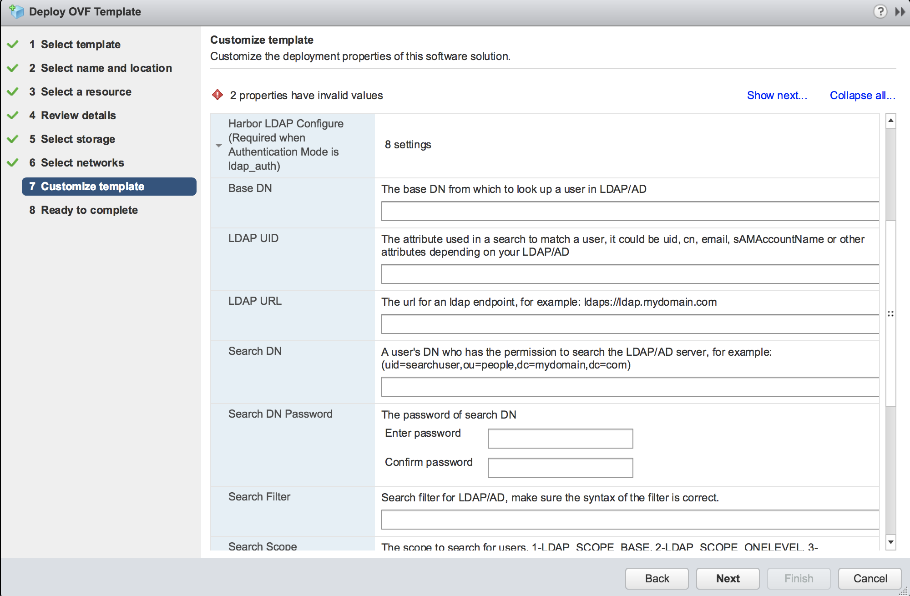
    Refer to **[Harbor's Installation Guide](installation_guide.md)** for more information about these settings.

6. On the **Customize template** page, under **System**, set the root password for the appliance VM and the option for **Permit Root Login**.

    Setting the root password for the appliance is mandatory. 

    - If you want to have SSH access to the Harbor appliance for troubleshooting, set **Permit Root Login** to true.
    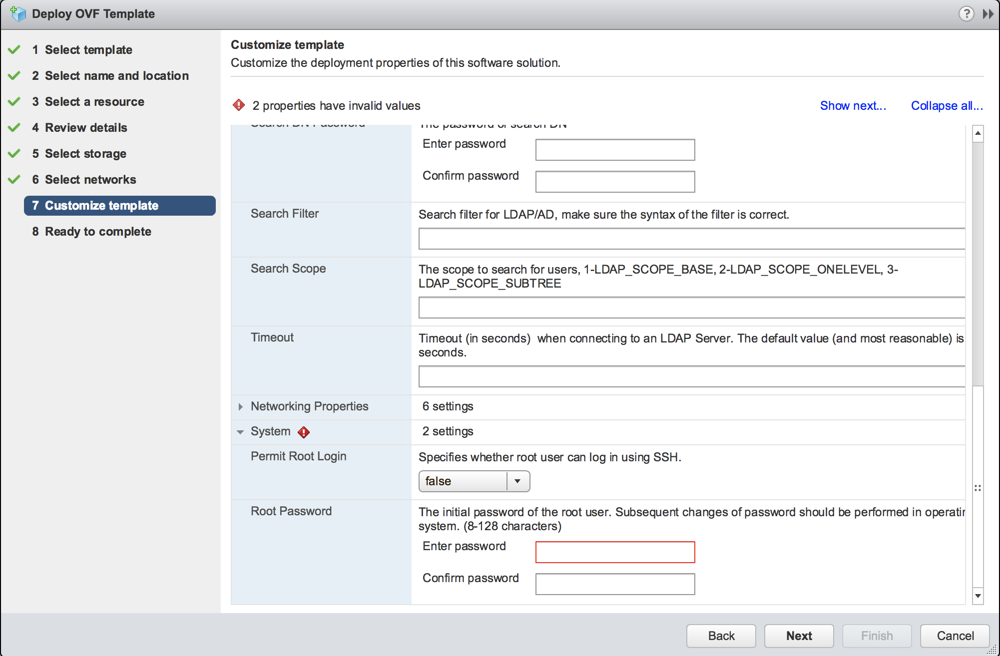

7. Expand **Networking Properties** and optionally configure a static IP address for the appliance VM. 

   - To use DHCP, leave the **Networking Properties** blank.
   - If a customized SSL certificate is configured, you need to configure Domain Name the same as the FQDN of the certificate in Step 4.
    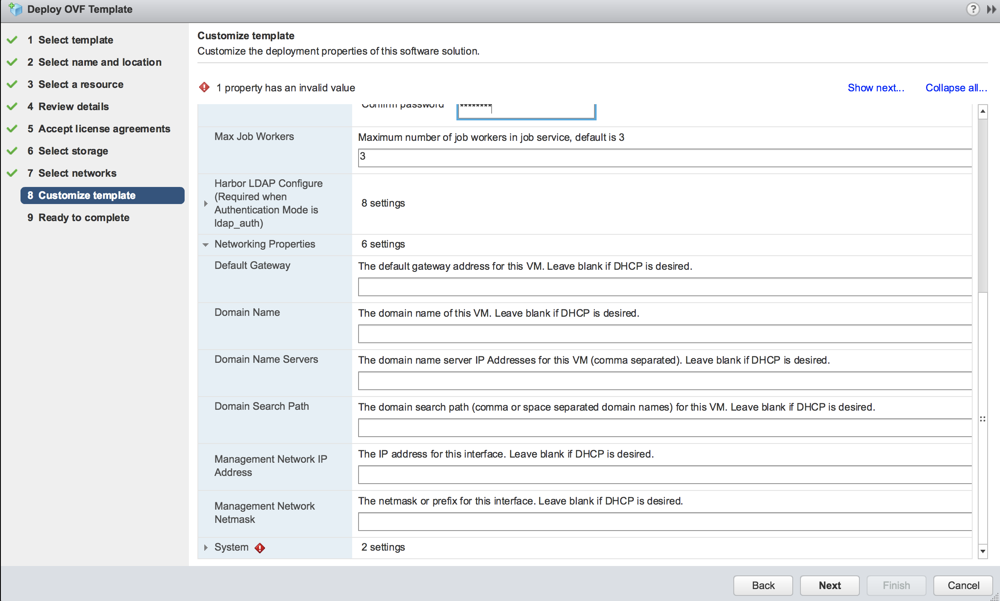
    **IMPORTANT**: If you set a static IP address for the appliance, use spaces to separate DNS servers. Do not use comma separation for DNS servers.

8. When the deployment completes, refresh the current page and power on the appliance VM. It will take several minutes after powering on as it needs to load Docker images. 

   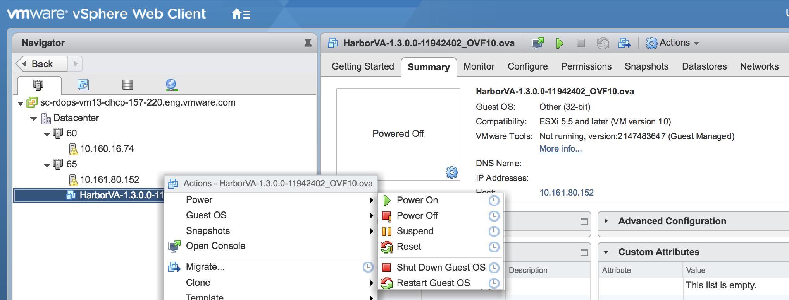

   Go to the **Summary** tab of the appliance VM and note the DNS Name.

9. (Optional) If you provided a static network configuration, view the network status of the appliance.

    1. In the **Summary** tab of the appliance VM, launch the VM console.
    2. In the VM console, press the right arrow key.

    The network status shows whether the network settings that you provided during the deployment match the settings with which the appliance is running. If there are mismatches, power off the appliance and select **Edit Settings** > **vApp Options** to correct the network settings.

10. In a browser, go to https://*&lt;DNS Name&gt;*. The *&lt;DNS Name&gt;* is noted in Step 7. When prompted, enter the username admin and the password of admin set in Step 4. 
   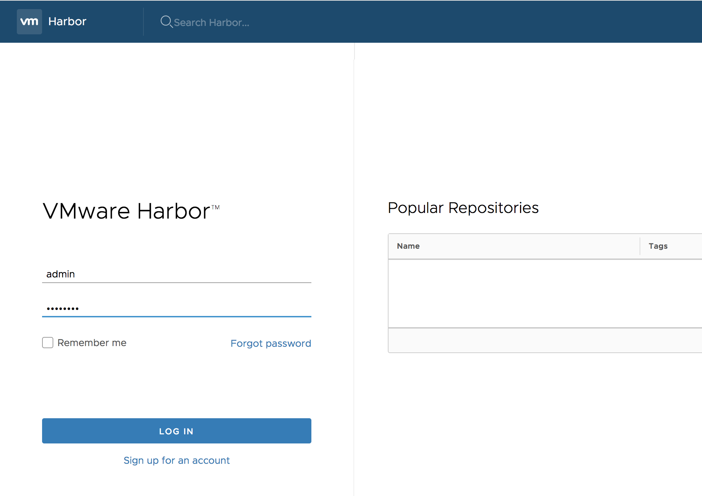

    If everything worked properly, you should see the administration console. Refer to **[Harbor User Guide](user_guide.md)** for how to use Harbor.

    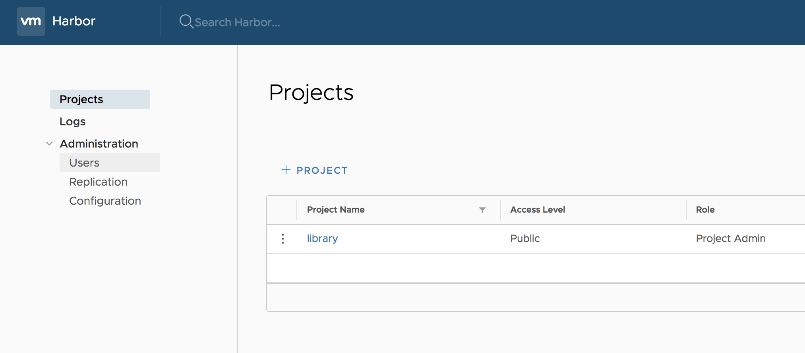

    To migrate Harbor OVA, please refer [migrate OVA guide](migrate_ova_guide.md)
  
    To extend the data disk in Harbor OVA, please refer [Expand the Hard Disk of Virtual Appliance](expand_hard_disk.md)

    Please run "tdnf distro-sync" command from time to time to keep the OS up to date.
