# Installing and Configuring Harbor on vSphere as Virtual Appliance

This guide walks you through the steps about installing and configuring Harbor on vSphere as an virtual appliance. If you are installing Harbor on a Linux host, refer to this **[Installation Guide](installation_guide.md)**.

## Prerequisites
* vCenter 5.5+ and at least an ESX host. 
* 2 vCPUs, 4GB memory and 80GB free disk space in datastore.
* A network with DHCP capability, or a static IP address for the virtual appliance.

## Planning for installation

### User management  
By default, Harbor stores user information in an internal database. Harbor can also be configured to authenticate against an external LDAP or AD server. For LDAP/AD authentication, the **Authentication Mode** property must be set to *ldap_auth* at the deployment time. 

**NOTE:** This mode cannot be changed after the first boot of Harbor.

### Security 

Harbor uses HTTPS for secure communication by default. A self-signed certificate is generated at first boot based on its FQDN (Fully Qualified Domain Name) or IP address. A Docker client or a VCH (Virtual Container Host) needs to trust the certificate of Harbor's CA (Certificate Authority) in order to interact with Harbor. 

Harbor always tries to generate a self-signed certificate based on its FQDN. Therefore, its IP address must have a FQDN associated with it in the DNS server. If Harbor cannot resolve its IP address to a FQDN, it generates the self-signed certificate using its IP address. In this case, Harbor can only be accessed by IP address. When Harbor's IP address or FQDN is changed, the self-signed certificate will be re-generated.  

Harbor's self-generated certificate can be replaced by supplying a certificate signed by other CAs in OVA's settings. 

Harbor can be configured to use plain HTTP for some environments such as testing and continuous integration (CI). However, it is **NOT** recommended to use HTTP for production because the communication is never secure.

### Networking

Harbor can obtain IP address by DHCP. This is convenient for testing purpose. For a production system, it is recommended that static IP address and FQDN be used.

For the purpose of generating a self-signed certificate, it is recommended that a DNS record be added to associate Harbor's IP address with a FQDN. This is necessary for both static IP address and dynamic IP address acquired from DHCP. If a DNS record is missing for Harbor's IP address, Harbor can only be accessed by its IP address.


## Installation
1. Download the OVA file to your local disk from the **[official release page](https://github.com/vmware/harbor/releases)**.  

2. Log in vSphere web client. Right click on the datacenter, cluster or host which Harbor will be deployed on. Select "Deploy OVF Template" and open the import wizard.  

 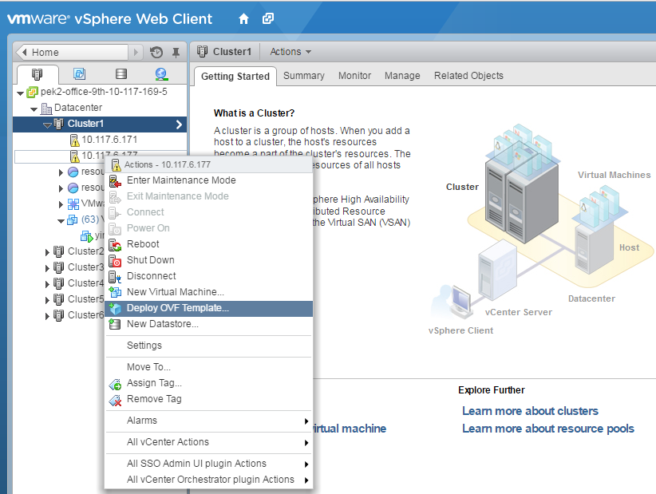

3. Select the OVA file from your local disk and click "Next".  

 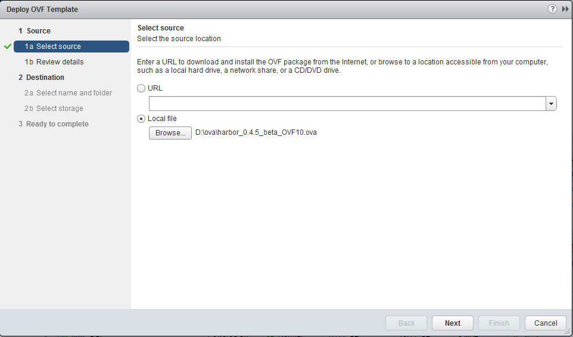

4. Review the OVF template details and click "Next".  

 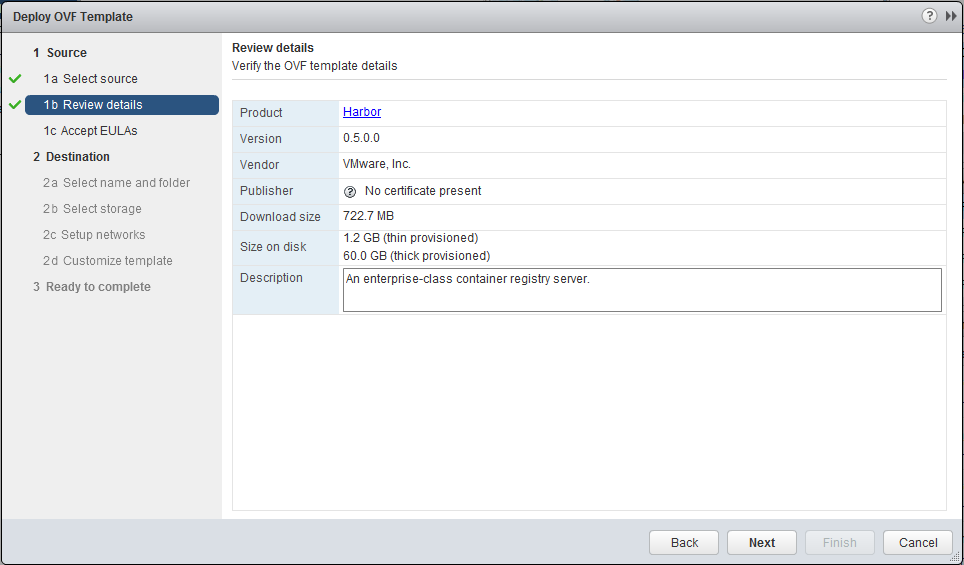

5. Accept the end user license agreements and click "Next".  

 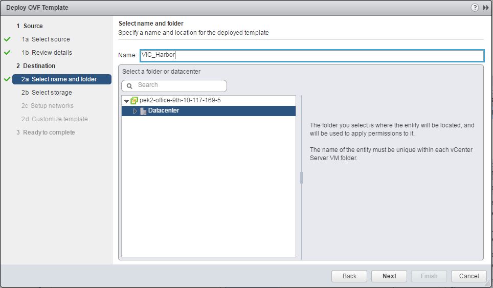

6. Specify a name and a location for the virtual appliance.  

 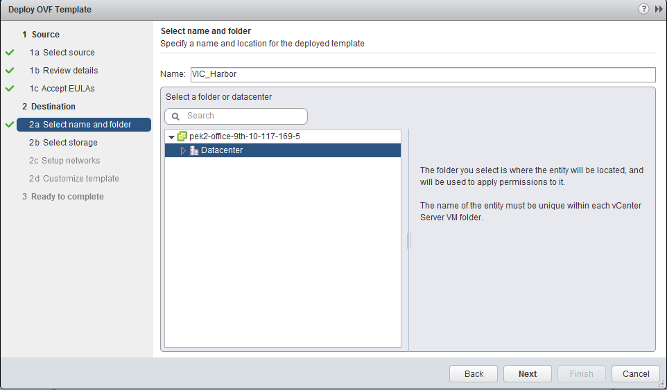

7. Select the datastore and virtual disk format, click "Next".  

 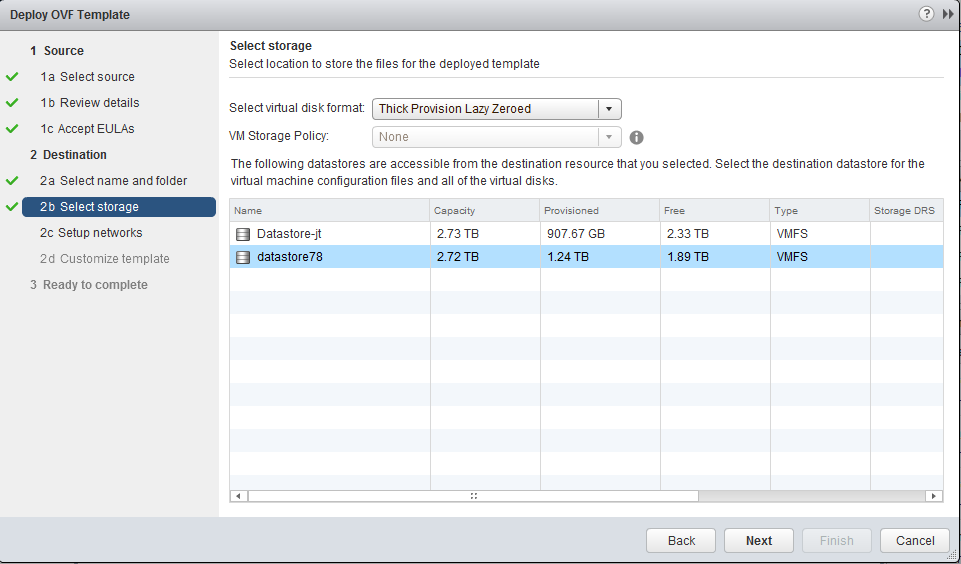

8. Configure the network(s) that the virtual appliance should be connected to.  

 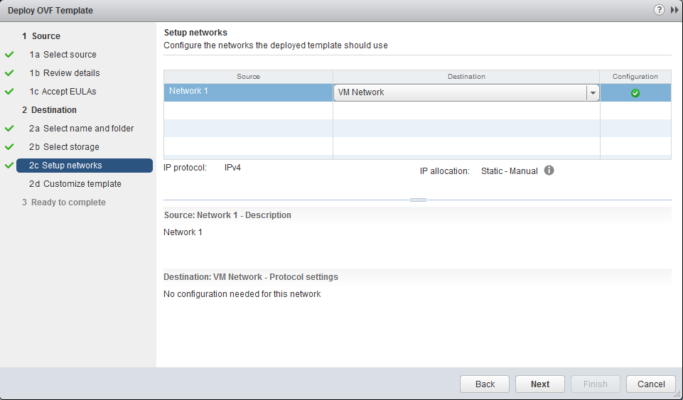

9. Customize the properties of Harbor. The properties are described below. Note that at the very least, you just need to set four properties: **Root Password**, **Harbor Admin Password**,  **Database Password** and **Authentication Mode**.  

 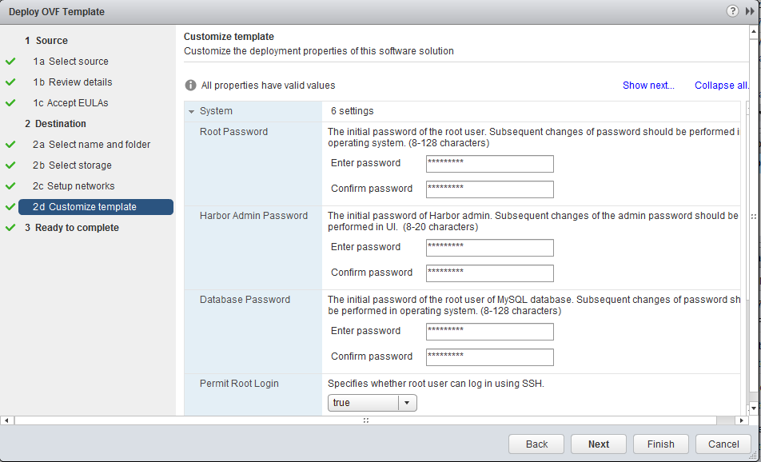

 * System
	* **Root Password**: The initial password of the root user. Subsequent changes of password should be performed in operating system. (8-128 characters)
	* **Harbor Admin Password**: The initial password of Harbor admin. It only works for the first time when Harbor starts. It has no effect after the first launch of Harbor. Change the admin password from UI after launching Harbor. 
	* **Database Password**: The initial password of the root user of MySQL database. Subsequent changes of password should be performed in operating system. (8-128 characters)
	* **Permit Root Login**: Specifies whether root user can log in using SSH.
	* **Self Registration**: Determine whether the self-registration is allowed or not. Set this to off to disable a user's self-registration in Harbor. This flag has no effect when users are stored in LDAP or AD.
	* **Garbage Collection**: When setting this to true, Harbor performs garbage collection everytime it boots up. The first time setting this flag to true needs to power off the VM and power it on again.

 * Authentication

    The **Authentication Mode** must be set before the first boot of Harbor. Subsequent changes to **Authentication Mode** do not have any effect. When **ldap_auth** mode is enabled, properties related to LDAP/AD must be set.
  
	* **Authentication Mode**: The default authentication mode is **db_auth**. Set it to **ldap_auth** when users' credentials are stored in an LDAP or AD server. Note: this option can only be set once.
	* **LDAP URL**: The URL of an LDAP/AD server.
	* **LDAP Search DN**: A user's DN who has the permission to search the LDAP/AD server. Leave blank if your LDAP/AD server supports anonymous search, otherwise you should configure this DN and **LDAP Seach Password**.
	* **LDAP Search Password**: The password of the user for LDAP search. Leave blank if your LDAP/AD server supports anonymous search.
	* **LDAP Base DN**: The base DN of a node from which to look up a user for authentication. The search scope includes subtree of the node.
	* **LDAP UID**: The attribute used in a search to match a user, it could be uid, cn, email, sAMAccountName or other attributes depending on your LDAP/AD server.

 * Security
 
    If HTTPS is enabled, a self-signed certificate is generated by default. To supply your own certificate, fill in two properties: **SSL Cert** and **SSL Cert Key**. Do not use HTTP in any production system.  **Notes:** If you want to enable HTTPS with your own self-signed certificate, refer to the "Getting a certificate" section of this **[guide](https://github.com/vmware/harbor/blob/master/docs/configure_https.md#getting-a-certificate)** for more details.  
 
	* **Protocol**: The protocol for accessing Harbor. Warning: setting it to http makes the communication insecure.
	* **SSL Cert**: Paste in the content of a certificate file. Leave blank for a generated self-signed certificate.
	* **SSL Cert Key**: Paste in the content of a certificate key file. Leave blank for a generated key.
	* **Verify Remote Cert**: Determine whether the image replication should verify the certificate of a remote Harbor registry. Set this flag to off when the remote registry uses a self-signed or untrusted certificate.

 * Email Settings
 
   To allow a user to reset his/her own password through email, configure the below email settings:
 
	* **Email Server**: The mail server to send out emails to reset password. 
	* **Email Server Port**: The port of mail server.
	* **Email Username**: The user from whom the password reset email is sent. Usually this is a system email address.
	* **Email Password**: The password of the user from whom the password reset email is sent.
	* **Email From**: The name of the email sender.
	* **Email SSL**: Whether to enabled secure mail transmission.

 * Networking properties
	* **Default Gateway**: The default gateway address for this VM. Leave blank if DHCP is desired.
	* **Domain Name**: The domain name of this VM. Run command `man resolv.conf` for more explanation. Leave blank if DHCP is desired or the domain name is not needed for static IP.
	* **Domain Search Path**: The domain search path(comma or space separated domain names) for this VM. Leave blank if DHCP is desired.
	* **Domain Name Servers**: The domain name server IP Address for this VM(comma separated). Leave blank if DHCP is desired.
	* **Network 1 IP Address**: The IP address of this interface. Leave blank if DHCP is desired.
	* **Network 1 Netmask**: The netmask or prefix for this interface. Leave blank if DHCP is desired.

 After you complete the properties, click "Next".  

10. Review your settings and click "Finish" to complete the deployment.  

 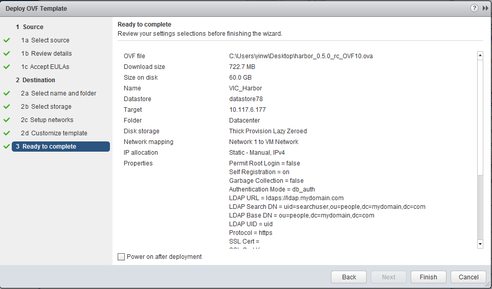

11. Power on the virtual appliance. It may take a few minutes for the first bootup. The virtual appliance needs to initialize itself for configuration like netowrk address and password. 

12. When the appliance is ready, check from vSphere Web Client for its IP address. Open a browser and type in the URL `http(s)://harbor_ip_address` or `http(s)://harbor_host_name`. Log in as the admin user and verify Harbor has been successfully installed. 

13. For information on how to use Harbor, please refer to [User Guide of Harbor](user_guide.md).

## Getting Certificate of Harbor's CA

By default, Harbor uses a self-signed certificate in HTTPS. A Docker client or a VCH needs to trust the certificate of Harbor's CA in order to interact with Harbor. 
To download the certificate of Harbor's CA and import into a Docker client, follow the below steps:

1. Log in Harbor's UI as an admin user.
2. Click on the admin's name at the upper left corner and select **"About"** from the drop-down menu. 
3. Click on the **Download** link to save the certificate file as `ca.crt`.
 
 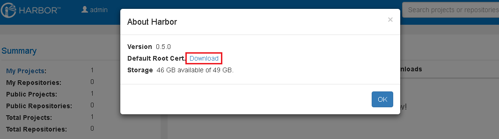
 
4. Copy the certificate file `ca.crt` to a Docker host. To access Harbor using its FQDN, run the below commands, replace `<Harbor_FQDN>` with the actual FQDN of the Harbor instance: 
   ```
     mkdir -p /etc/docker/certs.d/<Harbor_FQDN>
     cp ca.crt /etc/docker/certs.d/<Harbor_FQDN>/
   ```
   To access Harbor using its IP address, run the below commands, replace `<Harbor_IP>` with the actual IP address of the Harbor instance: 
   ```
     mkdir -p /etc/docker/certs.d/<Harbor_IP>
     cp ca.crt /etc/docker/certs.d/<Harbor_IP>/
   ```

   **Note:** If you run the above two sets of commands, Harbor can be accessed by both FQDN and IP address. 
   
5. Run `docker login` command to verify that HTTPS is working.

To import the CA's certificate into VCH, complete Step 1-3 and refer to VCH's document for instructions.

## Reconfiguration
If you want to change the properties of Harbor, follow the below steps:  

1. **Power off** Harbor's virtual appliance.  
2. Right click on the VM and select "Edit Settings".  

 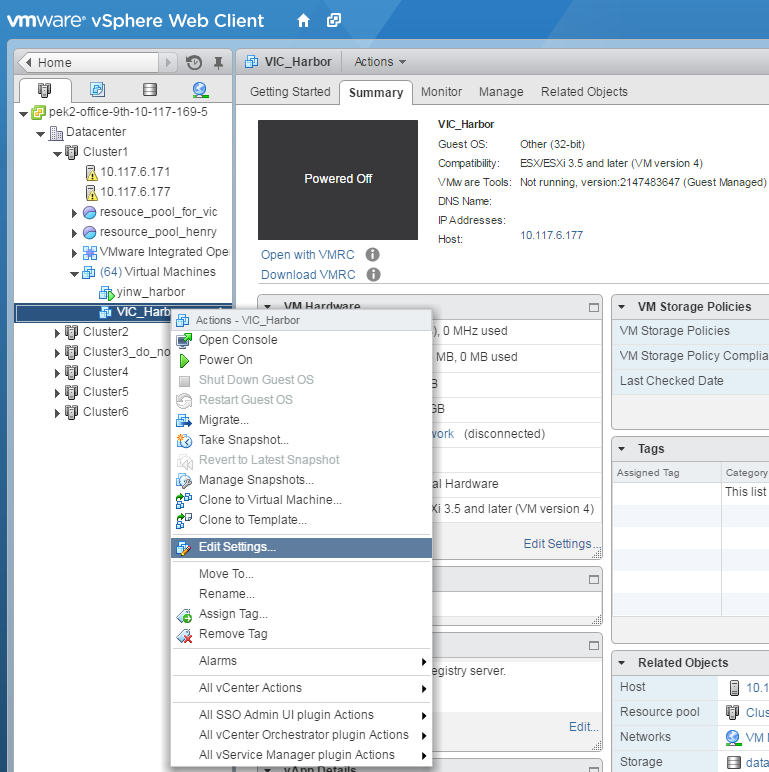

3. Click the "vApp Options" tab, update the properties and  click "OK".  

 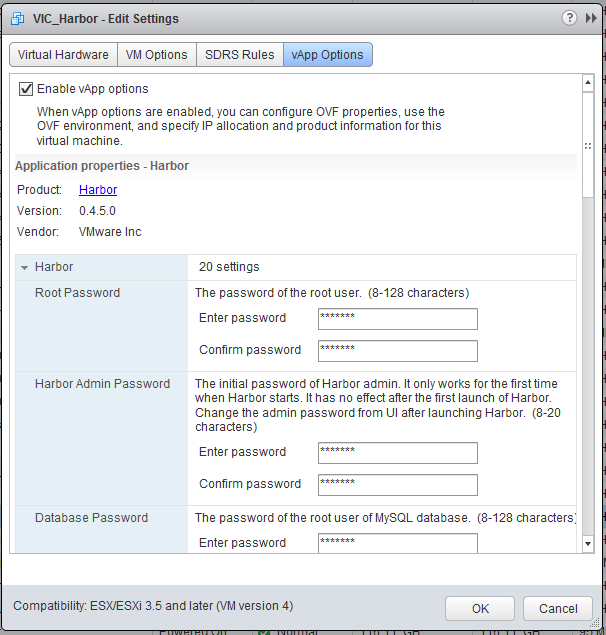

4. **Power on** the VM.  

**Notes:**  
1. The authentication mode can only be set once before the firtst boot. Subsequent modification of this option does not have any effect.  
2. The initial admin password, root password of the virtual appliance, MySQL root password, and all networking properties can not be modified using this method after Harbor's first launch. Modify them by the following approach:
 * **Harbor Admin Password**: Change it in Harbor admin portal.  
 * **Root Password of Virtual Appliance**: Change it by logging in the virtual appliance and doing it in the Linux operating system.  
 * **MySQL Root Password**: Change it by logging in the virtual appliance and doing it in the Linux operating system.  
 * **Networking Properties**: Visit `https://harbor_ip_address:5480`, log in with root/password of your virtual appliance and modify networking properties. Be sure to reboot the system after modification to ensure Harbor's self-signed certificate gets updated.  
 