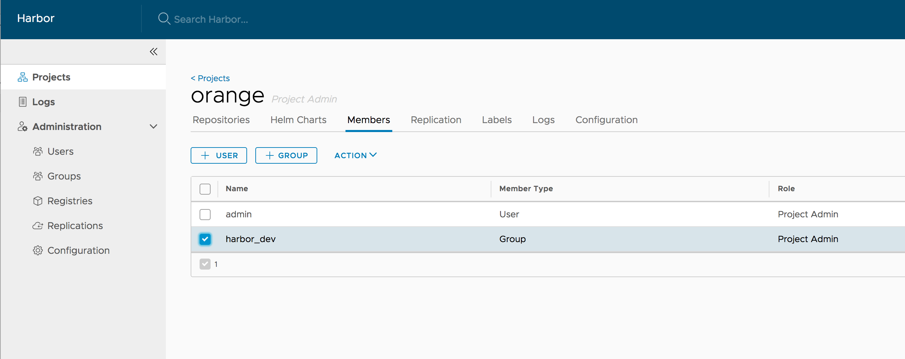

## Introduction

This guide provides instructions to manage roles by LDAP/AD group. You can import an LDAP/AD group to Harbor and assign project roles to it. All LDAP/AD users in this LDAP/AD group have assigned roles.

## Prerequisite

1. Harbor's auth_mode is ldap_auth and **[basic LDAP configure parameters](https://github.com/vmware/harbor/blob/master/docs/installation_guide.md#optional-parameters)** are configured.
1. Memberof overlay

    This feature requires the LDAP/AD server enabled the feature **memberof overlay**. 
    With this feature, the LDAP/AD user entity's attribute **memberof** is updated when the group entity's **member** attribute is updated. For example, adding or removing an LDAP/AD user from the LDAP/AD group.

    * OpenLDAP -- Refer this **[guide](https://technicalnotes.wordpress.com/2014/04/19/openldap-setup-with-memberof-overlay/)** to enable and verify **memberof overlay**
    * Active Directory -- this feature is enabled by default.

## Configure LDAP group settings

Besides **[basic LDAP configure parameters](https://github.com/vmware/harbor/blob/master/docs/installation_guide.md#optional-parameters)** , LDAP group related configure parameters should be configured, they can be configured before or after installation

  1. Configure LDAP parameters via API, refer to **[Config Harbor user settings by command line](configure_user_settings.md)**

For example:
```
curl -X PUT -u "<username>:<password>" -H "Content-Type: application/json" -ki https://harbor.sample.domain/api/configurations -d'{"ldap_group_basedn":"ou=groups,dc=example,dc=com"}'
```   
The following parameters are related to LDAP group configuration.
   * ldap_group_basedn -- The base DN from which to lookup a group in LDAP/AD, for example: ou=groups,dc=example,dc=com
   * ldap_group_filter -- The filter to search LDAP/AD group, for example: objectclass=groupOfNames 
   * ldap_group_gid    -- The attribute used to name an LDAP/AD group, for example: cn 
   * ldap_group_scope  -- The scope to search for LDAP/AD groups. 0-LDAP_SCOPE_BASE, 1-LDAP_SCOPE_ONELEVEL, 2-LDAP_SCOPE_SUBTREE 

  2. Or change configure parameter in web console after installation. Go to "Administration" -> "Configuration" -> "Authentication" and change following settings.
   - LDAP Group Base DN -- ldap_group_basedn in the Harbor user settings
   - LDAP Group Filter  -- ldap_group_filter in the Harbor user settings
   - LDAP Group GID     -- ldap_group_gid in the Harbor user settings
   - LDAP Group Scope   -- ldap_group_scope in the Harbor user settings
   - LDAP Groups With Admin Privilege -- Specify an LDAP/AD group DN, all LDAPA/AD users in this group have harbor admin privileges.


## Assign project role to LDAP/AD group

In "Project" -> "Members" -> "+ GROUP".



You can "Add an existing user group to project member" or "Add a group from LDAP to project member".


Once an LDAP group is assigned a project role, log in with an LDAP/AD user in this group, the user should have the privilege of its group role.

If a user is in the LDAP groups with admin privilege (ldap_group_admin_dn), the user should have the same privileges with Harbor admin.

## User privileges and group privileges

If a user has both user-level role and group-level role, these privileges are merged together.

## Enable nested group in LDAP/AD

If you need to search the user's nested group and the LDAP/AD server support to [search for LDAP_MATCHING_RULE_IN_CHAIN groups](https://ldapwiki.com/wiki/1.2.840.113556.1.4.1941), you can enabled it by checking the "Enable Nested Group" in LDAP group configure, it is disabled by default.