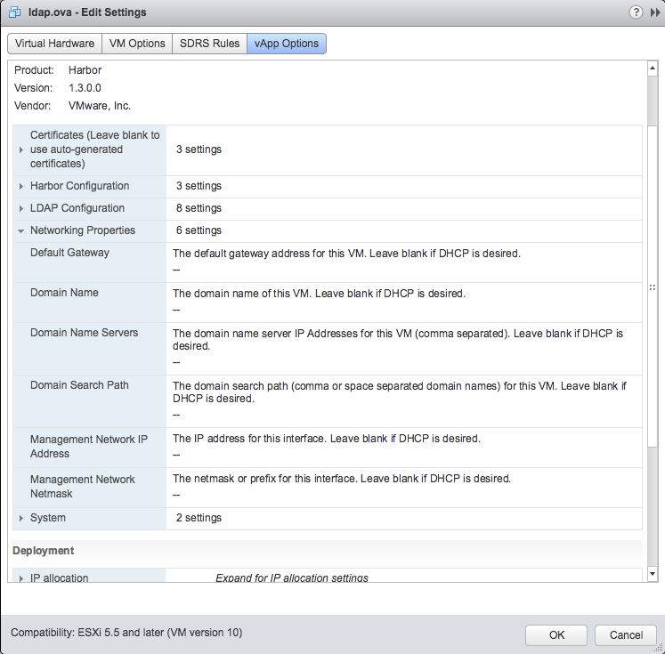
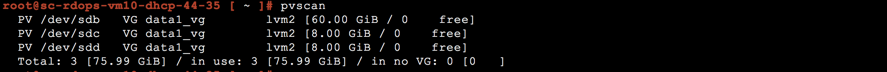

# Harbor OVA upgrade and database migration guide

This guide is limited to migrate a Harbor OVA instance to a next release. All Harbor data storeage settings is not manually changed after the existing Harbor OVA deployed.

**Steps to migrate Harbor OVA instances:**

1. Before migration, you need to note down these following items:
   - Note down the value of db_password in /data/harbor.cfg.
   - **"Networking properties"** if need to keep these settings. you can find them in **"Edit Settings"** -> **"vApp Options"**  
   

2.  Use pvscan command to check disks in logical volume "data1_vg". Note down all location of disk files in logical volume "data1_vg".
   
   
   
   In the vSphere Web Client, Select **"Shut Down Guest OS"** on the existing OVA instances, then select **"Edit Settings"**, remove the **"Hard disk 2"**, uncheck **"Delete files from datastore"**. All disks in the logical volume "data1_vg" should be removed if the original logic volume have been extended.
    Usually, the sda is the Hard Disk1 in the **"Edit Settings"** pannel, and the sdb is Hard Disk2 and so on. 
   
   

3. Deploy a new Harbor OVA instances. You may use different settings or keep same settings.

    |  Configuration Section Name |Use Different Settings | Keep Same Settings | 
    |-------------------------------- | ------------------|---------------------------------------------  |   
    | Certificates                    | Leave blank to use auto-generated certificates or paste in new certificates  |Replace files in /data/ca_download and /data/cert with backup files in the same path of prevous Harbor instance and restart Harbor OVA after migration | 
    | Harbor Configuration            | N/A |Input a random administrator password to bypass the data validation, it uses previous settings after migration |   
    | LDAP Configuration              | N/A |Leave blank, it uses previous settings after migration                 | 
    | Networking Properties           | Input new settings | Input previous settings                                | 
    | System                          | Input new settings | Input previous settings                                |
    
4. Copy all disk files of logic volume "data1_vg" in Step 2 to the new Harbor OVA's folder in vSphere's datastore.
5. Before powering on the new Harbor OVA instances, select **"Edit Settings"**, after remove the "Hard disk 2", then click **" Existing Hard Disk"** in **"New Device"**, let it point to the disk file copied in Step 4. Please add all disk files in the same order with previous OVA instance.
6. Power on the new OVA instance, login to the console and run following commands:
   ```
   chmod 700 /migrate_OVA.sh
   /migrate_OVA.sh 
   ```
   When prompt, input the value of db_password that note down in Step 1.
7. After the script is complete, visit URL: https://*&lt;DNS Name&gt;* to verify the new Harbor OVA instance. the administrator's password is the same password of previous Harbor instance.


