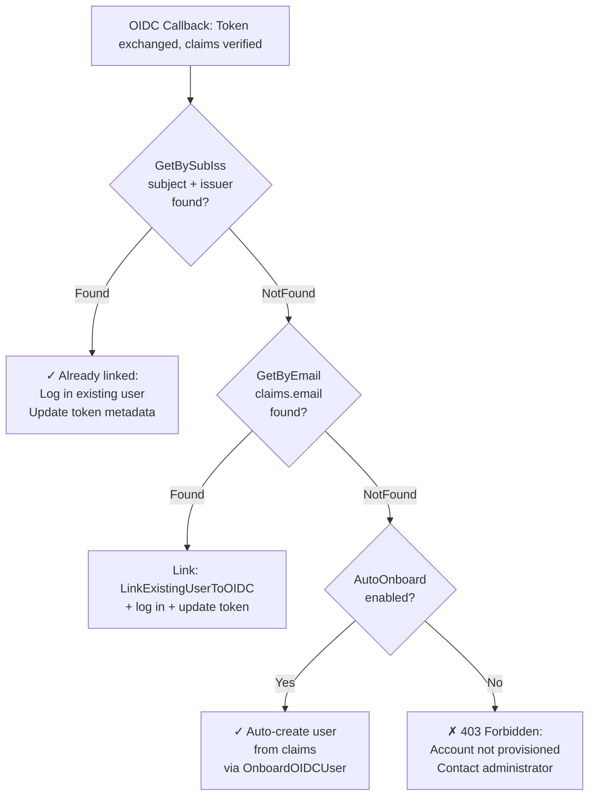

# OIDC Onboarding & User Linking Flow

This document describes the intended behavior of the OIDC callback handler when a user attempts to log in via an OIDC/OpenID Connect provider. It serves as the specification against which the implementation in `src/core/controllers/oidc.go` should be validated.

## Decision Tree

## Branches Explained

### 1. **Already Linked** (GetBySubIss finds a match)
**Decision**: User has previously linked their OIDC identity to this Harbor instance.

**Action**: 
- Log in the existing user (`*models.User` returned by `GetBySubIss`).
- Update the OIDC user's token metadata with the fresh token from this callback.
- Proceed to success: set session, emit login event, redirect to target page.

**Code path**: `GetBySubIss() → found → oidc.InjectGroupsToUser() → ctluser.Ctl.Get(WithOIDCInfo) → ctluser.Ctl.UpdateOIDCMeta() → PopulateUserSession() → Redirect()`

---

### 2. **Email Match & Link** (GetBySubIss not found, GetByEmail finds a local user)
**Decision**: A local user exists in Harbor (created via DB auth or prior manual account creation) with an email address matching the OIDC claim. This local user has not yet been linked to an OIDC identity. We treat email as the authoritative identifier for matching, to avoid accidental linkage to an unrelated person who shares a username.

**Action**:
- Link the existing local user to this OIDC identity by calling `LinkExistingUserToOIDC()`.
- Log in the user.
- This branch runs **unconditionally**, regardless of the `AutoOnboard` setting — existing users should always be able to use their OIDC identity to log in, even if `AutoOnboard` is disabled.

**Code path**: `GetBySubIss() → NotFound → GetByEmail() → found → LinkExistingUserToOIDC() → ctluser.Ctl.Get(WithOIDCInfo) → oidc.InjectGroupsToUser() → PopulateUserSession() → Redirect()`

---

### 3. **Auto-Create** (AutoOnboard enabled, no local user found)
**Decision**: `AutoOnboard` is enabled, and this is a brand-new identity (not found by sub/iss or email). We trust the OIDC provider's identity claims and automatically provision a new Harbor account.

**Action**:
- Derive a Harbor username from the OIDC `username` claim (sanitize spaces, etc.).
- Create a new user record with:
  - Username: claim-derived username
  - Email: from claims
  - OIDC metadata linked (sub + iss + token)
  - Comment: "Onboarded via OIDC provider"
  - Groups injected from claims (if any)
- Log in the newly created user.
- No manual username confirmation step — the identity is determined by the OIDC provider, not user input.

**Code path**: `GetBySubIss() → NotFound → GetByEmail() → not found → AutoOnboard=true → derive username → userOnboard() → ctluser.Ctl.OnboardOIDCUser() → ctluser.Ctl.Get(WithOIDCInfo) → PopulateUserSession() → Redirect()`

---

### 4. **Reject: Admin Provisioning Required** (AutoOnboard disabled, no local user found)
**Decision**: `AutoOnboard` is disabled, and this is a brand-new identity. The system does not allow self-service provisioning. The user must contact a Harbor administrator to have an account provisioned in advance (via DB auth account creation, LDAP integration, or manual admin account creation) before they can log in via OIDC.

**Action**:
- Return HTTP 403 Forbidden with a clear error message: "Your account has not been provisioned. Contact your administrator."
- Do **not** show the manual onboarding page (there is no such page anymore — it was removed because this semantic makes it unreachable).
- Abort the login flow; the user remains logged out.

**Code path**: `GetBySubIss() → NotFound → GetByEmail() → not found → AutoOnboard=false → SendForbiddenError("your account has not been provisioned; contact your administrator") → return`

---

## Design Rationale

### Why Email-Only Matching?
- Email is a more stable, more authoritative identifier from the OIDC provider than username.
- Username claims can be ambiguous or prone to collision (e.g., "ross" exists in multiple unrelated systems).
- Matching by username alone risks accidentally linking a new OIDC identity to an unrelated local user who happens to share a username.

### Why AutoOnboard Now Means "All-or-Nothing Self-Provisioning"?
- Stock Harbor's original `AutoOnboard` setting only controlled *how* new identities self-provision (automatically vs. manual username confirmation), but both allowed self-service.
- The revised semantics treat `AutoOnboard` as a strict on/off switch for whether *any* unrecognized identity is allowed to create an account.
  - `true`: Fully automatic provisioning; identity claims are authoritative.
  - `false`: No self-service provisioning allowed; only pre-provisioned accounts can log in.
- This better reflects the reality of OIDC-managed identity: the OIDC provider is the source of truth, and the username/attributes should not be negotiable by the end user.

### Why Unconditional Linking for Existing Users?
- An existing local user who has not yet linked their OIDC identity should be able to do so, regardless of the `AutoOnboard` setting.
- `AutoOnboard` controls what happens to *brand-new* identities, not to the linking of *existing* accounts.
- This ensures that administrators can pre-provision local accounts (via DB auth) and have users seamlessly migrate to OIDC without hitting a provisioning block.

### Why No Manual Onboard Page Anymore?
- The manual `/oidc-onboard` page allowed users to confirm/edit their username during onboarding.
- With email-only matching and OIDC claims as authoritative, there is no need for user confirmation.
- With the new semantics, `AutoOnboard=false` blocks all self-service paths, so the onboard page becomes unreachable — it was therefore removed entirely to avoid maintaining dead code.

## Testing Checklist

Each of the four branches should be tested:

1. **Already Linked**: User logs in via OIDC, sub/iss match found in DB → user logged in, token updated.
2. **Email Match & Link**: User logs in via OIDC, sub/iss not found, email found → user linked and logged in.
3. **Auto-Create (AutoOnboard=true)**: Brand-new OIDC identity + `AutoOnboard=true` → user created and logged in.
4. **Reject (AutoOnboard=false)**: Brand-new OIDC identity + `AutoOnboard=false` → 403 Forbidden, "contact your administrator" error.

Additionally:
- Verify the onboarding page (`/oidc-onboard`) is no longer reachable and has been removed from the codebase.
- Verify that username collision during auto-create is handled gracefully (fail early with a clear error, not silently).
