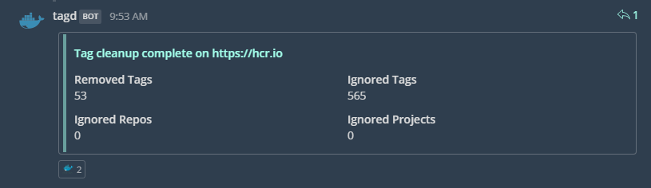

# Using `tagd`

> **NOTE**: `tagd` is a community contributed project. Please report any issues or feature
> suggestions to the [`tagd` repo itself](https://github.com/HylandSoftware/Harbor.Tagd/issues).

You can automatically delete old tags using a community contributed project
called [`tagd`](https://github.com/hylandsoftware/Harbor.Tagd). By default, the
`:latest` tag for all repositories is kept in addition to the 10 most recently
pushed tags. You can override this policy on a per-project or per-repository
basis.

`tagd` is shipped as a docker image and has the following syntax:

```text
$ docker run -it --rm hylandsoftware/tagd --help
Usage: Harbor.Tagd [ -h|--help ] [ --version ] --endpoint  -u|--user U -p|--password P [ --destructive ] [ --notify-slack  ] [ -v|--verbosity V ] [ --config-file  ] [ --config-server  ] [ --config-user  ] [ --config-password  ]

 Tag Cleanup daemon for VMware Harbor Registries

Required Arguments:
 --endpoint         The harbor registry to connect to
 -p, --password     The password for the user connecting to harbor
 -u, --user         The user to connect to harbor as

Optional Arguments:
 --destructive      Actually delete tags instead of generating a report
 --notify-slack     Post results to this slack-compatible webhook
 --config-file      The config file to parse
 --config-server    The springboot config server to get configuration from
 --config-user      The user to login to the springboot config server as
 --config-password  The password for the springboot config server user
 -h, --help         Display this help document.
 -v, --verbosity    How verbose should logging output be
 --version          Displays the version of the current executable.
```

Assuming your retention policy is available at `./rules.yml`, you can run the
cleanup process with the following syntax:

```bash
docker run -it --rm -v ./rules.yml:/rules.yml hylandsoftware/tagd \
    --endpoint https://my.harbor.net \
    --user myUser \
    --password myPassword \
    --config-file /rules.yml
```

This will run the cleanup process in **dry-run** mode. To actually delete tags,
append the `--destructive` switch.

You can also load configuration from a [Spring Cloud Config Server](https://spring.io/guides/gs/centralized-configuration/)
via the `--config-server` parameter.

If you have a Slack or Slack-compatible chat application (such as Mattermost)
you can tell `tagd` to post results to the webhook specified by
`--notify-slack`:



If `tagd` encounters any errors during the cleanup process, it will do its best
to attempt to notify you about the failure.

## Rules

The rules file has the following syntax:

```yaml
# Projects, Repositories, and Tags to globally ignore. Must match exactly
ignoreGlobally:
  projects: []
  repos: []
  tags: ['latest']

# The default rule to process if no other rules match
defaultRule:
  project: '.*'
  repo: '.*'
  tag: '.*'
  ignore: ['latest'] # Tags to always keep. Must match exactly
  keep: 10           # The number of tags matching this rule to keep, sorted by creation date

# Additional Rules to process
rules:
- project: 'projectA' # A regular expression matching a project
  repo: 'myapp'       # A regular Expression matching a repository
  tag: '.*'           # A regular Expression matching a tag
  ignore: ['latest']
  keep: 25
```

In the above example, the most recent 25 tags for `projectA/myapp` will be kept.
For all other projects, the default rule will be used, and `:latest` is always
kept due to the global ignore rule.

Note that when creating rules the `repo` slug must match the repo name, **not**
the `<project>/<repo>` name.

You can validate your rules using the `check` subcommand of `tagd`:

```text
$ docker run -it --rm hylandsoftware/tagd check --help
Usage: Harbor.Tagd [ -h|--help ] [ --version ] [ -v|--verbosity V ] [ --config-file  ] [ --config-server  ] [ --config-user  ] [ --config-password  ]

 Load and validate rules

Optional Arguments:
 --config-file      The config file to parse
 --config-server    The springboot config server to get configuration from
 --config-user      The user to login to the springboot config server as
 --config-password  The password for the springboot config server user
 -h, --help         Display this help document.
 -v, --verbosity    How verbose should logging output be
 --version          Displays the version of the current executable.
```

For example:

```bash
$ docker run -it --rm -v ./rules.yml:/rules.yml hylandsoftware/tagd check --config-file /rules.yml --verbosity verbose

[20:52:09 VRB] Found rule {'Project': 'projectA', 'Repo': 'myapp', 'Tag': '.*', 'Keep': 25, 'Ignore': [latest]}
[20:52:09 VRB] Using default rule {'Project': '.*', 'Repo': '.*', 'Tag': '.*', 'Keep': 10, 'Ignore': [latest]}
[20:52:09 VRB] Ignoring the following projects: []
[20:52:09 VRB] Ignoring the following repos: []
[20:52:09 VRB] Ignoring the following tags: ["latest"]
```

The container will exit with an error code if your rules file contains a syntax error:

```csharp
[20:53:38 FTL] An Error was encountered while processing tags
YamlDotNet.Core.YamlException: (Line: 17, Col: 3, Idx: 458) - (Line: 17, Col: 3, Idx: 458): Exception during deserialization ---> System.Runtime.Serialization.SerializationException: Property 'thisIsntARealKey' not found on type 'Harbor.Tagd.Rules.Rule'.
   at YamlDotNet.Serialization.TypeInspectors.TypeInspectorSkeleton.GetProperty(Type type, Object container, String name, Boolean ignoreUnmatched)
   at YamlDotNet.Serialization.NodeDeserializers.ObjectNodeDeserializer.YamlDotNet.Serialization.INodeDeserializer.Deserialize(IParser parser, Type expectedType, Func`3 nestedObjectDeserializer, Object& value)
   at YamlDotNet.Serialization.ValueDeserializers.NodeValueDeserializer.DeserializeValue(IParser parser, Type expectedType, SerializerState state, IValueDeserializer nestedObjectDeserializer)
   --- End of inner exception stack trace ---
   at YamlDotNet.Serialization.ValueDeserializers.NodeValueDeserializer.DeserializeValue(IParser parser, Type expectedType, SerializerState state, IValueDeserializer nestedObjectDeserializer)
   at YamlDotNet.Serialization.ValueDeserializers.AliasValueDeserializer.DeserializeValue(IParser parser, Type expectedType, SerializerState state, IValueDeserializer nestedObjectDeserializer)
   at YamlDotNet.Serialization.NodeDeserializers.CollectionNodeDeserializer.DeserializeHelper(Type tItem, IParser parser, Func`3 nestedObjectDeserializer, IList result, Boolean canUpdate)
   at YamlDotNet.Serialization.NodeDeserializers.CollectionNodeDeserializer.YamlDotNet.Serialization.INodeDeserializer.Deserialize(IParser parser, Type expectedType, Func`3 nestedObjectDeserializer, Object& value)
   at YamlDotNet.Serialization.ValueDeserializers.NodeValueDeserializer.DeserializeValue(IParser parser, Type expectedType, SerializerState state, IValueDeserializer nestedObjectDeserializer)
   at YamlDotNet.Serialization.ValueDeserializers.AliasValueDeserializer.DeserializeValue(IParser parser, Type expectedType, SerializerState state, IValueDeserializer nestedObjectDeserializer)
   at YamlDotNet.Serialization.NodeDeserializers.ObjectNodeDeserializer.YamlDotNet.Serialization.INodeDeserializer.Deserialize(IParser parser, Type expectedType, Func`3 nestedObjectDeserializer, Object& value)
   at YamlDotNet.Serialization.ValueDeserializers.NodeValueDeserializer.DeserializeValue(IParser parser, Type expectedType, SerializerState state, IValueDeserializer nestedObjectDeserializer)
   at YamlDotNet.Serialization.ValueDeserializers.AliasValueDeserializer.DeserializeValue(IParser parser, Type expectedType, SerializerState state, IValueDeserializer nestedObjectDeserializer)
   at YamlDotNet.Serialization.Deserializer.Deserialize(IParser parser, Type type)
   at YamlDotNet.Serialization.Deserializer.Deserialize[T](String input)
   at Harbor.Tagd.Rules.FilesystemRuleProvider.Load() in C:\Users\nlowe\projects\harbor.tagd\src\Harbor.Tagd\Rules\FilesystemRuleProvider.cs:line 33
   at Harbor.Tagd.Program.<Main>d__2.MoveNext() in C:\Users\nlowe\projects\harbor.tagd\src\Harbor.Tagd\Program.cs:line 85
```

## Installation via Kubernetes

`tagd` comes with a helm chart to deploy itself as a `CronJob` in a kubernetes cluster:

```bash
helm upgrade --install tagd https://github.com/HylandSoftware/Harbor.Tagd/tree/master/contrib/helm/tagd \
    --namespace tagd \
    --set harbor.endpoint="https://my.harbor.net" \
    --set harbor.username=myUser \
    --set harbor.password=myPassword \
    --wait
```

See the [helm chart in the `tagd` repository](https://github.com/HylandSoftware/Harbor.Tagd/tree/master/contrib/helm/tagd)
for details.