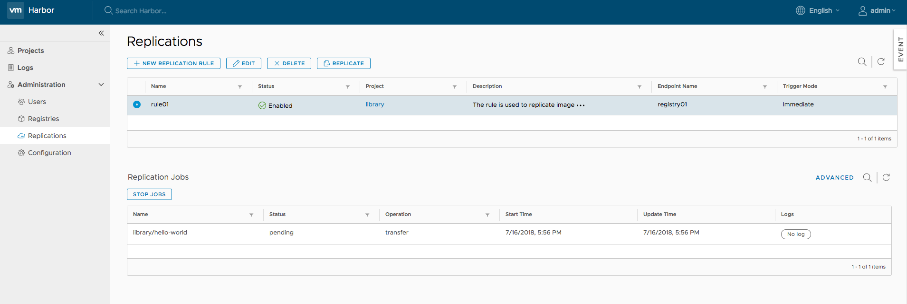
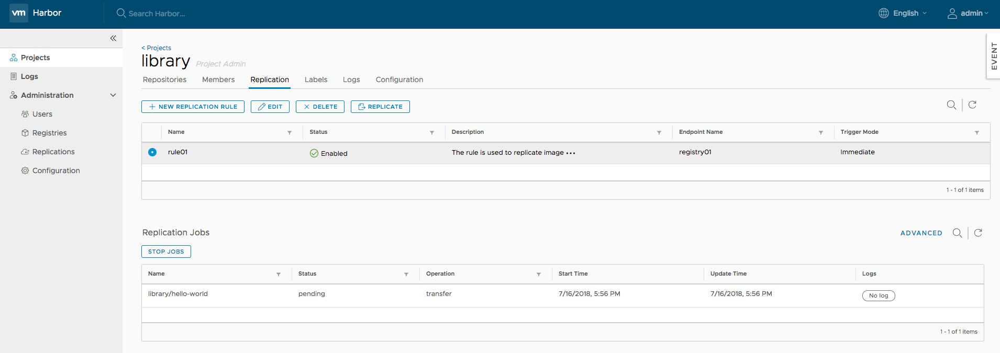
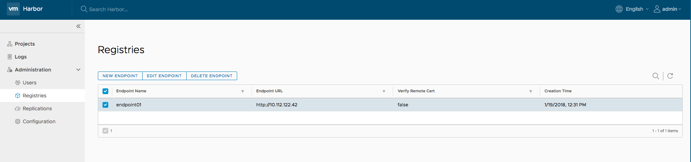

# User Guide  
## Overview  
This guide walks you through the fundamentals of using Harbor. You'll learn how to use Harbor to:  

* [Manage your projects.](#managing-projects)
* [Manage members of a project.](#managing-members-of-a-project)
* [Replicate projects to a remote registry.](#replicating-images)
* [Search projects and repositories.](#searching-projects-and-repositories)
* [Manage labels.](#managing-labels)
* [Manage Harbor system if you are the system administrator:](#administrator-options)
  * [Manage users.](#managing-user)
  * [Manage endpoints.](#managing-endpoint)
  * [Manage replication policies.](#managing-replication)
  * [Manage authentication.](#managing-authentication)
  * [Manage project creation.](#managing-project-creation)
  * [Manage self-registration.](#managing-self-registration)
  * [Manage email settings.](#managing-email-settings)
  * [Manage registry read only.](#managing-registry-read-only)
* [Pull and push images using Docker client.](#pulling-and-pushing-images-using-docker-client)
* [Add description to repositories](#add-description-to-repositories)
* [Delete repositories and images.](#deleting-repositories)
* [Content trust.  ](#content-trust)
* [Vulnerability scanning via Clair.](#vulnerability-scanning-via-clair)
* [Pull image from Harbor in Kubernetes.](#pull-image-from-harbor-in-kubernetes)
* [Manage Helm Charts](#manage-helm-charts)
  * [Manage Helm Charts via portal](#manage-helm-charts-via-portal)
  * [Working with Helm CLI](#working-with-helm-cli)

## Role Based Access Control(RBAC)  


Harbor manages images through projects. Users can be added into one project as a member with three different roles:  

* **Guest**: Guest has read-only privilege for a specified project.
* **Developer**: Developer has read and write privileges for a project.
* **ProjectAdmin**: When creating a new project, you will be assigned the "ProjectAdmin" role to the project. Besides read-write privileges, the "ProjectAdmin" also has some management privileges, such as adding and removing members, starting a vulnerability scan.

Besides the above three roles, there are two system-wide roles:  

* **SysAdmin**: "SysAdmin" has the most privileges. In addition to the privileges mentioned above, "SysAdmin" can also list all projects, set an ordinary user as administrator, delete users and set vulnerability scan policy for all images. The public project "library" is also owned by the administrator.  
* **Anonymous**: When a user is not logged in, the user is considered as an "Anonymous" user. An anonymous user has no access to private projects and has read-only access to public projects.  

## User account
Harbor supports two authentication modes:  

* **Database(db_auth)**  

	Users are stored in the local database.  
	
	A user can register himself/herself in Harbor in this mode. To disable user self-registration, refer to the [installation guide](installation_guide.md) for initial configuration, or disable this feature in [Administrator Options](#administrator-options). When self-registration is disabled, the system administrator can add users into Harbor.  
	
	When registering or adding a new user, the username and email must be unique in the Harbor system. The password must contain at least 8 characters with 1 lowercase letter, 1 uppercase letter and 1 numeric character.  
	
	When you forgot your password, you can follow the below steps to reset the password:  

	1. Click the link "Forgot Password" in the sign in page.  
	2. Input the email address entered when you signed up, an email will be sent out to you for password reset.  
	3. After receiving the email, click on the link in the email which directs you to a password reset web page.  
	4. Input your new password and click "Save".  
	
* **LDAP/Active Directory (ldap_auth)**  

	Under this authentication mode, users whose credentials are stored in an external LDAP or AD server can log in to Harbor directly.  
	
	When an LDAP/AD user logs in by *username* and *password*, Harbor binds to the LDAP/AD server with the **"LDAP Search DN"** and **"LDAP Search Password"** described in [installation guide](installation_guide.md). If it succeeded, Harbor looks up the user under the LDAP entry **"LDAP Base DN"** including substree. The attribute (such as uid, cn) specified by **"LDAP UID"** is used to match a user with the *username*. If a match is found, the user's *password* is verified by a bind request to the LDAP/AD server. Uncheck **"LDAP Verify Cert"** if the LDAP/AD server uses a self-signed or an untrusted certificate.
	
	Self-registration, deleting user, changing password and resetting password are not supported under LDAP/AD authentication mode because the users are managed by LDAP or AD.  

## Managing projects
A project in Harbor contains all repositories of an application. No images can be pushed to Harbor before the project is created. RBAC is applied to a project. There are two types of projects in Harbor:  

* **Public**: All users have the read privilege to a public project, it's convenient for you to share some repositories with others in this way.
* **Private**: A private project can only be accessed by users with proper privileges.  

You can create a project after you signed in. Check on the "Access Level" checkbox will make this project public.  

  

After the project is created, you can browse repositories, members, logs, replication and configuration using the navigation tab.


There are two views to show repositories, listview and card view, you can switch between them by clicking the corresponding icon.


All logs can be listed by clicking "Logs". You can apply a filter by username, or operations and dates under "Advanced Search".  


  

Project properties can be changed by clicking "Configuration".

* To make all repositories under the project accessible to everyone, select the `Public` checkbox.

* To prevent un-signed images under the project from being pulled, select the `Enable content trust` checkbox.

* To prevent vulnerable images under the project from being pulled, select the `Prevent vulnerable images from running` checkbox and change the severity level of vulnerabilities. Images cannot be pulled if their level equals to or higher than the currently selected level.

* To activate an immediate vulnerability scan on new images that are pushed to the project, select the `Automatically scan images on push` checkbox.

 

## Managing members of a project  
### Adding members  
You can add members with different roles to an existing project. You can add a LDAP/AD user to project members under LDAP/AD authentication mode. 


### Updating and removing members
You can check one or more members, then click `ACTION`, choose one role to batch switch checked members' roles or remove them from the project.


## Replicating images  
Images replication is used to replicate repositories from one Harbor instance to another.

The function is project-oriented, and once the system administrator has set a rule to one project, all repositories under the project that match the defined [filter](#image-filter) patterns will be replicated to the remote registry when the [triggering condition](#trigger-mode) is triggered. Each repository will start a job to run. If the project does not exist on the remote registry, a new project will be created automatically. If it already exists and the user configured in policy has no write privilege to it, the process will fail. The member information will not be replicated.  

There may be a bit of delay during replication based on the situation of the network. If replication job fails due to the network issue, the job will be re-scheduled a few minutes later and the schedule will keep trying until the network issue is resolved.  

**Note:** Due to API changes, replication between different versions of Harbor may be broken.

### Creating a replication rule
Replication can be configured by creating a rule. Click `NEW REPLICATION RULE` under `Administration->Replications` and fill in the necessary fields. You can choose different image filters and trigger modes according to the different requirements. If there is no endpoint available in the list, you need to create one. Click `SAVE` to create a replication rule for the selected project. If `Replicate existing images immediately` is chosen, the existing images under the project will be replicated to the remote registry immediately.  

#### Image filter
Three image filters are supported:
* **Repository**: Filter images according to the repository part of image name.
* **Tag**: Filter images according to the tag part of image name.
* **Label**: Filter images according to the [labels](#managing-labels). **Notes**: If the labels referenced by a rule are deleted, the rule's status will be set to `Disabled`. You need to edit and update it according to the tips.

Two terms are supported in the pattern used by repository filter and tag filter:
* **\***: Matches any sequence of non-separator characters `/`.
* **?**: Matches any single non-separator character `/`.

#### Trigger mode
* **Manual**: Replicate the repositories manually when needed. **Note**: The deletion operations are not replicated. 
* **Immediate**: When a new repository is pushed to the project, it is replicated to the remote registry immediately. Same to the deletion operation if the `Delete remote images when locally deleted` checkbox is selected.
* **Scheduled**: Replicate the repositories daily or weekly. **Note**: The deletion operations are not replicated. 


### Listing and stopping replication jobs
Click a rule, jobs which belong to this rule will be listed. A job represents the progress of replicating the repository to the remote instance. Click `STOP JOBS`, the pending and retrying jobs will be stopped immediately and the running jobs will be canceled at the next checkpoint.  



### Starting a replication manually
Select a replication rule and click `REPLICATE`, the images under the project which the rule is applied to will be replicated to the remote registry immediately. If there is any pending/running job that belongs to the rule, the new replication will not be started.


### Deleting the replication rule
Select the replication rule and click `DELETE` to delete it. Only rules which have no pending/running/retrying jobs can be deleted.  


The system administrator can also operate the replication rules defined for the specified project in `Replication` tab under `Projects` view. Project administrator has read-only privilege.




## Searching projects and repositories  
Entering a keyword in the search field at the top lists all matching projects and repositories. The search result includes both public and private repositories you have access to.  


## Managing labels
Harbor provides two kinds of labels to isolate kinds of resources(only images for now):
* **Global Level Label**: Managed by system administrators and used to manage the images of the whole system. They can be added to images under any projects.
* **Project Level Label**: Managed by project administrators under a project and can only be added to the images of the project.

### Managing global level labels
The system administrators can list, create, update and delete the global level labels under `Administration->Configuration->Labels`:


### Managing project level labels
The project administrators and system administrators can list, create, update and delete the project level labels under `Labels` tab of the project detail page:


### Adding labels to/remove labels from images
Users who have system administrator, project administrator or project developer role can click the `ADD LABELS` button to add labels to or remove labels from images. The label list contains both globel level labels(come first) and project level labels:


### Filtering images by labels
The images can be filtered by labels:


## Administrator options  
### Managing user  
Administrator can add "Administrator" role to one or more ordinary users by checking checkboxes and clicking `SET AS ADMINISTRATOR`. To delete users, checked checkboxes and select `DELETE`. Deleting user is only supported under database authentication mode.


### Managing endpoint  
You can list, add, edit and delete endpoints under `Administration->Registries`. Only endpoints which are not referenced by any rules can be deleted.  



### Managing replication  
You can list, add, edit and delete rules under `Administration->Replications`.   


### Managing authentication
You can change authentication mode between **Database**(default) and **LDAP** before any user is added, when there is at least one user(besides admin) in Harbor, you cannot change the authentication mode.  

When using LDAP mode, user's self-registration is disabled. The parameters of LDAP server must be filled in. For more information, refer to [User account](#user-account).   


### Managing project creation
Use the **Project Creation** drop-down menu to set which users can create projects. Select **Everyone** to allow all users to create projects. Select **Admin Only** to allow only users with the Administrator role to create projects.  


### Managing self-registration
You can manage whether a user can sign up for a new account. This option is not available if you use LDAP authentication.  


### Managing email settings
You can change Harbor's email settings, the mail server is used to send out responses to users who request to reset their password.  


### Managing registry read only
You can change Harbor's registry read only settings, read only mode will allow 'docker pull' while preventing 'docker push' and the deletion of repository and tag.


If it set to true, deleting repository, tag and pushing image will be disabled. 


```
$ docker push 10.117.169.182/demo/ubuntu:14.04  
The push refers to a repository [10.117.169.182/demo/ubuntu]
0271b8eebde3: Preparing 
denied: The system is in read only mode. Any modification is prohibited.  
``` 

## Pulling and pushing images using Docker client  

**NOTE: Harbor only supports Registry V2 API. You need to use Docker client 1.6.0 or higher.**  

Harbor supports HTTP by default and Docker client tries to connect to Harbor using HTTPS first, so if you encounter an error as below when you pull or push images, you need to configure insecure registry. Please, read [this document](https://docs.docker.com/registry/insecure/) in order to understand how to do this. 
  

```Error response from daemon: Get https://myregistrydomain.com/v1/users/: dial tcp myregistrydomain.com:443 getsockopt: connection refused.```   
  

If this private registry supports only HTTP or HTTPS with an unknown CA certificate, please add   
`--insecure-registry myregistrydomain.com` to the daemon's start up arguments.  
  

In the case of HTTPS, if you have access to the registry's CA certificate, simply place the CA certificate at /etc/docker/certs.d/myregistrydomain.com/ca.crt .   

### Pulling images  
If the project that the image belongs to is private, you should sign in first:  

```sh
$ docker login 10.117.169.182  
```
  
You can now pull the image:  

```sh
$ docker pull 10.117.169.182/library/ubuntu:14.04  
```

**Note: Replace "10.117.169.182" with the IP address or domain name of your Harbor node. You cannot pull a unsigned image if you enabled content trust.**

### Pushing images  
Before pushing an image, you must create a corresponding project on Harbor web UI. 

First, log in from Docker client:  

```sh
$ docker login 10.117.169.182  
```
  
Tag the image:  

```sh
$ docker tag ubuntu:14.04 10.117.169.182/demo/ubuntu:14.04  
``` 

Push the image:

```sh
$ docker push 10.117.169.182/demo/ubuntu:14.04  
```  

**Note: Replace "10.117.169.182" with the IP address or domain name of your Harbor node.**

###  Add description to repositories

After pushing an image, an Information can be added by project admin to describe this repository.

Go into the repository and select the "Info" tab, and click the "EDIT" button.  An textarea will appear and enter description here. Click "SAVE" button to save this information.


###  Deleting repositories  

Repository deletion runs in two steps.  

First, delete a repository in Harbor's UI. This is soft deletion. You can delete the entire repository or just a tag of it. After the soft deletion, 
the repository is no longer managed in Harbor, however, the files of the repository still remain in Harbor's storage.  


**CAUTION: If both tag A and tag B refer to the same image, after deleting tag A, B will also get deleted. if you enabled content trust, you need to use notary command line tool to delete the tag's signature before you delete an image.**  

Next, delete the actual files of the repository using the registry's garbage collection(GC). Make sure that no one is pushing images or Harbor is not running at all before you perform a GC. If someone were pushing an image while GC is running, there is a risk that the image's layers will be mistakenly deleted which results in a corrupted image. So before running GC, a preferred approach is to stop Harbor first.  

Run the below commands on the host which Harbor is deployed on to preview what files/images will be affected: 

```sh
$ docker-compose stop

$ docker run -it --name gc --rm --volumes-from registry goharbor/registry:2.6.2-photon garbage-collect --dry-run /etc/registry/config.yml

```  
**NOTE:** The above option "--dry-run" will print the progress without removing any data.  

Verify the result of the above test, then use the below commands to perform garbage collection and restart Harbor. 

```sh

$ docker run -it --name gc --rm --volumes-from registry goharbor/registry:2.6.2-photon garbage-collect  /etc/registry/config.yml

$ docker-compose start
```  

For more information about GC, please see [GC](https://github.com/docker/docker.github.io/blob/master/registry/garbage-collection.md).  

### Content trust  
**NOTE: Notary is an optional component, please make sure you have already installed it in your Harbor instance before you go through this section.**  
If you want to enable content trust to ensure that images are signed, please set two environment variables in the command line before pushing or pulling any image:
```sh
export DOCKER_CONTENT_TRUST=1
export DOCKER_CONTENT_TRUST_SERVER=https://10.117.169.182:4443
```
If you push the image for the first time, You will be asked to enter the root key passphrase. This will be needed every time you push a new image while the ``DOCKER_CONTENT_TRUST`` flag is set.  
The root key is generated at: ``/root/.docker/trust/private/root_keys``  
You will also be asked to enter a new passphrase for the image. This is generated at ``/root/.docker/trust/private/tuf_keys/[registry name] /[imagepath]``.  
If you are using a self-signed cert, make sure to copy the CA cert into ```/etc/docker/certs.d/10.117.169.182``` and ```$HOME/.docker/tls/10.117.169.182:4443/```. When an image is signed, it is indicated in the Web UI.  
**Note: Replace "10.117.169.182" with the IP address or domain name of your Harbor node. In order to use content trust, HTTPS must be enabled in Harbor.**  
  

When an image is signed, it has a tick shown in UI; otherwise, a cross sign(X) is displayed instead.  


### Vulnerability scanning via Clair 
**CAUTION: Clair is an optional component, please make sure you have already installed it in your Harbor instance before you go through this section.**

Static analysis of vulnerabilities is provided through open source project [Clair](https://github.com/coreos/clair). You can initiate scanning on a particular image, or on all images in Harbor. Additionally, you can also set a policy to scan all the images at a specified time everyday.

**Vulnerability metadata** 

Clair depends on the vulnerability metadata to complete the analysis process. After the first initial installation, Clair will automatically start to update the metadata database from different vulnerability repositories. The updating process may take a while based on the data size and network connection. If the database has not been fully populated, there is a warning message at the footer of the repository datagrid view.


The 'database not fully ready' warning message is also displayed in the **'Vulnerability'** tab of **'Configuration'** section under **'Administration'** for your awareness.


Once the database is ready, an overall database updated timestamp will be shown in the **'Vulnerability'** tab of **'Configuration'** section under **'Administration'**. 


**Scanning an image** 

Enter your project, select the repository. For each tag there will be an 'Vulnerability' column to display vulnerability scanning status and related information. You can select the image and click the "SCAN" button to trigger the vulnerability scan process. 

**NOTES: Only the users with 'Project Admin' role have the privilege to launch the analysis process.**

The analysis process may have the following status that are indicated in the 'Vulnerability' column:
* **Not Scanned:** The tag has never been scanned.
* **Queued:** The scanning task is scheduled but not executed yet.
* **Scanning:** The scanning process is in progress.
* **Error:** The scanning process failed to complete.
* **Complete:** The scanning process was successfully completed.

For the **'Not Scanned'** and **'Queued'** statuses, a text label with status information is shown. For the **'Scanning'**, a progress bar will be displayed.
If an error occurred, you can click on the **'View Log'** link to view the related logs.


If the process was successfully completed, a result bar is created. The width of the different colored sections indicates the percentage of features with vulnerabilities for a particular severity level.
* **Red:** **High** level of vulnerabilities
* **Orange:** **Medium** level of vulnerabilities
* **Yellow:** **Low** level of vulnerabilities
* **Grey:** **Unknown** level of vulnerabilities
* **Green:** **No** vulnerabilities


Move the cursor over the bar, a tooltip with summary report will be displayed. Besides showing the total number of features with vulnerabilities and the total number of features in the scanned image tag, the report also lists the counts of features with vulnerabilities of different severity levels. The completion time of the last analysis process is shown at the bottom of the tooltip.


Click on the tag name link, the detail page will be opened. Besides the information about the tag, all the vulnerabilities found in the last analysis process will be listed with the related information. You can order or filter the list by columns.


**NOTES: You can initiate the vulnerability analysis for a tag at anytime you want as long as the status is not 'Queued' or 'Scanning'.** 

**Scanning all images**

In the **'Vulnerability'** tab of **'Configuration'** section under **'Administration'**, click on the **'SCAN NOW'** button to start the analysis process for all the existing images. 

**NOTES: The scanning process is executed via multiple concurrent asynchronous tasks. There is no guarantee on the order of scanning or the returned results.** 


To avoid frequently triggering the resource intensive scanning process, the availability of the button is restricted. It can be only triggered once in a predefined period. The next available time will be displayed besides the button.


**Scheduled Scan by Policy** 

You can set policies to control the vulnerability analysis process. Currently, two options are available:
* **None:** No policy is selected.
* **Daily:** Policy is activated daily. It means an analysis job is scheduled to be executed at the specified time everyday. The scheduled job will scan all the images in Harbor.


**NOTES: Once the scheduled job is executed, the completion time of scanning all images will be updated accordingly. Please be aware that the completion time of the images may be different because the execution of analysis for each image may be carried out at different time.**

### Pull image from Harbor in Kubernetes
Kubernetes users can easily deploy pods with images stored in Harbor.  The settings are similar to that of another private registry.  There are two major issues:

1. When your Harbor instance is hosting http and the certificate is self signed.  You need to modify daemon.json on each work node of your cluster, for details please refer to: https://docs.docker.com/registry/insecure/#deploy-a-plain-http-registry
2. If your pod references an image under private project, you need to create a secret with the credentials of user who has permission to pull image from this project, for details refer to: https://kubernetes.io/docs/tasks/configure-pod-container/pull-image-private-registry/

## Manage Helm Charts
Helm charts is a good way to package, share and use software built for Kubernetes. From version 1.6.0, Harbor is upgraded to be a composite cloud-native registry, which supports both image management and helm charts management. The charts are also isolated by projects and controlled by RBAC access control system.

### Manage Helm Charts via portal
#### List charts
Click your project to enter the project detail page after successful logging in. The existing helm charts will be listed under the tab `Helm Charts` which is beside the image `Repositories` tab with the following information:
* Name of helm chart
* The status of the chart: Active or Deprecated
* The count of chart versions
* The created time of the chart


You can click the icon buttons on the top right to switch views between card view and list view.

#### Upload new chart
Click the `UPLOAD` button on the top left to open the chart uploading dialog. Choose the uploading chart from your filesystem. Click the `UPLOAD` button to upload it to the chart repository server.


If the chart is signed, you can choose the corresponding provenance file from your filesystem and Click the `UPLOAD` button to upload them together at once.

If the chart is successfully uploaded, it will be displayed in the chart list at once.

#### List chart versions
Clicking the chart name from the chart list will show all the available versions of that chart with the following information:
* the chart version number
* the maintainers of the chart version
* the template engine used (default is gotpl)
* the created timestamp of the chart version


Obviously, there will be at least 1 version for each of the charts in the top chart list. Same with chart list view, you can also click the icon buttons on the top right to switch views between card view and list view.

Check the checkbox at the 1st column to select the specified chart versions:
* Click the `DELETE` button to delete all the selected chart versions from the chart repository server. Batch operation is supported.
* Click the `DOWNLOAD` button to download the chart artifact file. Batch operation is not supported.
* Click the `UPLOAD` button to upload the new chart version for the current chart

#### View chart version details
Clicking the chart version number link will open the chart version details view. You can see more details about the specified chart version here. There are three content sections:
* **Summary:**
  * readme of the chart
  * overall metadata like home, created timestamp and application version
  * related helm commands for reference, such as `helm add repo` and `helm install` etc.

* **Dependencies:**
  * list all the dependant sun charts with 'name', 'version' and 'repository' fields

* **Values:**
  * display the content from `values.yaml` file with highlight code preview
  * clicking the icon buttons on the top right to switch the yaml file view to k-v value pair list view


Clicking the `DOWNLOAD` button on the top right will start the downloading process.

### Working with Helm CLI
As a helm chart repository, Harbor can work smoothly with Helm CLI. About how to install Helm CLI, please refer [install helm](https://docs.helm.sh/using_helm/#installing-helm). Run command `helm version` to make sure the version of Helm CLI is v2.9.1+.
```
helm version

#Client: &version.Version{SemVer:"v2.9.1", GitCommit:"20adb27c7c5868466912eebdf6664e7390ebe710", GitTreeState:"clean"}
#Server: &version.Version{SemVer:"v2.9.1", GitCommit:"20adb27c7c5868466912eebdf6664e7390ebe710", GitTreeState:"clean"}
```
#### Add harbor to the repository list
Before working, Harbor should be added into the repository list with `helm repo add` command. Two different modes are supported.
* Add Harbor as a unified single index entry point

With this mode, helm can aware all the charts located in the different projects which are accessable by the current authenticated user.
```
helm repo add --ca-file ca.crt --cert-file server.crt --key-file server.key --username=admin --password=Passw0rd myrepo https://xx.xx.xx.xx/chartrepo
```
**NOTES:** Providing both ca file and cert files is caused by an issue from helm.

* Add Harbor project as separate index entry point

With this mode, helm can only pull charts in the specified project.
```
helm repo add --ca-file ca.crt --cert-file server.crt --key-file server.key --username=admin --password=Passw0rd myrepo https://xx.xx.xx.xx/chartrepo/myproject
```

#### Push charts to the repository server by CLI
As an alternative, you can also upload charts via the CLI. It is not supported by the native helm CLI. A plugin from the community should be installed before pushing. Run `helm plugin install` to install the `push` plugin first.
```
helm plugin install https://github.com/chartmuseum/helm-push
```
After a successful installation,  run `push` command to upload your charts:
```
helm push --ca-file=ca.crt --key-file=server.key --cert-file=server.crt --username=admin --password=passw0rd chart_repo/hello-helm-0.1.0.tgz myrepo
```
**NOTES:** `push` command does not support pushing a prov file of a signed chart yet.

#### Install charts
Before installing, make sure your helm is correctly initialized with command `helm init` and the chart index is synchronized with command `helm repo update`.

Search the chart with the keyword if you're not sure where it is:
```
helm search hello

#NAME                            CHART VERSION   APP VERSION     DESCRIPTION                
#local/hello-helm                0.3.10          1.3             A Helm chart for Kubernetes
#myrepo/chart_repo/hello-helm    0.1.10          1.2             A Helm chart for Kubernetes
#myrepo/library/hello-helm       0.3.10          1.3             A Helm chart for Kubernetes
```
Everything is ready, install the chart to your kubernetes:
```
helm install --ca-file=ca.crt --key-file=server.key --cert-file=server.crt --username=admin --password=Passw0rd --version 0.1.10 repo248/chart_repo/hello-helm
```

For other more helm commands like how to sign a chart, please refer to the [helm doc](https://docs.helm.sh/helm/#helm).

