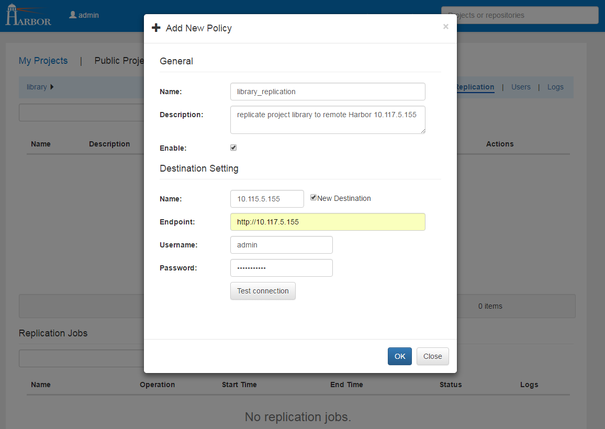
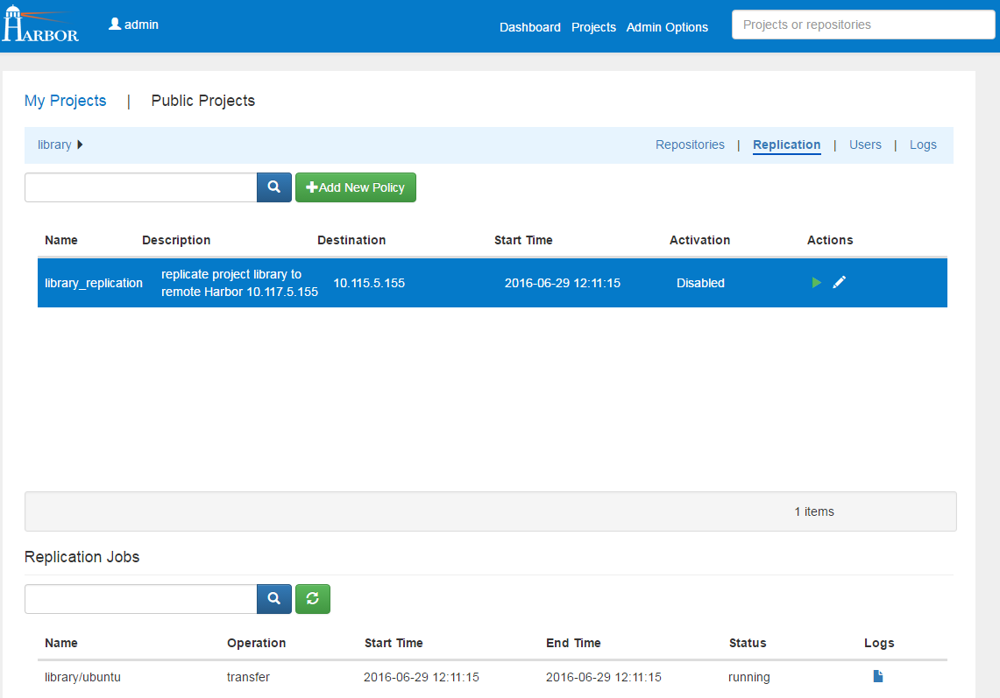
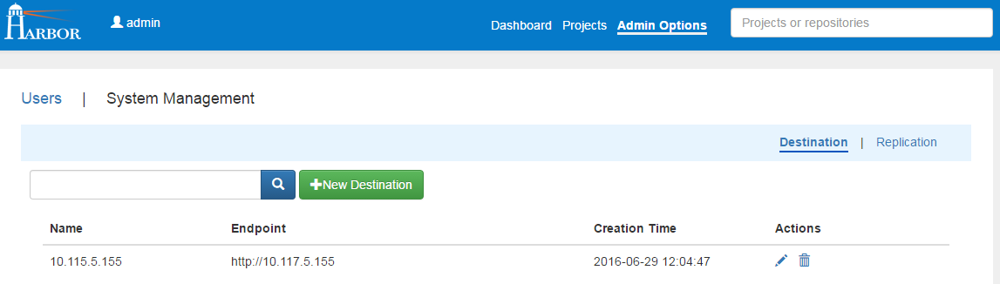
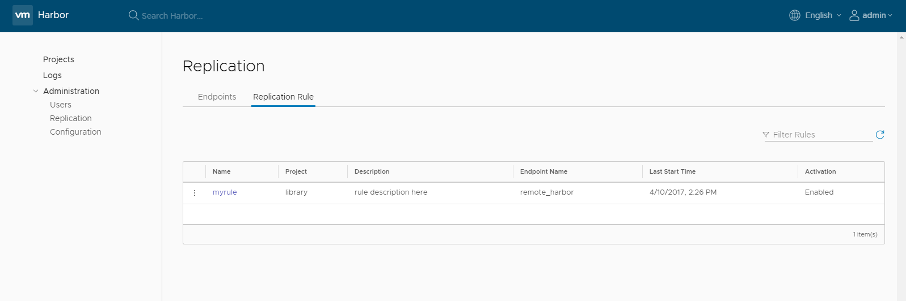
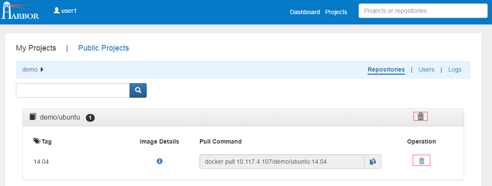

#User Guide
##Overview
This guide takes you through the fundamentals of using Harbor. You'll learn how to use Harbor to:  

* Manage your projects.
* Manage members of a project.
* Replicate projects to a remote registry.
* Search projects and repositories.
* Manage Harbor system if you are the system administrator:
 + Manage users.
 + Manage destinations.
 + Manage replication policies.
* Pull and push images using Docker client.
* Delete repositories.


##Role Based Access Control
RBAC (Role Based Access Control) is provided in Harbor and there are four roles with different privileges:  

* **Guest**: Guest has read-only privilege for a specified project.
* **Developer**: Developer has read and write privileges for a project.
* **ProjectAdmin**: When creating a new project, you will be assigned the "ProjectAdmin" role to the project. Besides read-write privileges, the "ProjectAdmin" also has some management privileges, such as adding and removing members.
* **SysAdmin**: "SysAdmin" has the most privileges. In addition to the privileges mentioned above, "SysAdmin" can also list all projects, set an ordinary user as administrator and delete users. The public project "library" is also owned by the administrator.  
* **Anonymous**: When a user is not logged in, the user is considered as an "anonymous" user. An anonymous user has no access to private projects and has read-only access to public projects.  

##User account
As a new user, you can sign up an account by going through the self-registration process. The username and email must be unique in the Harbor system. The password must contain at least 7 characters with 1 lowercase letter, 1 uppercase letter and 1 numeric character.  

If the administrator has configured LDAP/AD as authentication source, no sign-up is required. The LDAP/AD user id can be used directly to log in to Harbor.  
  
When you forgot your password, you can follow the below steps to reset the password:  

1. Click the link "forgot password" in the sign in page.
2. Input the email used when you signed up, an email will be sent out to you.
3. After receiving the email, click on the link in the email which directs you to a password reset web page.
4. Input your new password and click "Submit".


##Managing projects
A project in Harbor contains all repositories of an application. RBAC is applied to a project. There are two types of projects in Harbor:  

* **Public**: All users have the read privilege to a public project, it's convenient for you to share some repositories with others in this way.
* **Private**: A private project can only be accessed by users with proper privileges.  

You can create a project after you signed in. Enabling the "Public" checkbox will make this project public.  

  

After the project is created, you can browse repositories, users and logs using the navigation tab.  

  

All logs can be listed by clicking "Logs". You can apply a filter by username, or operations and dates under "Advanced Search".  

  

##Managing members of a project 
###Adding members
You can add members with different roles to an existing project.  


###Updating and removing members
You can update or remove a member by clicking the icon on the right.  


##Replicating images
If you are a system administrator, you can replicate images to a remote registry, which is called destination in Harbor. Only Harbor instance is supported as a destination for now.  
Click "Add New Policy" on the "Replication" tab, fill the necessary fields and click "OK", a policy for this project will be created. If  "Enable" is chosen, the project will be replicated to the remote immediately, and when a new repository is pushed to this project or an existing repository is deleted from this project, the same operation will also be replicated to the destination.  



You can enable or disable a policy in the policy list view, and only the policies which are disbled can be edited.  
Click a policy, jobs which belong to this policy will be listed. A job represents the progress which will replicate a repository of one project to the remote.



##Searching projects and repositories
Entering a keyword in the search field at the top lists all matching projects and repositories. The search result includes both public and private repositories you have access privilege to.  


##Administrator options
###Managing user
Administrator can add "administrator" role to an ordinary user by toggling the switch under "Administrator". To delete a user, click on the recycle bin icon.  


###Managing destination
You can list, add, edit and delete destinations in the "Destination" tab. Only destinations which are not referenced by any policies can be edited.  



###Managing replication
You can list, edit, enable and disable policies in the "Replication" tab. Make sure the policy is disabled before you edit it.  



##Pulling and pushing images using Docker client

**NOTE: Harbor only supports Registry V2 API. You need to use Docker client 1.6.0 or higher.**  

Harbor supports HTTP by default and Docker client trys to connect to Harbor using HTTPS first, so if you encounter an error as below when you pull or push images, you need to add '--insecure-registry' option to /etc/default/docker (ubuntu) or /etc/sysconfig/docker (centos):    
*FATA[0000] Error response from daemon: v1 ping attempt failed with error:  
Get https://myregistrydomain.com:5000/v1/_ping: tls: oversized record received with length 20527.   
If this private registry supports only HTTP or HTTPS with an unknown CA certificate,please add   
`--insecure-registry myregistrydomain.com:5000` to the daemon's arguments.  
In the case of HTTPS, if you have access to the registry's CA certificate, no need for the flag;  
simply place the CA certificate at /etc/docker/certs.d/myregistrydomain.com:5000/ca.crt*  

###Pulling images
If the project that the image belongs to is private, you should sign in first:  

```sh
$ docker login 10.117.169.182  
```
  
You can now pull the image:  

```sh
$ docker pull 10.117.169.182/library/ubuntu:14.04  
```

**Note: Replace "10.117.169.182" with the IP address or domain name of your Harbor node.**

###Pushing images
Before pushing an image, you must create a corresponding project on Harbor web UI. 

First, log in from Docker client:  

```sh
$ docker login 10.117.169.182  
```
  
Tag the image:  

```sh
$ docker tag ubuntu:14.04 10.117.169.182/demo/ubuntu:14.04  
``` 

Push the image:

```sh
$ docker push 10.117.169.182/demo/ubuntu:14.04  
```  

**Note: Replace "10.117.169.182" with the IP address or domain name of your Harbor node.**

##Deleting repositories

Repositories deletion runs in two steps.  
First, delete repositories in Harbor's UI. This is soft deletion. You can delete the entire repository or just a tag of it.  



**Note: If both tag A and tag B reference the same image, after deleting tag A, B will also disappear.**  

Second, delete the real data using registry's garbage colliection(GC). 

```sh
$ docker run -it --name gc -v /harbor_deploy_path/harbor/Deploy/config/registry/:/etc/registry/ -v /data/registry/:/storage/ registry:2.4.0 garbage-collect [--dry-run] /etc/registry/config.yml
```  
Replace "/harbor_deploy_path" with path where your Harbor is deployed. And if your images are not storaged in "/data/registry", replace it too.  
Option "--dry-run" will print the progress without removing any data.

About the details of GC, please see [GC](https://github.com/docker/distribution/blob/master/docs/garbage-collection.md).  