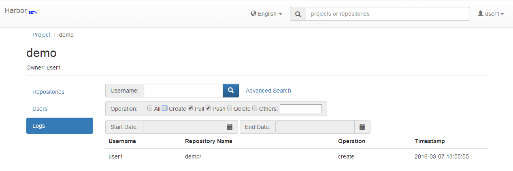
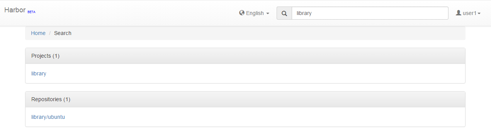
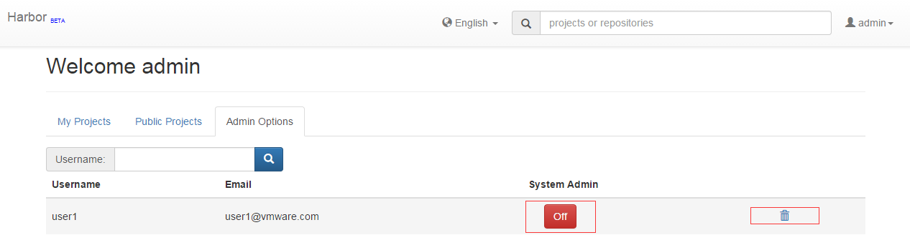

#User Guide
##Overview
This guide takes you through the fundamentals of using Harbor. You'll learn how to use Harbor to:  

* Manage your projects.
* Manage the members of a project.
* Search projects and repositories.
* Manage Harbor system if you are the system administrator.
* Pull and push images using Docker client.


##Role Based Access Control
RBAC (Role Based Access Control) is provided in Harbor and there are four roles with different privileges:  

* **Guest**: Guest has read-only privilege for a specified project.
* **Developer**: Developer has read and write privileges for a project.
* **ProjectAdmin**: When create a new project, you will be assigned the "ProjectAdmin" role to the project. Besides read-write privileges, the "ProjectAdmin" also has some management privileges, such as adding and removing members.
* **SysAdmin**: "SysAdmin" has the most privileges. In addition to the privileges mentioned above, "SysAdmin" can also list all projects, set an ordinary user as administrator and delete users. The public project "library" is also owned by the administrator.  

##Managing projects
A project in Harbor is a namespace that role based access control is applied to it and the repositories in it. Two types of projects are provided: 

* **Public**: All users have the read privilege to a public project, it's convenient for you to share some repositories with others in this way.
* **Private**: A private project can only been accessed by its members.

You can create a project after you signing in. Enable the "Public project" checkbox will make this project public.  

  

After the project being created, you can browse the repositories, members and access logs using the tabs in the left.  

  

  

##Managing the members of a project 
###Adding members
You can add members with different roles to an existing project.  


###Updating and removing members
You can update or remove the members by click the icons.  


##Searching projects and repositories
If you have signed in, you will get a list of projects and repositories that you have read privilege to and contain the keywords. Otherwise, only the public projects will be listed.  



##Administrator options
###Setting administrator and deleting user
Administrator can add "SysAdmin" role to an ordinary user and delete users by clicking the icons.  



##Pulling and pushing images using Docker client
**NOTE: The Registry V2 is compatible only with Docker engine version 1.6.0 or higher, so the version of your Docker must meet the requirement.**  
###Pulling images
If the project that the image belongs to is private, you should sign in first.  

```sh
$ docker login 10.117.169.182  
```
  
And then you can pull the image.  

```sh
$ docker pull 10.117.169.182/library/ubuntu:14.04  
```

**Note: Replace "10.117.169.182" with your Harbor IP or domain name.**

###Pushing images
Before pushing images, you must create corresponding projects using Harbor web UI. 

Sign in first.  

```sh
$ docker login 10.117.169.182  
```
  
Tag the image.  

```sh
$ docker tag ubuntu:14.04 10.117.169.182/demo/ubuntu:14.04  
``` 

Push the image.

```sh
$ docker push 10.117.169.182/demo/ubuntu:14.04  
```  

**Note: Replace "10.117.169.182" with your Harbor IP or domain name.**