# Harbor User Guide  

This guide walks you through the fundamentals of using the different Harbor features.

* [Role Based Access Control (RBAC)](#rbac)
* [Authentication Modes and User Accounts](#auth)
* [Managing Projects](#managing-projects)
* [Managing Members of a Project](#managing-members-of-a-project)
* [Access Project Logs](#access-project-logs)
* [Replicating Resources](#replicating-resources)
* [Retagging Images](#retagging-images)
* [Searching Projects and Repositories](#searching-projects-and-repositories)
* [Managing Labels](#managing-labels)
* [Set Project Quotas](#set-project-quotas)
* [Administrator Options](#administrator-options)
* [Pulling and Pushing Images using Docker Client](#pulling-and-pushing-images-in-the-docker-client)
* [Add Descriptions to Repositories](#add-descriptions-to-repositories)
* [Deleting Repositories](#deleting-repositories)
* [Content Trust](#content-trust)
* [Vulnerability Scanning](#vulnerability-scanning)
* [Configure CVE Whitelists](#configure-cve-whitelists)
* [Pulling Images from Harbor in Kubernetes](#pulling-images-from-harbor-in-kubernetes)
* [Managing Helm Charts](#managing-helm-charts)
* [Garbage Collection](#garbage-collection)
* [View Build History](#build-history)
* [Robot Accounts](#robot-accounts)
* [Tag Retention Rules](#tag-retention-rules)
* [Tag Immutability Rules](#tag-immutability-rules)
* [Webhook Notifications](#webhook-notifications)
* [Using API Explorer](#api-explorer)

<a id="rbac"></a>
## Role Based Access Control (RBAC)  


Harbor manages images through projects. Users can be added into one project as a member with one of the following different roles:  

* **Limited Guest**: A Limited Guest does not have full read privileges for a project. They can pull images but cannot push, and they cannot see logs or the other members of a project. For example, you can create limited guests for users from different organizations who share access to a project.
* **Guest**: Guest has read-only privilege for a specified project. They can pull and retag images, but cannot push.
* **Developer**: Developer has read and write privileges for a project.
* **Master**: Master has elevated permissions beyond those of 'Developer' including the ability to scan images, view replications jobs, and delete images and helm charts. 
* **ProjectAdmin**: When creating a new project, you will be assigned the "ProjectAdmin" role to the project. Besides read-write privileges, the "ProjectAdmin" also has some management privileges, such as adding and removing members, starting a vulnerability scan.

Besides the above roles, there are two system-level roles:  

* **Harbor system administrator**: "Harbor system administrator" has the most privileges. In addition to the privileges mentioned above, "Harbor system administrator" can also list all projects, set an ordinary user as administrator, delete users and set vulnerability scan policy for all images. The public project "library" is also owned by the administrator.  
* **Anonymous**: When a user is not logged in, the user is considered as an "Anonymous" user. An anonymous user has no access to private projects and has read-only access to public projects.  

See detailed permissions matrix listed here: https://github.com/goharbor/harbor/blob/master/docs/permissions.md

<a id="auth"></a>
## Authentication Modes and User Accounts
Harbor supports different modes for authenticating users and managing user accounts.

- [Database Authentication](#db_auth)
- [LDAP/Active Directory Authentication](#ldap_auth)
- [OIDC Provider Authentication](#oidc_auth)

**NOTE**: The Harbor interface offers an option to configure UAA authentication. This authentication mode is not recommended and is not documented in this guide.

<a id="db_auth"></a>
### Database Authentication

In database authentication mode, user accounts are stored in the local database. By default, only the Harbor system administrator can create user accounts to add users to Harbor. You can optionally configure Harbor to allow self-registration.  

**IMPORTANT**: If you create users in the database, Harbor is locked in database mode. You cannot change to a different authentication mode after you have created local users.

1. Log in to the Harbor interface with an account that has Harbor system administrator privileges.
1. Under **Administration**, go to **Configuration** and select the **Authentication** tab.
1. Leave **Auth Mode** set to the default **Database** option.

   
   
1. Optionally select the **Allow Self-Registration** check box.

   
    
   If you enable self registration option, users can register themselves in Harbor. Self-registration is disabled by default. If you enable self-registration, unregistered users can sign up for a Harbor account by clicking **Sign up for an account** in the Harbor log in page.
    
    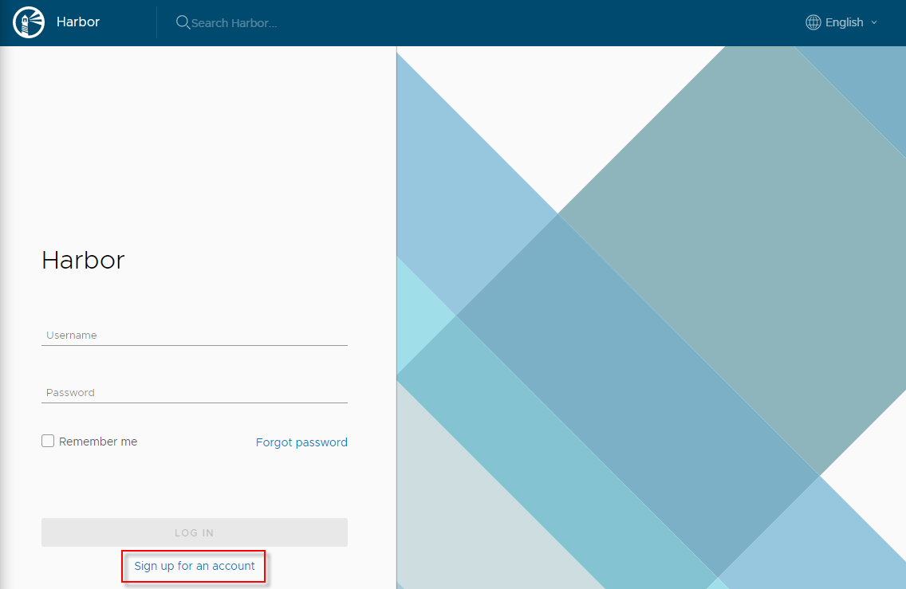
    
#### Create User Accounts
	
In database authentication mode, the Harbor system administrator creates user accounts manually. 

1. Log in to the Harbor interface with an account that has Harbor system administrator privileges.
1. Under **Administration**, go to **Users**.

   
1. Click **New User**.
1. Enter information about the new user.

   

   - The username must be unique in the Harbor system
   - The email address is used for password recovery
   - The password must contain at least 8 characters with 1 lowercase letter, 1 uppercase letter and 1 numeric character

If users forget their password, there is a **Forgot Password** in the Harbor log in page.

<a id="ldap_auth"></a>
### LDAP/Active Directory Authentication 

If you select LDAP/AD authentication, users whose credentials are stored in an external LDAP or AD server can log in to Harbor directly. In this case, you do not create user accounts in Harbor.

**IMPORTANT**: You can change the authentication mode from database to LDAP only if no local users have been added to the database. If there is at least one user other than `admin` in the Harbor database, you cannot change the authentication mode.

Because the users are managed by LDAP or AD, self-registration, creating users, deleting users, changing passwords, and resetting passwords are not supported in LDAP/AD authentication mode.  

If you want to manage user authentication by using LDAP groups, you must enable the `memberof` feature on the LDAP/AD server. With the `memberof` feature, the LDAP/AD user entity's `memberof` attribute is updated when the group entity's `member` attribute is updated, for example by adding or removing an LDAP/AD user from the LDAP/AD group. This feature is enabled by default in Active Directory. For information about how to enable and verify `memberof` overlay in OpenLDAP, see [this technical note]( https://technicalnotes.wordpress.com/2014/04/19/openldap-setup-with-memberof-overlay/).

1. Log in to the Harbor interface with an account that has Harbor system administrator privileges.
1. Under **Administration**, go to **Configuration** and select the **Authentication** tab.
1. Use the **Auth Mode** drop-down menu to select **LDAP**.

   
1. Enter the address of your LDAP server, for example `ldaps://10.162.16.194`.
1. Enter information about your LDAP server.

   - **LDAP Search DN** and **LDAP Search Password**: When a user logs in to Harbor with their LDAP username and password, Harbor uses these values to bind to the LDAP/AD server. For example, `cn=admin,dc=example.com`.
   - **LDAP Base DN**: Harbor looks up the user under the LDAP Base DN entry, including the subtree. For example, `dc=example.com`.
   - **LDAP Filter**: The filter to search for LDAP/AD users. For example, `objectclass=user`. 
   - **LDAP UID**: An attribute, for example `uid`, or `cn`, that is used to match a user with the username. If a match is found, the user's password is verified by a bind request to the LDAP/AD server. 
   - **LDAP Scope**: The scope to search for LDAP/AD users. Select from **Subtree**, **Base**, and **OneLevel**.
   
       
1. If you want to manage user authentication with LDAP groups, configure the group settings.
   - **LDAP Group Base DN**: The base DN from which to lookup a group in LDAP/AD. For example, `ou=groups,dc=example,dc=com`.
   - **LDAP Group Filter**: The filter to search for LDAP/AD groups. For example, `objectclass=groupOfNames`. 
   - **LDAP Group GID**: The attribute used to name an LDAP/AD group. For example, `cn`.  
   - **LDAP Group Admin DN**: All LDAP/AD users in this group DN have Harbor system administrator privileges.
   - **LDAP Group Membership**: The user attribute usd to identify a user as a member of a group. By default this is `memberof`.
   - **LDAP Scope**: The scope to search for LDAP/AD groups. Select from **Subtree**, **Base**, and **OneLevel**.
   
     
1. Uncheck **LDAP Verify Cert** if the LDAP/AD server uses a self-signed or untrusted certificate.

   
1. Click **Test LDAP Server** to make sure that your configuration is correct.
1. Click **Save** to complete the configuration.

<a id="oidc_auth"></a>
### OIDC Provider Authentication

If you select OpenID Connect (OIDC) authentication, users log in to the Harbor interface via an OIDC single sign-on (SSO) provider, such as Okta, KeyCloak, or dex. In this case, you do not create user accounts in Harbor.

**IMPORTANT**: You can change the authentication mode from database to OIDC only if no local users have been added to the database. If there is at least one user other than `admin` in the Harbor database, you cannot change the authentication mode.

Because the users are managed by the OIDC provider, self-registration, creating users, deleting users, changing passwords, and resetting passwords are not supported in OIDC authentication mode.  

#### Configure Your OIDC Provider

You must configure your OIDC provider so that you can use it with Harbor. For precise information about how to perform these configurations, see the documentation for your OIDC provider.

- Set up the users and groups that will use the OIDC provider to log in to Harbor. You do not need to assign any specific OIDC roles to users or groups as these do not get mapped to Harbor roles.
- The URL of the OIDC provider endpoint, known as the Authorization Server in OAuth terminology, must service the well-known URI for its configuration document. For more information about the configuration document, see the [OpenID documentation] (https://openid.net/specs/openid-connect-discovery-1_0.html#ProviderConfigurationRequest).
- To manage users by using OIDC groups, create a custom group claim that contains all of the user groups that you want to register in Harbor. The group claim must be mapped in the ID token that is sent to Harbor when users log in. You can enable the `memberof` feature on the OIDC provider. With the `memberof` feature, the OIDC user entity's `memberof` attribute is updated when the group entity's `member` attribute is updated, for example by adding or removing an OIDC user from the OIDC group.
- Register Harbor as a client application with the OIDC provider. Associate Harbor's callback URI to the client application as a `redirectURI`. This is the address to which the OIDC provider sends ID tokens.

#### Configure an OIDC Provider in Harbor

Before configuring an OIDC provider in Harbor, make sure that your provider is configured correctly according to the preceding section.

1. Log in to the Harbor interface with an account that has Harbor system administrator privileges.
1. Under **Administration**, go to **Configuration** and select the **Authentication** tab.
1. Use the **Auth Mode** drop-down menu to select **OIDC**.

   
1. Enter information about your OIDC provider.   

   - **OIDC Provider Name**: The name of the OIDC provider.
   - **OIDC Provider Endpoint**: The URL of the endpoint of the OIDC provider.
   - **OIDC Client ID**: The client ID with which Harbor is registered as  client application with the OIDC provider.
   - **OIDC Client Secret**: The secret for the Harbor client application.
   - **Group Claim Name**: The name of a custom group claim that you have configured in your OIDC provider, that includes the groups to add to Harbor.
   - **OIDC Scope**: A comma-separated string listing the scopes to be used during authentication. 
   
       The OIDC scope must contain `openid` and usually also contains `profile` and `email`. To obtain refresh tokens it should also contain `offline_access`. If you are using OIDC groups, a scope must identify the group claim. Check with your OIDC provider administrator for precise details of how to identify the group claim scope, as this differs from vendor to vendor.
       
       
1. Uncheck **Verify Certificate** if the OIDC Provider uses a self-signed or untrusted certificate.
1. Verify that the Redirect URI that you configured in your OIDC provider is the same as the one displayed at the bottom of the page. 
      
     
1. Click **Test OIDC Server** to make sure that your configuration is correct.
1. Click **Save** to complete the configuration.

#### Log In to Harbor via an OIDC Provider

When the Harbor system administrator has configured Harbor to authenticate via OIDC a **Login via OIDC Provider** button appears on the Harbor login page.  


**NOTE:** When Harbor is configured authentication via OIDC, the **Username** and **Password** fields are reserved for the local Harbor system administrator to log in.
    
1. As a Harbor user, click the **Login via OIDC Provider** button.
 
   This redirects you to the OIDC Provider for authentication.  
1. If this is the first time that you are logging in to Harbor with OIDC, specify a user name for Harbor to associate with your OIDC username.

   
    
   This is the user name by which you are identified in Harbor, which is used when adding you to projects, assigning roles, and so on. If the username is already taken, you are prompted to choose another one.
1. After the OIDC provider has authenticated you, you are redirected back to Harbor.

#### Using OIDC from the Docker or Helm CLI

After you have authenticated via OIDC and logged into the Harbor interface for the first time, you can use the Docker or Helm CLI to access Harbor.

The Docker and Helm CLIs cannot handle redirection for OIDC, so Harbor provides a CLI secret for use when logging in from Docker or Helm. This is only available when Harbor uses OIDC authentication.  

1. Log in to Harbor with an OIDC user account.
1. Click your username at the top of the screen and select **User Profile**.

   
1. Click the clipboard icon to copy the CLI secret associated with your account.

   
1. Optionally click the **...** icon in your user profile to display buttons for automatically generating or manually creating a new CLI secret.

    

   A user can only have one CLI secret, so when a new secret is generated or create, the old one becomes invalid.
1. If you generated a new CLI secret, click the clipboard icon to copy it.

You can now use your CLI secret as the password when logging in to Harbor from the Docker or Helm CLI.

<pre>
sh docker login -u testuser -p <i>cli_secret</i> jt-test.local.goharbor.io
</pre> 

**NOTE**: The CLI secret is associated with the OIDC ID token. Harbor will try to refresh the token, so the CLI secret will be valid after the ID token expires. However, if the OIDC Provider does not provide a refresh token or the refresh fails, the CLI secret becomes invalid. In this case, log out and log back in to Harbor via your OIDC provider so that Harbor can get a new ID token. The CLI secret will then work again.

## Managing Projects
A project in Harbor contains all repositories of an application. No images can be pushed to Harbor before the project is created. RBAC is applied to a project. There are two types of projects in Harbor:  

* **Public**: All users have the read privilege to a public project, it's convenient for you to share some repositories with others in this way.
* **Private**: A private project can only be accessed by users with proper privileges.  

You can create a project after you signed in. Check on the "Access Level" checkbox will make this project public.  

  

After the project is created, you can browse repositories, members, logs, replication and configuration using the navigation tab.


There are two views to show repositories, list view and card view, you can switch between them by clicking the corresponding icon.


Project properties can be changed by clicking "Configuration".

* To make all repositories under the project accessible to everyone, select the `Public` checkbox.

* To prevent un-signed images under the project from being pulled, select the `Enable content trust` checkbox.

 

## Managing Members of a Project  

You can add individual users to an existing project and assign a role to them. You can add an LDAP/AD or OIDC user to the project members if you  use LDAP/AD or OIDC authentication, or a user that you have already created if you use database authentication. If you use LDAP/AD or OIDC authentication, you can add groups to projects and assign a role to the group.

### Add Individual Members to Projects 

1. Log in to the Harbor interface with an account that has at least project administrator privileges.
1. Go to **Projects** and select a project. 
1. Select the **Members** tab and click **+User**.

    
1. Enter the name of an existing database, LDAP/AD, or OIDC user and select a role for this user.

   
1. Optionally select one or more members, click **Action**, and select a different role for the user or users, or select **Remove** to remove them from the project.

   

### Add LDAP/AD Groups to Projects

1. Log in to the Harbor interface with an account that has at least project administrator privileges.
1. Go to **Projects** and select a project. 
1. Select the **Members** tab and click **+Group**.

   
1. Select **Add an existing user group to project members** or **Add a group from LDAP to project member**.

   
   
   - If you selected **Add an existing user group to project members**, enter the name of a group that you have already used in Harbor and assign a role to that group.
   - If you selected **Add a group from LDAP to project member**, enter the LDAP Group DN and assign a role to that group.

Once an LDAP group has been assigned a role in a project, all LDAP/AD users in this group have the privileges of the role you assigned to the group. If a user has both user-level role and group-level role, these privileges are merged.

If a user in the LDAP group has admin privilege, the user has the same privileges as the Harbor system administrator.

### Add OIDC Groups to Projects

To be able to add OIDC groups to projects, your OIDC provider and Harbor instance must be configured correctly. For information about how to configure OIDC so that Harbor can use groups, see [OIDC Provider Authentication](#oidc_auth).

1. Log in to the Harbor interface with an account that has at least project administrator privileges.
1. Go to **Projects** and select a project. 
1. Select the **Members** tab and click **+Group**.

   
1. Enter the name of a group that already exists in your OIDC provider and assign a role to that group.

   
   
**NOTE**: Unlike with LDAP groups, Harbor cannot check whether OIDC groups exist when you add them to a project. If you mistype the group name, or if the group does not exist in your OIDC provider, Harbor still creates the group.

## Access Project Logs

1. Log in to the Harbor interface with an account that has at least developer privileges.
1. Go to **Projects**, select a project, and select **Logs**.

   

   All logs for the project are displayed.
1. Click the **Search** icon and start typing to filter the logs by name.
 
   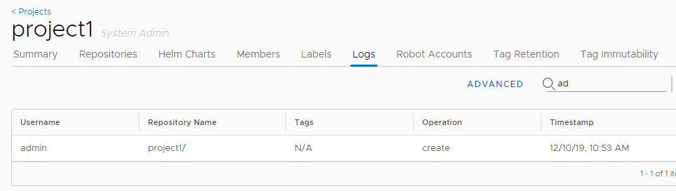  
1. Click **Advanced**. 

   
1. Use the **Operations** drop-down menu to filter by operation type.
    
1. Click the calendar icons to enter dates between which to search for logs of the types you set in the **Operations** drop-down menu. 

   

## Replicating Resources  
Replication allows users to replicate resources, namely images and charts, between Harbor and non-Harbor registries, in both pull or push mode. 

When the Harbor system administrator has set a replication rule, all resources that match the defined filter patterns are replicated to the destination registry when the triggering condition is met. Each resource that is replicated starts a replication task. If the namespace does not exist in the destination registry, a new namespace is created automatically. If it already exists and the user account that is configured in the replication policy does not have write privileges in it, the process fails. Member information is not replicated.  

There might be some delay during replication based on the condition of the network. If a replication task fails, it is re-scheduled for a few minutes later and retried several times.  

**NOTE:** Due to API changes, replication between different versions of Harbor is not supported.

### Creating Replication Endpoints

To replicate image repositories from one instance of Harbor to another Harbor or non-Harbor registry, you first create replication endpoints.

1. Go to **Registries** and click the **+ New Endpoint** button.

   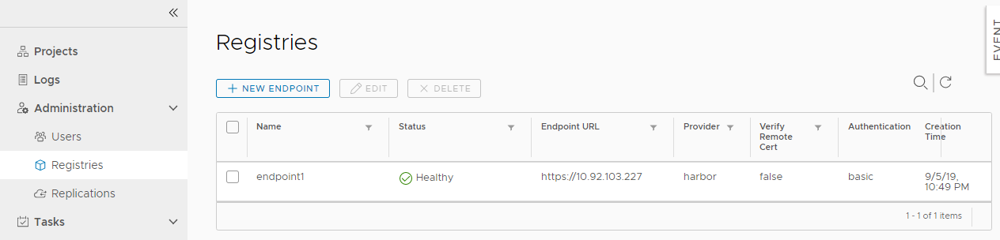
1. For **Provider**, use the drop-down menu to select the type of registry to set up as a replication endpoint.

   The endpoint can be another Harbor instance, or a non-Harbor registry. Currently, the following non-Harbor registries are supported:

   - Docker Hub
   - Docker registry
   - AWS Elastic Container Registry
   - Azure Container Registry
   - Ali Cloud Container Registry
   - Google Container Registry
   - Huawei SWR
   - Helm Hub
   - Gitlab
   - Quay.io
   - Jfrog Artifactory

   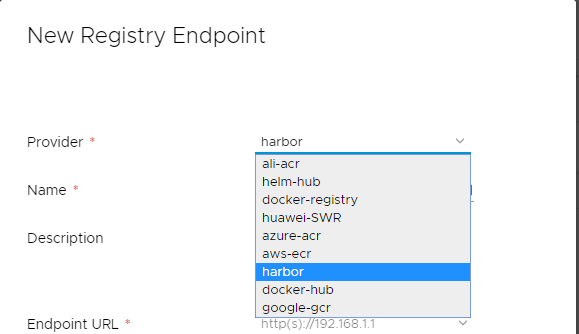

1. Enter a suitable name and description for the new replication endpoint.
1. Enter the full URL of the registry to set up as a replication endpoint.

   For example, to replicate to another Harbor instance, enter https://harbor_instance_address:443. The registry must exist and be running before you create the endpoint.
1. Enter the Access ID and Access Secret for the endpoint registry instance.

   Use an account that has the appropriate privileges on that registry, or an account that has write permission on the corresponding project in a Harbor  registry.
   
   **NOTES**: 
    - AWS ECR adapters should use access keys, not a username and password. The access key should have sufficient permissions, such as storage permission.
    - Google GCR adapters should use the entire JSON key generated in the service account. The namespace should start with the project ID.
1. Optionally, select the **Verify Remote Cert** check box.

    Deselect the check box if the remote registry uses a self-signed or untrusted certificate.
1. Click **Test Connection**.
1. When you have successfully tested the connection, click **OK**.

### Creating a Replication Rule

A replication endpoint must exist before you create a replication rule. To create an endpoint, follow the instructions in the [Creating replication endpoints](#creating-replication-endpoints).

1. Log in to the Harbor interface with an account that has Harbor system administrator privileges.
1. Expand **Administration**, and select **Replications**.

   
1. Click **New Replication Rule**.
1. Provide a name and description for the replication rule.
1. Select **Push-based** or **Pull-based** replication, depending on whether you want to replicate images to or from the remote registry.

   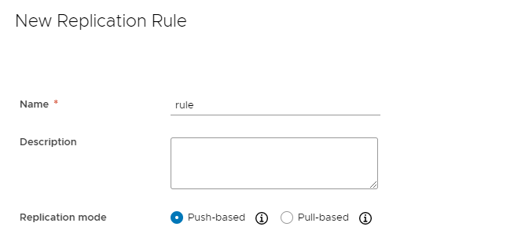
1. For **Source resource filter**, identify the images to replicate.  

   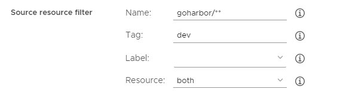

   * **Name**: Replicate resources with a given name by entering an image name or fragment.
   * **Tag**: Replicate resources with a given tag by entering a tag name or fragment.
   * **Label**: Replicate resources with a given label by using the drop-down menu to select from the available labels.
   * **Resource**: Replicate images, charts, or both.
   
   The name filter and tag filters support the following patterns:
   
   * **\***: Matches any sequence of non-separator characters `/`.
   * **\*\***: Matches any sequence of characters, including path separators `/`.
   * **?**: Matches any single non-separator character `/`.
   * **{alt1,...}**: Matches a sequence of characters if one of the comma-separated alternatives matches. are as follows:
   * **\***: Matches any sequence of non-separator characters `/`.
   * **\*\***: Matches any sequence of characters, including path separators `/`.
   * **?**: Matches any single non-separator character `/`.
   * **{alt1,...}**: Matches a sequence of characters if one of the comma-separated alternatives matches.
   
   **NOTE:** You must add `library` if you want to replicate the official images of Docker Hub. For example, `library/hello-world` matches the official hello-world images.  
   
   Pattern | String(Match or not)
   ---------- | -------
   `library/*`      | `library/hello-world`(Y)<br> `library/my/hello-world`(N)
   `library/**`     | `library/hello-world`(Y)<br> `library/my/hello-world`(Y)
   `{library,goharbor}/**` | `library/hello-world`(Y)<br> `goharbor/harbor-core`(Y)<br> `google/hello-world`(N)
   `1.?`      | `1.0`(Y)<br> `1.01`(N)
1. Use the **Destination Registry** drop-down menu to select from the configured replication endpoints. 
1. Enter the name of the namespace in which to replicate resources in the **Destination namespace** text box.

   If you do not enter a namespace, resources are placed in the same namespace as in the source registry. 

   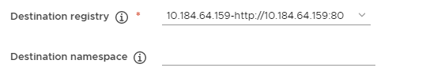
1. Use the Trigger Mode drop-down menu to select how and when to run the rule.
   * **Manual**: Replicate the resources manually when needed. **Note**: Deletion operations are not replicated. 
   * **Scheduled**: Replicate the resources periodically by defining a cron job. **Note**: Deletion operations are not replicated. 
   * **Event Based**: When a new resource is pushed to the project, or an image is retagged, it is replicated to the remote registry immediately. If you select the `Delete remote resources when locally deleted`, if you delete an image, it is automatically deleted from the replication target.

      **NOTE**: You can filter images for replication based on the labels that are applied to the images. However, changing a label on an image does not trigger replication. Event-based replication is limited to pushing, retagging, and deleting images.

   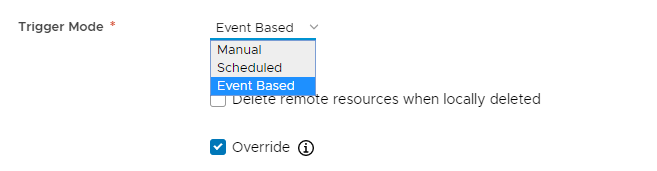
      
1. Optionally select the Override checkbox to force replicated resources to replace resources at the destination with the same name.
1. Click **Save** to create the replication rule.  


### Running Replication Manually

1. Log in to the Harbor interface with an account that has Harbor system administrator privileges.
1. Expand **Administration**, and select **Replications**.
1. Select a replication rule and click **Replicate**. 

   

   The resources to which the rule is applied start to replicate from the source registry to the destination immediately.     
1. Click the rule to see its execution status.
1. Click the **ID** of the execution to see the details of the replication  and the task list. The count of `IN PROGRESS` status in the summary includes both `Pending` and `In Progress` tasks.  
1. Optionally click **STOP** to stop the replication. 
1. Click the log icon to see detailed information about the replication task. 


To edit or delete a replication rule, select the replication rule in the **Replications** view and click **Edit** or **Delete**. Only rules which have no executions in progress can be edited deleted.  


## Retagging Images

Images retag helps users to tag images in Harbor, images can be tagged to  different repositories and projects, as long as the users have sufficient permissions. For example,

```
release/app:stg  -->  release/app:prd
develop/app:v1.0 --> release/app:v1.0
```
To retag an image, users should have read permission (guest role or above) to the source project and write permission (developer role or above) to the target project.

In Harbor portal, select the image you'd like to retag, and click the enabled `Retag` button to open the retag dialog.


In the retag dialog, project name, repository name and the new tag should be specified. On click the `CONFIRM` button, the new tag would be created instantly. You can check the new tag in the corresponding project. 

## Searching Projects and Repositories
Entering a keyword in the search field at the top lists all matching projects and repositories. The search result includes both public and private repositories you have access to.  


## Managing Labels
Harbor provides two kinds of labels to isolate kinds of resources(only images for now):
* **Global Level Label**: Managed by Harbor system administrators and used to manage the images of the whole system. They can be added to images under any projects.
* **Project Level Label**: Managed by project administrators under a project and can only be added to the images of the project.

### Managing Global Labels
The Harbor system administrators can list, create, update and delete the global level labels under `Administration->Configuration->Labels`:


### Managing Project-Level Labels
The project administrators and Harbor system administrators can list, create, update and delete the project level labels under `Labels` tab of the project detail page:


### Adding and Removing Labels to and from Images
Users who have Harbor system administrator, project administrator or project developer role can click the `ADD LABELS` button to add labels to or remove labels from images. The label list contains both globel level labels(come first) and project level labels:


### Filtering Images by Label
The images can be filtered by labels:


## Set Project Quotas

To exercise control over resource use, as a Harbor system administrator you can set  quotas on projects. You can limit the number of tags that a project can contain and limit the amount of storage capacity that a project can consume. You can set default quotas that apply to all projects globally.

**NOTE**: Default quotas apply to projects that are created after you set or change the default quota. The default quota is not applied to projects that already existed before you set it.

You can also set quotas on individual projects. If you set a global default quota and you set different quotas on individual projects, the per-project quotas are applied.

By default, all projects have unlimited quotas for both tags and storage use. 

1. Select the **Project Quotas** view.
   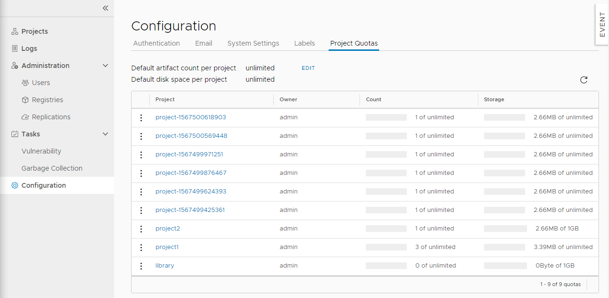
1. To set global default quotas on all projects, click **Edit**.

   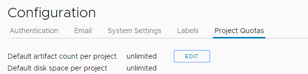
   1. For **Default artifact count**, enter the maximum number of tags that any project can contain at a given time, or enter `-1` to set the default to unlimited.   
   1. For **Default storage consumption**, enter the maximum quantity of storage that any project can consume, selecting `MB`, `GB`, or `TB` from the drop-down menu, or enter `-1` to set the default to unlimited.  
   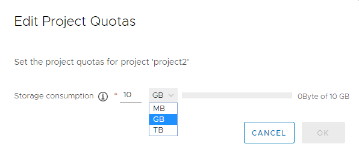
   1. Click **OK**.
1. To set quotas on an individual project, click the 3 vertical dots next to a project and select **Edit**.
   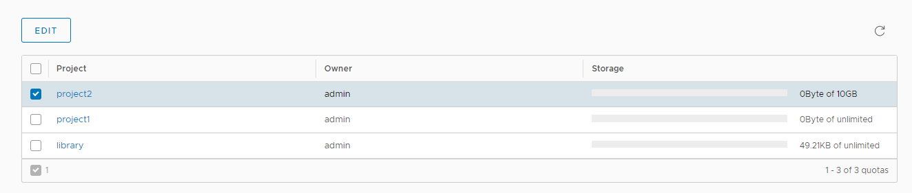
   1. For **Default artifact count**, enter the maximum number of tags that this individual project can contain, or enter `-1` to set the default to unlimited. 
   1. For **Default storage consumption**, enter the maximum quantity of storage that this individual project can consume, selecting `MB`, `GB`, or `TB` from the drop-down menu.

After you set quotas, you can see how much of their quotas each project has consumed.

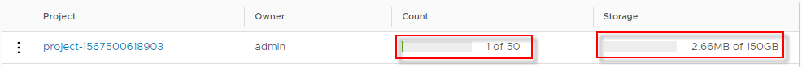

### How Harbor Calculates Resource Usage

When setting project quotas, it is useful to know how Harbor calculates tag numbers and storage use, especially in relation to image pushing, retagging, and garbage collection.

- Harbor computes image size when blobs and manifests are pushed from the Docker client.
- Harbor computes tag counts when manifests are pushed from the Docker client.

   **NOTE**: When users push an image, the manifest is pushed last, after all of the associated blobs have been pushed successfully to the registry. If several images are pushed concurrently and if there is an insufficient number of tags left in the quota for all of them, images are accepted in the order that their manifests arrive. Consequently, an attempt to push an image might not be immediately rejected for exceeding the quota. This is because there was availability in the tag quota when the push was initiated, but by the time the manifest arrived the quota had been exhausted.
- Shared blobs are only computed once per project. In Docker, blob sharing is defined globally. In Harbor, blob sharing is defined at the project level. As a consequence, overall storage usage can be greater than the actual disk capacity.
- Retagging images reserves and releases resources: 
  -  If you retag an image within a project, the tag count increases by one, but storage usage does not change because there are no new blobs or manifests.
  - If you retag an image from one project to another, the tag count and storage usage both increase.
- During garbage collection, Harbor frees the storage used by untagged blobs in the project.
- If the tag count reaches the limit, image blobs can be pushed into a project and storage usage is updated accordingly. You can consider these blobs to be untagged blobs. They can be removed by garbage collection, and the storage that they consume is returned after garbage colletion.
- Helm chart size is not calculated. Only tag counts are calculated.

## Administrator Options  
### Managing Users
Administrator can add "Administrator" role to one or more ordinary users by checking checkboxes and clicking `SET AS ADMINISTRATOR`. To delete users, checked checkboxes and select `DELETE`. Deleting user is only supported under database authentication mode.


### Managing Project Creation
Use the **Project Creation** drop-down menu to set which users can create projects. Select **Everyone** to allow all users to create projects. Select **Admin Only** to allow only users with the Administrator role to create projects.  


### Managing Email Settings
You can change Harbor's email settings, the mail server is used to send out responses to users who request to reset their password.  


### Managing Registry Read Only
You can change Harbor's registry read only settings, read only mode will allow 'docker pull' while preventing 'docker push' and the deletion of repository and tag.


If it set to true, deleting repository, tag and pushing image will be disabled. 


```
$ docker push 10.117.169.182/demo/ubuntu:14.04  
The push refers to a repository [10.117.169.182/demo/ubuntu]
0271b8eebde3: Preparing 
denied: The system is in read only mode. Any modification is prohibited.  
```
## Pulling and Pushing Images in the Docker Client

**NOTE**: Harbor only supports the Registry V2 API. You must use Docker client 1.6.0 or higher.  

Harbor optionally supports HTTP connections, however the Docker client always attempts to connect to registries by first using HTTPS. If Harbor is configured for HTTP, you must configure your Docker client so that it can connect to insecure registries. In your Docker client is not configured for insecure registries, you will see the following error when you attempt to pull or push images to Harbor: 

<pre>
Error response from daemon: Get https://<i>myregistrydomain.com</i>/v1/users/: dial tcp <i>myregistrydomain.com</i>:443 getsockopt: connection refused.
</pre>

For information about how to add insecure registries to your Docker client, see [Connecting to Harbor via HTTP](installation_guide.md#connect_http) in the *Harbor Installation and Configuration Guide*.

You also see this error if Harbor uses HTTPS with an unknown CA certificate. In this case, obtain the registry's CA certificate, and copy it to <code>/etc/docker/certs.d/<i>myregistrydomain.com</i>/ca.crt</code>.   

### Pulling Images  
If the project that the image belongs to is private, you should sign in first:  

```
sh
$ docker login 10.117.169.182  
```

You can now pull the image:  

```
sh 
$ docker pull 10.117.169.182/library/ubuntu:14.04  
```

**Note**: Replace "10.117.169.182" with the IP address or domain name of your Harbor node. You cannot pull an unsigned image if you enabled content trust.

### Pushing Images  
Before pushing an image, you must create a corresponding project on Harbor web UI. 

First, log in from Docker client:  

```
sh
$ docker login 10.117.169.182  
```

Tag the image:  

```
sh
$ docker tag ubuntu:14.04 10.117.169.182/demo/ubuntu:14.04  
```

Push the image:

```
sh
$ docker push 10.117.169.182/demo/ubuntu:14.04  
```

**Note: Replace "10.117.169.182" with the IP address or domain name of your Harbor node.**

##  Add Descriptions to Repositories

After pushing an image, an Information can be added by project admin to describe this repository.

Go into the repository and select the "Info" tab, and click the "EDIT" button.  An textarea will appear and enter description here. Click "SAVE" button to save this information.


## Download the Harbor Certificate

Users  can click the "registry certificate" link to download the registry certificate.


##  Deleting Repositories  

Repository deletion runs in two steps.  

First, delete a repository in Harbor's UI. This is soft deletion. You can delete the entire repository or just a tag of it. After the soft deletion, 
the repository is no longer managed in Harbor, however, the files of the repository still remain in Harbor's storage.  


**CAUTION: If both tag A and tag B refer to the same image, after deleting tag A, B will also get deleted. if you enabled content trust, you need to use notary command line tool to delete the tag's signature before you delete an image.**  

Next, delete the actual files of the repository using the [garbage collection](#online-garbage-collection) in Harbor's UI. 

## Content Trust  
**NOTE: Notary is an optional component, please make sure you have already installed it in your Harbor instance before you go through this section.**  
If you want to enable content trust to ensure that images are signed, please set two environment variables in the command line before pushing or pulling any image:
```sh
export DOCKER_CONTENT_TRUST=1
export DOCKER_CONTENT_TRUST_SERVER=https://10.117.169.182:4443
```
If you push the image for the first time, You will be asked to enter the root key passphrase. This will be needed every time you push a new image while the ``DOCKER_CONTENT_TRUST`` flag is set.  
The root key is generated at: ``/root/.docker/trust/private/root_keys``  
You will also be asked to enter a new passphrase for the image. This is generated at ``/root/.docker/trust/private/tuf_keys/[registry name] /[imagepath]``.  
If you are using a self-signed cert, make sure to copy the CA cert into ```/etc/docker/certs.d/10.117.169.182``` and ```$HOME/.docker/tls/10.117.169.182:4443/```. When an image is signed, it is indicated in the Web UI.  
**Note: Replace "10.117.169.182" with the IP address or domain name of your Harbor node. In order to use content trust, HTTPS must be enabled in Harbor.**  


When an image is signed, it has a tick shown in UI; otherwise, a cross sign(X) is displayed instead.  


## Vulnerability Scanning

Harbor provides static analysis of vulnerabilities in images through the open source [Clair](https://github.com/coreos/clair) project. 

**IMPORTANT**: Clair is an optional component. To be able to use Clair you must have enabled Clair when you installed your Harbor instance. 

You can also connect Harbor to your own instance of Clair or to additional vulnerability scanners by using an interrogation service. You configure additional scanners in the Harbor interface, after you have installed Harbor. For the list of additional scanners that are currently supported, see the [Harbor Compatibility List](harbor_compatibility_list.md#scanner-adapters).

It might be necessary to connect Harbor to other scanners for corporate compliance reasons, or because your organization already uses a particular scanner. Different scanners also use different vulnerability databases, capture different CVE sets, and apply different severity thresholds. By connecting Harbor to more than one vulnerability scanner, you broaden the scope of your protection against vulnerabilities.

- For information about installing Harbor with Clair, see the [Installation and Configuration Guide](installation_guide.md). 
- For information about adding additional scanners, see [Connect Harbor to Additional Vulnerability Scanners](#pluggable-scanners) below.

You can manually initiate scanning on a particular image, or on all images in Harbor. Additionally, you can also set a policy to automatically scan all of the images at specific intervals.

<a id="pluggable-scanners"></a>
### Connect Harbor to Additional Vulnerability Scanners

To connect Harbor to additional vulnerability scanners, you must install and configure an instance of the additional scanner according to the scanner vendor's requirements. The scanner must expose an API endpoint to allow Harbor to trigger the scan process or get reports. You can deploy multiple different scanners, and multiple instances of the same type of scanner.

1. Log in to the Harbor interface with an account that has Harbor system administrator privileges.
1. Expand **Administration**, and select **Interrogation Services**. 
   
1. Click the **New Scanner** button.
1. Enter the information to identify the scanner.
   - A unique name for this scanner instance, to display in the Harbor interface.
   - An optional description of this scanner instance.
   - The address of the API endpoint that the scanner exposes to Harbor.
   
1. Select how to connect to the scanner from the **Authorization** drop-down menu.
   
   - **None**: The scanner allows all connections without any security.
   - **Basic**: Enter a username and password for an account that can connect to the scanner.
   - **Bearer**: Paste the contents of a bearer token in the **Token** text box.
   - **APIKey**: Paste the contents of an API key for the scanner in the **APIKey** text box.
1. Optionally select **Skip certificate verification** if the scanner uses a self-signed or untrusted certificate. 
1. Optionally select **Use internal registry address** if the scanner should connect to Harbor using an internal network address rather than its external URL.

   **NOTE**: To use this option, the scanner must be deployed in a network that allows the scanner to reach Harbor via Harbor's internal network.
1. Click **Test Connection** to make sure that Harbor can connect successfully to the scanner. 
   
1. Click **Add** to connect Harbor to the scanner.
1. Optionally repeat the procedure to add more scanners.
1. If you configure multiple scanners, select one and click **Set as Default** to designate it as the default scanner.

### Updating the Vulnerability Metadata in the Database

Vulnerability scanners depend on the vulnerability metadata to complete the analysis process. After the first initial installation, the vulnerability scanner automatically starts to update the metadata database from different vulnerability repositories. The database update might take a while, based on the data size and network connection. 

Depending on the scanner that you use, once the database is ready, the timestamp of the last update is shown in the **Interrogation Services** > **Vulnerability** tab. Currently, only Clair and Anchore provide timestamp information.


Until the database has been fully populated, the timestamp is replaced by a warning symbol. When the database is ready, you can scan images individually or scan all images across all projects.

### Scan Individual Images

1. Log in to the Harbor interface with an account that has at least project administrator privileges.
1. Go to **Projects** and select a project. 
1. Select the **Scanner** tab.

   The **Scanner** tab shows the details of the scanner that is currently set as the scanner to use for this project.
   
   
1. Click **Edit** to select a different scanner from the list of scanners that are connected to this Harbor instance, and click **OK**.

   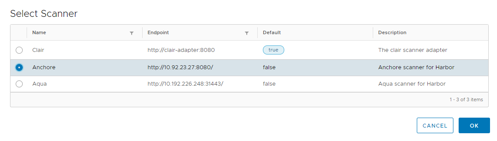
   
   **NOTE**: If you have selected the **Prevent vulnerable images from running** option in the project **Configuration** tab, the prevention of pulling vulnerable images is determined by the scanner that is set in the project, or by the global default scanner if no scanner is configured specifically for the project. Different scanners might apply different levels of severity to image vulnerabilities.
1. Select the **Repositories** tab and select a repository.

   For each tag in the repository, the **Vulnerabilities** column displays the vulnerability scanning status and related information.
   
   
1. Select a tag, or use the check box at the top to select all tags in the repository, and click the **Scan** button to run the vulnerability scan on this image.

   

   **NOTE**: You can start a scan at any time, unless the status is **Queued** or **Scanning**. If the database has not been fully populated, you should not run a scan. The following statuses are displayed in the **Vulnerabilities** column:
   
   * **Not Scanned:** The tag has never been scanned.
   * **Queued:** The scanning task is scheduled but has not run yet.
   * **Scanning:** The scanning task is in progress and a progress bar is displayed.
   * **View log:** The scanning task failed to complete. Click **View Log** link to view the related logs.
   * **Complete:** The scanning task completed successfully.

   If the process completes successfully, the result indicates the overall severity level, with the total number of vulnerabilities found for each severity level, and the number of fixable vulnerabilities.

   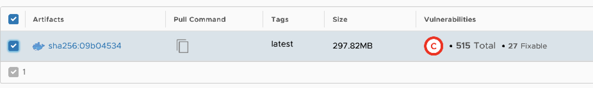

   * **Red:** At least one critical vulnerability found
   * **Orange:** At least one high level vulnerability found
   * **Yellow:** At least one medium level vulnerability found
   * **Blue:** At least one low level vulnerability found
   * **Green:** No vulnerabilities found
   * **Grey:** Unknown vulnerabilities
1. Hover over the number of fixable vulnerabilities to see a summary of the vulnerability report. 

   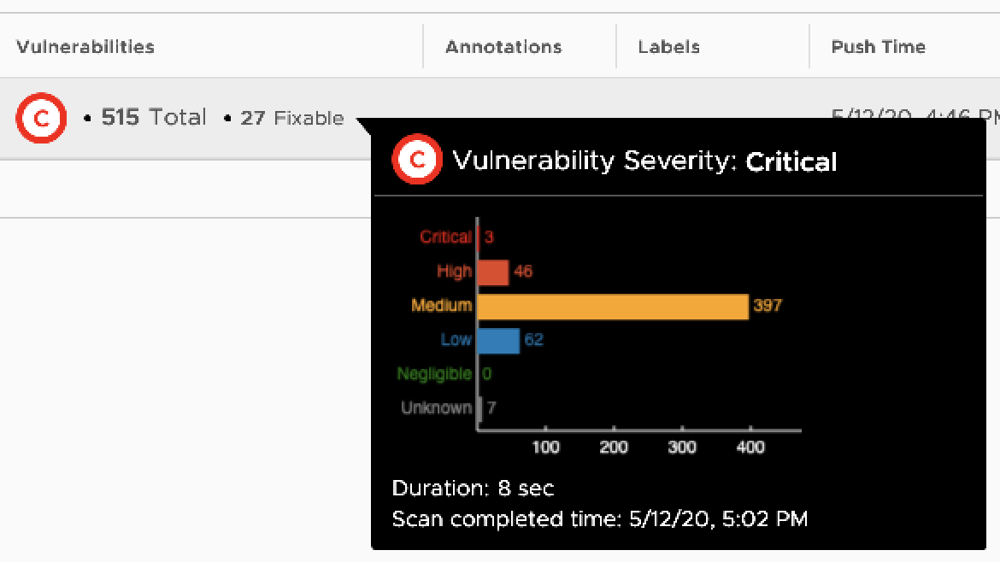
1. Click on the tag name to see a detailed vulnerability report.
 
  
  
   In addition to information about the tag, all of the vulnerabilities found in the last scan are listed. You can order or filter the list by the different columns. You can also click **Scan** in the report page to run a scan on this image tag.

### Scan All Images

In addition to scanning individual images in projects, you can run global scans on all of the images in a Harbor instance, across all projects.

1. Log in to the Harbor interface with an account that has Harbor system administrator privileges.
1. Expand **Administration**, and select **Interrogation Services**. 
1. Select the **Vulnerability** tab and click **Scan Now** to scan all of the images in all projects.

   
   
Scanning requires intensive resource consumption. If scanning is in progress, the **Scan Now** button is unavailable.

### Schedule Scans

You can set policies to control when vulnerability scanning should run.

1. Log in to the Harbor interface with an account that has Harbor system administrator privileges.
1. Expand **Administration**, and select **Interrogation Services**. 
1. Select the **Vulnerability** tab and click the **Edit** button next to **Schedule to scan all**.  
1. Use the drop down-menu to select how often to run scans.

   
   
   * **None**: No scans are scheduled.
   * **Hourly**: Run a scan at the beginning of every hour.
   * **Daily**: Run a scan at midnight every day.
   * **Weekly**: Run a scan at midnight every Saturday.
   * **Custom**: Run a scan according to a `cron` job.
1. Click **Save**.

### Configure Vulnerability Settings in Projects

You can configure projects so that images with vulnerabilities cannot be run, and to automatically scan images as soon as they are pushed into the project.

1. Log in to the Harbor interface with an account that has at least project administrator privileges.
1. Go to **Projects** and select a project. 
1. Select the **Configuration** tab.
1. To prevent vulnerable images under the project from being pulled, select the **Prevent vulnerable images from running** checkbox.

   

1. Select the severity level of vulnerabilities to prevent images from running.

   
   
   Images cannot be pulled if their level is equal to or higher than the selected level of severity. Harbor does not prevent images with a vulnerability severity of `negligible` from running.
1. To activate an immediate vulnerability scan on new images that are pushed to the project, select the **Automatically scan images on push** check box.

   

## Configure CVE Whitelists

When you run vulnerability scans, images that are subject to Common Vulnerabilities and Exposures (CVE) are identified. According to the severity of the CVE and your security settings, these images might not be permitted to run. As a Harbor system administrator, you can create whitelists of CVEs to ignore during vulnerability scanning. 

You can set a system-wide CVE whitelist or you can set CVE whitelists on a per-project basis.

### Configure a System-Wide CVE Whitelist

System-wide CVE whitelists apply to all of the projects in a Harbor instance.

1. Go to **Configuration** > **System Settings**.
1. Under **Deployment security**, click **Add**. 
   
1. Enter the list of CVE IDs to ignore during vulnerability scanning. 
   

   Either use a comma-separated list or newlines to add multiple CVE IDs to the list.
1. Click **Add** at the bottom of the window to add the list.
1. Optionally uncheck the **Never expires** checkbox and use the calendar selector to set an expiry date for the whitelist.
   
1. Click **Save** at the bottom of the page to save your settings.
   
After you have created a system whitelist, you can remove CVE IDs from the list by clicking the delete button next to it in the list. You can click **Add** to add more CVE IDs to the system whitelist.

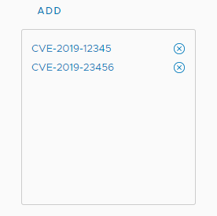

### Configure a Per-Project CVE Whitelist

By default, the system whitelist is applied to all projects. You can configure different CVE whitelists for individual projects, that override the system whitelist. 

1. Go to **Projects**, select a project, and select **Configuration**.
1. Under **CVE whitelist**, select **Project whitelist**. 
   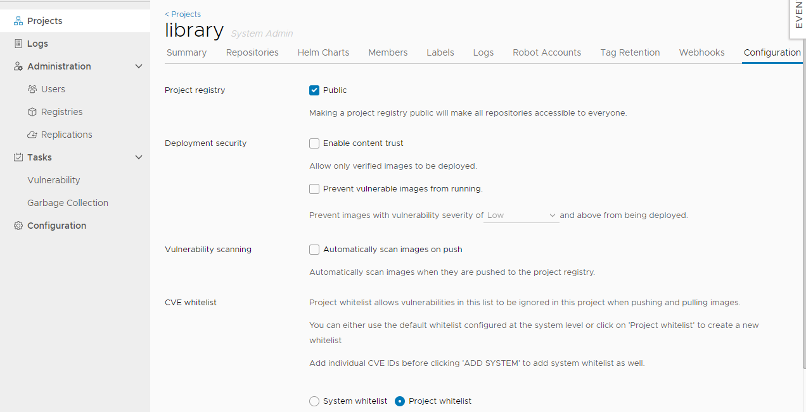
1. Optionally click **Copy From System** to add all of the CVE IDs from the system CVE whitelist to this project whitelist.
1. Click **Add** and enter a list of additional CVE IDs to ignore during vulnerability scanning of this project. 
   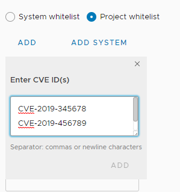

   Either use a comma-separated list or newlines to add multiple CVE IDs to the list.
1. Click **Add** at the bottom of the window to add the CVEs to the project whitelist.
1. Optionally uncheck the **Never expires** checkbox and use the calendar selector to set an expiry date for the whitelist.
1. Click **Save** at the bottom of the page to save your settings.

After you have created a project whitelist, you can remove CVE IDs from the list by clicking the delete button next to it in the list. You can click **Add** at any time to add more CVE IDs to this project whitelist. 

If CVEs are added to the system whitelist after you have created a project whitelist, click **Copy From System** to add the new entries from the system whitelist to the project whitelist. 

**NOTE**: If CVEs are deleted from the system whitelist after you have created a project whitelist, and if you added the system whitelist to the project whitelist, you must manually remove the deleted CVEs from the project whitelist. If you click **Copy From System** after CVEs have been deleted from the system whitelist, the deleted CVEs are not automatically removed from the project whitelist.

## Pulling Images from Harbor in Kubernetes
Kubernetes users can easily deploy pods with images stored in Harbor.  The settings are similar to that of another private registry. There are two major issues:

1. When your Harbor instance is hosting http and the certificate is self signed.  You need to modify daemon.json on each work node of your cluster, for details please refer to: https://docs.docker.com/registry/insecure/#deploy-a-plain-http-registry
2. If your pod references an image under private project, you need to create a secret with the credentials of user who has permission to pull image from this project, for details refer to: https://kubernetes.io/docs/tasks/configure-pod-container/pull-image-private-registry/

## Managing Helm Charts
[Helm](https://helm.sh) is a package manager for [Kubernetes](https://kubernetes.io). Helm uses a packaging format called [charts](https://docs.helm.sh/developing_charts). Since version 1.6.0 Harbor is now a composite cloud-native registry which supports both container image management and Helm charts management. Access to Helm charts in Harbor is controlled by [role-based access controls (RBAC)](https://en.wikipedia.org/wiki/Role-based_access_control) and is restricted by projects.

### Manage Helm Charts via the Harbor Interface
#### List charts
Click your project to enter the project detail page after successful logging in. The existing helm charts will be listed under the tab `Helm Charts` which is beside the image `Repositories` tab with the following information:
* Name of helm chart
* The status of the chart: Active or Deprecated
* The count of chart versions
* The created time of the chart


You can click the icon buttons on the top right to switch views between card view and list view.

#### Upload a New Chart
Click the `UPLOAD` button on the top left to open the chart uploading dialog. Choose the uploading chart from your filesystem. Click the `UPLOAD` button to upload it to the chart repository server.


If the chart is signed, you can choose the corresponding provenance file from your filesystem and Click the `UPLOAD` button to upload them together at once.

If the chart is successfully uploaded, it will be displayed in the chart list at once.

#### List Chart Versions
Clicking the chart name from the chart list will show all the available versions of that chart with the following information:
* the chart version number
* the maintainers of the chart version
* the template engine used (default is gotpl)
* the created timestamp of the chart version


Obviously, there will be at least 1 version for each of the charts in the top chart list. Same with chart list view, you can also click the icon buttons on the top right to switch views between card view and list view.

Check the checkbox at the 1st column to select the specified chart versions:
* Click the `DELETE` button to delete all the selected chart versions from the chart repository server. Batch operation is supported.
* Click the `DOWNLOAD` button to download the chart artifact file. Batch operation is not supported.
* Click the `UPLOAD` button to upload the new chart version for the current chart

#### Adding Labels to and Removing Labels from Chart Versions
Users who have Harbor system administrator, project administrator or project developer role can click the `ADD LABELS` button to add labels to or remove labels from chart versions.


#### Filtering Chart Versions by Label
The chart versions can be filtered by labels:


#### View Chart Version Details
Clicking the chart version number link will open the chart version details view. You can see more details about the specified chart version here. There are three content sections:
* **Summary:**
  * readme of the chart
  * overall metadata like home, created timestamp and application version
  * related helm commands for reference, such as `helm add repo` and `helm install` etc.

* **Dependencies:**
  * list all the dependant sun charts with 'name', 'version' and 'repository' fields

* **Values:**
  * display the content from `values.yaml` file with highlight code preview
  * clicking the icon buttons on the top right to switch the yaml file view to k-v value pair list view


Clicking the `DOWNLOAD` button on the top right will start the downloading process.

### Working with the Helm CLI
As a helm chart repository, Harbor can work smoothly with Helm CLI. About how to install Helm CLI, please refer [install helm](https://docs.helm.sh/using_helm/#installing-helm). Run command `helm version` to make sure the version of Helm CLI is v2.9.1+.
```
helm version

#Client: &version.Version{SemVer:"v2.9.1", GitCommit:"20adb27c7c5868466912eebdf6664e7390ebe710", GitTreeState:"clean"}
#Server: &version.Version{SemVer:"v2.9.1", GitCommit:"20adb27c7c5868466912eebdf6664e7390ebe710", GitTreeState:"clean"}
```
#### Add Harbor to the Repository List
Before working, Harbor should be added into the repository list with `helm repo add` command. Two different modes are supported.
* Add Harbor as a unified single index entry point

With this mode Helm can be made aware of all the charts located in different projects and which are accessible by the currently authenticated user.
```
helm repo add --ca-file ca.crt --username=admin --password=Passw0rd myrepo https://xx.xx.xx.xx/chartrepo
```
**NOTES:** Providing both ca file and cert files is caused by an issue from helm.

* Add Harbor project as separate index entry point

With this mode, helm can only pull charts in the specified project.
```
helm repo add --ca-file ca.crt --username=admin --password=Passw0rd myrepo https://xx.xx.xx.xx/chartrepo/myproject
```

#### Push Charts to the Repository Server with the CLI
As an alternative, you can also upload charts via the CLI. It is not supported by the native helm CLI. A plugin from the community should be installed before pushing. Run `helm plugin install` to install the `push` plugin first.
```
helm plugin install https://github.com/chartmuseum/helm-push
```
After a successful installation,  run `push` command to upload your charts:
```
helm push --ca-file=ca.crt --username=admin --password=passw0rd chart_repo/hello-helm-0.1.0.tgz myrepo
```
**NOTES:** `push` command does not support pushing a prov file of a signed chart yet.

#### Install Charts
Before installing, make sure your helm is correctly initialized with command `helm init` and the chart index is synchronized with command `helm repo update`.

Search the chart with the keyword if you're not sure where it is:
```
helm search hello

#NAME                            CHART VERSION   APP VERSION     DESCRIPTION                
#local/hello-helm                0.3.10          1.3             A Helm chart for Kubernetes
#myrepo/chart_repo/hello-helm    0.1.10          1.2             A Helm chart for Kubernetes
#myrepo/library/hello-helm       0.3.10          1.3             A Helm chart for Kubernetes
```
Everything is ready, install the chart to your kubernetes:
```
helm install --ca-file=ca.crt --username=admin --password=Passw0rd --version 0.1.10 repo248/chart_repo/hello-helm
```

For other more helm commands like how to sign a chart, please refer to the [helm doc](https://docs.helm.sh/helm/#helm).

## Garbage Collection

When you delete images from Harbor, space is not automatically freed up. You must run garbage collection to free up space by removing blobs that are no longer referenced by a manifest from the file system.  

### Run Garbage Collection

1. Log in to the Harbor interface with an account that has Harbor system administrator privileges.
1. Expand **Administration**, and select **Garbage Collection**. 
1. Select the **'Garbage Collection'** tab.
  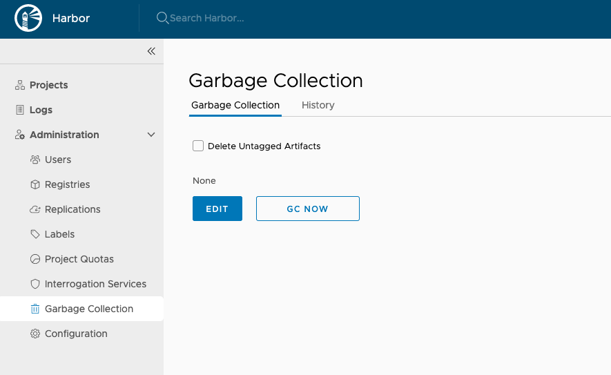
1. To run garbage collection immediately, click **GC Now**.

When you run garbage collection, Harbor goes into read-only mode. All modifications to the registry are prohibited.

To avoid triggering the garbage collection process too frequently, the availability of the **GC Now** button is restricted. Garbage collection can be only run once per minute.

### Schedule Garbage Collection

1. Expand **Administration**, and select **Garbage Collection**. 
1. Select the **'Garbage Collection'** tab.
1. Use the drop down-menu to select how often to run garbage collection.
   
   * **None**: No garbage collection is scheduled.
   * **Hourly**: Run garbage collection at the beginning of every hour.
   * **Daily**: Run garbage collection at midnight every day.
   * **Weekly**: Run garbage collection at midnight every Saturday.
   * **Custom**: Run garbage collection according to a `cron` job.
1. Click **Save**.
1. Select the **History** tab to view records of the 10 most recent garbage collection runs.
   
1. Click on the **Logs** link to view the related logs.

## Build history

Build history make it easy to see the contents of a container image, find the code which bulids an image, or locate the image for a source repository.

In Harbor portal, enter your project, select the repository, click on the link of tag name you'd like to see its build history, the detail page will be opened. Then switch to `Build History` tab, you can see the build history information.


## Robot Accounts

You can create robot accounts to run automated operations. Robot accounts have the following limitations:

1. Robot Accounts cannot log in to the Harbor interface.
1. Robot Accounts can only perform operations by using the Docker and Helm CLIs.

### Add a Robot Account

1. Log in to the Harbor interface with an account that has at least project administrator privileges.
1. Go to **Projects**, select a project, and select **Robot Accounts**.

   
1. Click **New Robot Account**.
1. Enter a name and an optional description for this robot account.
1. Grant permission to the robot account to push images and to push and pull Helm charts.

   Robot accounts can always pull images, so you cannot deselect this option.
   
   
1. Click **Save**.
1. In the confirmation window, click **Export to File** to download the access token as a JSON file, or click the clipboard icon to copy its contents to the clipboard.
   
   

   **IMPORTANT**: Harbor does not store robot account tokens, so you must either download the token JSON or copy and paste its contents into a text file. There is no way to get the token from Harbor after you have created the robot account.
   
   The new robot account appears as `robot$account_name` in the list of robot accounts. The `robot$` prefix makes it easily distinguishable from a normal Harbor user account.

   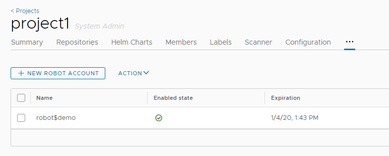
1. To delete or disable a robot account, select the account in the list, and select **Disable account** or **Delete** from the Action drop-down menu.

   

### Configure the Expiry Period of Robot Accounts

By default, robot accounts expire after 30 days. You can set a longer or shorter lifespan for robot accounts by modifying the expiry period for robot account tokens. The expiry period applies to all robot accounts in all projects.

1. Log in to the Harbor interface with an account that has Harbor system administrator privileges.
1. Go to **Configuration** and select **System Settings**.
1. In the **Robot Token Expiration (Days)** row, modify the number of days after which robot account tokens expire. 
   
   

### Authenticate with a Robot Account

To use a robot account in an automated process, for example a script, use `docker login` and provide the credentials of the robot account.

<pre>
docker login <i>harbor_address</i>
Username: robot$<i>account_name</i>
Password: <i>robot_account_token</i>
</pre>

## Tag Retention Rules

A repository can rapidly accumulate a large number of image tags, many of which might not be required after a given time or once they have been superseded by a subsequent image build. These excess tags can obviously consume large quantities of storage capacity. As a Harbor system administrator, you can define rules that govern how many tags of a given repository to retain, or for how long to retain certain tags. 

### How Tag Retention Rules Work

You define tag retention rules on repositories, not on projects. This allows for greater granularity when defining your retention rules. As the name suggests, when you define a retention rule for a repository, you are identifying which tags to retain. You do not define rules to explicitly remove tags. Rather, when you set a rule, any tags in a repository that are not identified as being eligible for retention are discarded. 

A tag retention rule has 3 filters that are applied sequentially, as described in the following table.

|Order|Filter|Description|
|---|---|---|
|First|Repository or repositories|Identify the repository or repositories on which to apply the rule. You can identify repositories that either have a certain name or name fragment, or that do not have that name or name fragment. Wild cards (for example `*repo`, `repo*`, and `**`) are permitted. The repository filter is applied first to mark the repositories to which to apply the retention rule. The identified repositories are earmarked for further matching based on the tag criteria. No action is taken on the nonspecified repositories at this stage.|
|Second|Quantity to retain|Set which tags to retain either by specifying a maximum number of tags, or by specifying a maximum period for which to retain tags.|
|Third|Tags to retain|Identify the tag or tags on which to apply the rule. You can identify tags that either have a certain name or name fragment, or that do not have that name or name fragment. Wild cards (for example `*tag`, `tag*`, and `**`) are permitted.|

For information about how the `**` wildcard is applied, see https://github.com/bmatcuk/doublestar#patterns.

#### Example 1

- You have 5 repositories in a project, repositories A to E.
  - Repository A has 100 image tags, all of which have been pulled in the last week.
  - Repositories B to E each have 6 images, none of which have been pulled in the last month.
- You set the repository filter to `**`, meaning that all repositories in the project are included.
- You set the retention policy to retain the 10 most recently pulled images in each repository.
- You set the tag filter to `**`, meaning that all tags in the repository are included.

In this example the rule retains the 10 most recently pulled images in repository A, and all 6 of the images in each of the 4 repositories B to E. So, a total of 34 image tags are retained in the project. In other words, the rule does not treat all of the images in repositories A to E as a single pool from which to choose the 10 most recent images. So, even if the 11th to 100th tags in repository A have been pulled more recently than any of the tags in repositories B to E, all of the tags in repositories B to E are retained, because each of those repositories has fewer than 10 tags.

#### Example 2

This example uses the same project and repositories as example 1, but sets the retention policy to retain the images in each repository that have been pulled in the last 7 days.

In this case, all of the images in repository A are retained because they have been pulled in the last 7 days. None of the images in repositories B to E are retained, because none of them has been pulled in the last week. In this example, 100 images are retained, as opposed to 34 images in example 1.

#### Tag Retention Rules and Native Docker Tag Deletion

**WARNING**: Due to native Docker tag deletion behavior, there is an issue with the current retention policy implementation. If you have multiple tags that refer to the same SHA digest, and if a subset of these tags are marked for deletion by a configured retention policy, all of the remaining tags would also be deleted. This violates the retention policy, so in this case all of the tags are retained. This issue will be addressed in a future update release, so that tag retention policies can delete tags without deleting the digest and other shared tags.

For example, you have following tags, listed according to their push time, and all of them refer to the same SHA digest:

- `harbor-1.8`, pushed 8/14/2019 12:00am
- `harbor-release`, pushed 8/14/2019 03:00am
- `harbor-nightly`, pushed 8/14/2019 06:00am
- `harbor-latest`, pushed 8/14/2019 09:00am

You configure a retention policy to retain the two latest tags that match `harbor-*`, so that `harbor-release` and `harbor-nightly` are deleted. However, since all tags refer to the same SHA digest, this policy would also delete the tags `harbor-1.8` and `harbor-latest`, so all tags are retained.

### Combining Rules on a Repository

You can define up to 15 rules per project. You can apply multiple rules to a repository or set of repositories. When you apply multiple rules to a repository, they are applied with `OR` logic rather than with `AND` logic. In this way, there is no prioritization of application of the rules on a given repository. Rules run concurrently in the background, and the resulting sets from each rule are combined at the end of the run.

#### Example 3

This example uses the same project and repositories as examples 1 and 2, but sets two rules:

- Rule 1: Retain all of the images in each repository that have been pulled in the last 7 days.
- Rule 2: Retain a maximum number of 10 images in each repository.

For repository A, rule 1 retains all of the images because they have all been pulled in the last week. Rule 2 retains the 10 most recently pulled images. So, since the two rules are applied with an `OR` relationship, all 100 images are retained in repository A.

For repositories B-E, rule 1 will retain 0 images as no images are pulled in the last week. Rule 2 will retain all 6 images because 6 < 10. So, since the two rules are applied with an `OR` relationship, for repositories B-E, each repository will keep all 6 images.

In this example, all of the images are retained.

#### Example 4

This example uses a different repository to the previous examples.

- You have a repository that has 12 tags:

  |Production|Release Candidate|Release|
  |---|---|---|
  |`2.1-your_repo-prod`|`2.1-your_repo-rc`|`2.1-your_repo-release`|
  |`2.2-your_repo-prod`|`2.2-your_repo-rc`|`2.2-your_repo-release`|
  |`3.1-your_repo-prod`|`3.1-your_repo-rc`|`3.1-your_repo-release`|
  |`4.4-your_repo-prod`|`4.4-your_repo-rc`|`4.4-your_repo-release`| 

- You define three tag retention rules on this repository:
  - Retain the 10 most recently pushed image tags that start with `2`.
  - Retain the 10 most recently pushed image tags that end with `-prod`.
  - Retain all tags that do not include `2.1-your_repo-prod`.

In this example, the rules are applied to the following 7 tags:

- `2.1-your_repo-rc`
- `2.1-your_repo-release`
- `2.2-your_repo-prod`
- `2.2-your_repo-rc`
- `2.2-your_repo-release`
- `3.1-your_repo-prod`
- `4.4-your_repo-prod`

### How Tag Retention Rules Interact with Project Quotas

The Harbor system administrator can set a maximum on the number of tags that a project can contain and the amount of storage that it can consume. For information about project quotas, see [Set Project Quotas](#set-project-quotas). 

If you set a quota on a project, this quota cannot be exceeded. The quota is applied to a project even if you set a retention rule that would exceed it. In other words, you cannot use retention rules to bypass quotas.

### Configure Tag Retention Rules

1. Log in to the Harbor interface with an account that has at least project administrator privileges.
1. Go to **Projects**, select a project, and select **Tag Retention**.

   
1. Click **Add Rule** to add a rule.
1. In the **Repositories** drop-down menu, select **matching** or **excluding**.
  
1. In the **Repositories** text box, identify the repositories on which to apply the rule.
  
   You can define the repositories on which to apply the rule by entering the following information:
  
   - A repository name, for example `my_repo_1`.
   - A comma-separated list of repository names, for example `my_repo_1,my_repo_2,your_repo_3`.
   - A partial repository name with wildcards, for example `my_*`, `*_3`, or `*_repo_*`.
   - `**` to apply the rule to all of the repositories in the project. 
  
   If you selected **matching**, the rule is applied to the repositories you identified. If you selected **excluding**, the rule is applied to all of the repositories in the project except for the ones that you identified.
1. In the **By image count or number of days** drop-down menu, define how many tags to retain or the period to retain tags.
  
  
   |Option|Description|
   |---|---|
   |**retain the most recently pushed # images**|Enter the maximum number of images to retain, keeping the ones that have been pushed most recently. There is no maximum age for an image.|
   |**retain the most recently pulled # images**|Enter the maximum number of images to retain, keeping only the ones that have been pulled recently. There is no maximum age for an image.|
   |**retain the images pushed within the last # days**|Enter the number of days to retain images, keeping only the ones that have been pushed during this period. There is no maximum number of images.|
   |**retain the images pulled within the last # days**|Enter the number of days to retain images, keeping only the ones that have been pulled during this period. There is no maximum number of images.|
   |**retain always**|Always retain the images identified by this rule.| 

1. In the **Tags** drop-down menu, select **matching** or **excluding**.
1. In the **Tags** text box, identify the tags on which to apply the rule.
  
   You can define the tags on which to apply the rule by entering the following information:
  
   - A tag name, for example `my_tag_1`.
   - A comma-separated list of tag names, for example `my_tag_1,my_tag_2,your_tag_3`.
   - A partial tag name with wildcards, for example `my_*`, `*_3`, or `*_tag_*`.
   - `**` to apply the rule to all of the tags in the project. 
  
   If you selected **matching**, the rule is applied to the tags you identified. If you selected **excluding**, the rule is applied to all of the tags in the repository except for the ones that you identified.
1. Click **Add** to save the rule.
1. (Optional) Click **Add Rule** to add more rules, up to a maximum of 15 per project.
1. (Optional) Under Schedule, click **Edit** and select how often to run the rule.

   
   
   If you select **Custom**, enter a cron job command to schedule the rule. 
  
   **NOTE**: If you define multiple rules, the schedule is applied to all of the rules. You cannot schedule different rules to run at different times. 
1. Click **Dry Run** to test the rule or rules that you have defined.
1. Click **Run Now** to run the rule immediately.

**WARNING**: You cannot revert a rule after you run it. It is strongly recommended to perform a dry run before you run rules. 

To modify an existing rule, use the **Action** drop-down menu next to a rule to disable, edit, or delete that rule. 

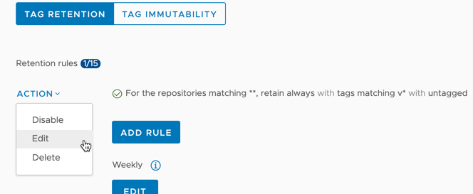

## Tag Immutability Rules

By default, users can repeatedly push an image with the same tag to repositories in Harbor. This causes the previous image to effectively be overwritten with each push, in that the tag now points to a different image and the image that previously used the tag now becomes tagless. This is due to the Docker implementation, that does not enforce the mapping between an image tag and the image digest. This can be undesirable in certain cases, because the tag can no longer be trusted to identify the image version. The sha256 digest remains reliable and always points to the same build, but it is not rendered in a human-readable format.  

Moreover, the Docker implementation requires that deleting a tag results in the deletion of all other tags that point to the same digest, causing unwanted image deletions.

To prevent this, Harbor allows you to configure tag immutability at the project level, so that images with certain tags cannot be pushed into Harbor if their tags match existing tags. This prevents existing images from being overwritten. Tag immutability guarantees that an immutable tagged image cannot be deleted, and cannot be altered through repushing, retagging, or replication. 

Immutability rules use `OR` logic, so if you set multiple rules and a tag is matched by any of those rules, it is marked as immutable. 

### How Immutable Tags Prevent Tag Deletion

Tags that share a common digest cannot be deleted even if only a single tag is configured as immutable. For example:

1. In a project, set an immutable tag rule that matches the image and tag `hello-world:v1`.
1. In the Docker client, pull `hello-world:v1` and retag it to `hello-world:v2`.
1. Push `hello-world:v2` to the same project.
1. In the Harbor interface, attempt to delete `hello-world:v2`.

In this case, you cannot delete `hello-world:v2` because it shares the sha256 digest with `hello-world:v1`, and `hello-world:v1` is an immutable tag. 

### Create a Tag Immutability Rule

1. Log in to the Harbor interface with an account that has at least project administrator privileges.
1. Go to **Projects**, select a project, and select **Tag Immutability**.

   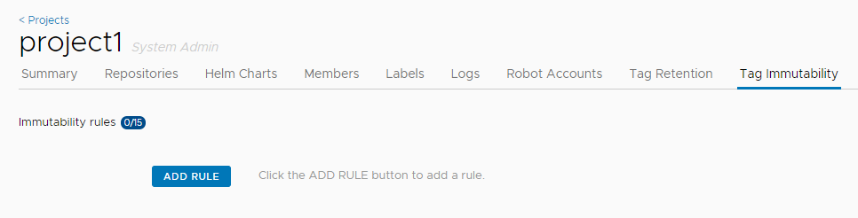
1. Click **Add Rule**.

   - In the **Respositories** row, enter a comma-separated list of repositories to which to either apply or exclude from the rule by selecting either **matching** or **excluding** from the drop-down menu.
   - In the **Tags** row, enter a comma-separated list of tags to which to either apply or exclude from the rule by selecting either **matching** or **excluding** from the drop-down menu.
 
   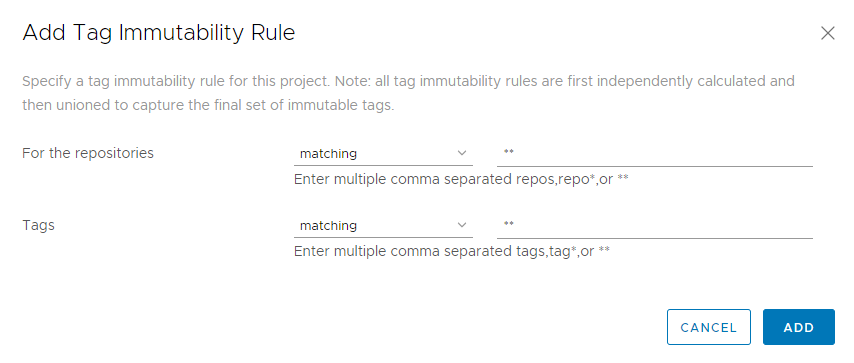
1. Click **Add** to save the rule.

   You can add a maximum of 15 immutability rules per project. 

   After you add a rule, any tags that are identified by the rule are marked **Immutable** in the Repositories tab.
1. To modify an existing rule, use the **Action** drop-down menu next to a rule to disable, edit, or delete that rule. 

   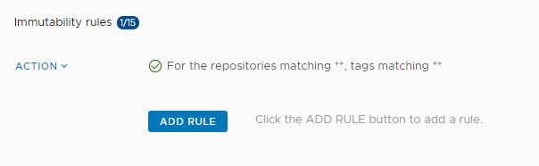

### Example

To make all tags for all repositories in the project immutable, set the following options:

- Set **For the respositories** to **matching** and enter `**`.
- Set **Tags** to **matching** and enter `**`.

To allow the tags `rc`, `test`, and `nightly` to be overwritten but make all other tags immutable, set the following options:

- Set **For the respositories** to **matching** and enter `**`.
- Set **Tags** to **excluding** and enter `rc,test,nightly`.

## Webhook Notifications

If you are a project administrator, you can configure a connection from a project in Harbor to a webhook endpoint. If you configure webhooks, Harbor notifies the webhook endpoint of certain events that occur in the project. Webhooks allow you to integrate Harbor with other tools to streamline continuous integration and development processes. 

The action that is taken upon receiving a notification from a Harbor project depends on your continuous integration and development processes. For example, by configuring Harbor to send a `POST` request to a webhook listener at an endpoint of your choice, you can trigger a build and deployment of an application whenever there is a change to an image in the repository.

### Supported Events

You can define one webhook endpoint per project. Webhook notifications provide information about events in JSON format and are delivered by `HTTP` or `HTTPS POST` to an existing webhhook endpoint URL that you provide. The following table describes the events that trigger notifications and the contents of each notification.

|Event|Webhook Event Type|Contents of Notification|
|---|---|---|
|Push image to registry|`IMAGE PUSH`|Repository namespace name, repository name, resource URL, tags, manifest digest, image name, push time timestamp, username of user who pushed image|
|Pull manifest from registry|`IMAGE PULL`|Repository namespace name, repository name, manifest digest, image name, pull time timestamp, username of user who pulled image|
|Delete manifest from registry|`IMAGE DELETE`|Repository namespace name, repository name, manifest digest, image name, image size, delete time timestamp, username of user who deleted image|
|Upload Helm chart to registry|`CHART PUSH`|Repository name, chart name, chart type, chart version, chart size, tag, timestamp of push, username of user who uploaded chart|
|Download Helm chart from registry|`CHART PULL`|Repository name, chart name, chart type, chart version, chart size, tag, timestamp of push, username of user who pulled chart|
|Delete Helm chart from registry|`CHART DELETE`|Repository name, chart name, chart type, chart version, chart size, tag, timestamp of delete, username of user who deleted chart|
|Image scan completed|`IMAGE SCAN COMPLETED`|Repository namespace name, repository name, tag scanned, image name, number of critical issues, number of major issues, number of minor issues, last scan status, scan completion time timestamp, vulnerability information (CVE ID, description, link to CVE, criticality, URL for any fix), username of user who performed scan|
|Image scan failed|`IMAGE SCAN FAILED`|Repository namespace name, repository name, tag scanned, image name, error that occurred, username of user who performed scan|
|Project quota exceeded|`PROJECT QUOTA EXCEED`|Repository namespace name, repository name, tags, manifest digest, image name, push time timestamp, username of user who pushed image|

#### JSON Payload Format

The webhook notification is delivered in JSON format. The following example shows the JSON notification for a push image event:

```
{
 "event_type": "pushImage"
    "events": [
               {
                "project": "prj",
                "repo_name": "repo1",
                "tag": "latest",
                "full_name": "prj/repo1",
                "trigger_time": 158322233213,
                "image_id": "9e2c9d5f44efbb6ee83aecd17a120c513047d289d142ec5738c9f02f9b24ad07",
                "project_type": "Private"
               }
             ]
}
```

### Webhook Endpoint Recommendations

The endpoint that receives the webhook should ideally have a webhook listener that is capable of interpreting the payload and acting upon the information it contains. For example, running a shell script.

### Example Use Cases

You can configure your continuous integration and development infrastructure so that it performs the following types of operations when it receives a webhook notification from Harbor.

- Image push: 
  - Trigger a new build immediately following a push on selected repositories or tags.
  - Notify services or applications that use the image that a new image is available and pull it.
  - Scan the image using Clair.
  - Replicate the image to remote registries.
- Image scanning:
  - If a vulnerability is found, rescan the image or replicate it to another registry.
  - If the scan passes, deploy the image.

### Configure Webhooks

1. Log in to the Harbor interface with an account that has at least project administrator privileges.
1. Go to **Projects**, select a project, and select **Webhooks**.

     
1. Enter the URL for your webhook endpoint listener.
1. If your webhook listener implements authentication, enter the authentication header. 
1. To implement `HTTPS POST` instead of `HTTP POST`, select the **Verifiy Remote Certficate** check box.

   
1. Click **Test Endpoint** to make sure that Harbor can connect to the listener.
1. Click **Continue** to create the webhook.

When you have created the webhook, you see the status of the different notifications and the timestamp of the last time each notification was triggered. You can click **Disable** to disable notifications. 

**NOTE**: You can only disable and reenable all notifications. You cannot disable and enable selected notifications.


If a webhook notification fails to send, or if it receives an HTTP error response with a code other than `2xx`, the notification is re-sent based on the configuration that you set in `harbor.yml`. 

### Globally Enable and Disable Webhooks

As a Harbor system administrator, you can enable and disable webhook notifications for all projects.

1. Go to **Configuration** > **System Settings**.
1. Scroll down and check or uncheck the **Webhooks enabled** check box.

   

## API Explorer

Harbor integrated swagger UI from 1.8. That means all apis can be invoked through UI. Normally, user have 2 ways to navigate to API Explorer. 

1. User can login harbor, and click the "API EXPLORER" button.All apis will be invoked with current user authorization.                         
  


2. User can navigate to swagger page by ip address by router "devcenter". For example: https://10.192.111.118/devcenter. After go to the page, need to click "authorize" button to give basic authentication to all apis. All apis will be invoked with the authorized user authorization. 


