# User Guide  
## Overview  
This guide walks you through the fundamentals of using Harbor. You'll learn how to use Harbor to:  

* [Manage your projects.](#managing-projects)
* [Manage members of a project.](#managing-members-of-a-project)
* [Replicate resources between Harbor and non-Harbor registries.](#replicating-resources)
* [Retag images within Harbor](#retag-images)
* [Search projects and repositories.](#searching-projects-and-repositories)
* [Manage labels.](#managing-labels)
* [Manage Harbor system if you are the system administrator:](#administrator-options)
  * [Manage users.](#managing-user)
  * [Manage registries.](#managing-registry)
  * [Manage replication rules.](#managing-replication)
  * [Manage authentication.](#managing-authentication)
  * [Manage project creation.](#managing-project-creation)
  * [Manage self-registration.](#managing-self-registration)
  * [Manage email settings.](#managing-email-settings)
  * [Manage registry read only.](#managing-registry-read-only)
  * [Manage role by LDAP group.](#managing-role-by-ldap-group)
* [Pull and push images using Docker client.](#pulling-and-pushing-images-using-docker-client)
* [Add description to repositories](#add-description-to-repositories)
* [Delete repositories and images.](#deleting-repositories)
* [Content trust.  ](#content-trust)
* [Vulnerability scanning via Clair.](#vulnerability-scanning-via-clair)
* [Pull image from Harbor in Kubernetes.](#pull-image-from-harbor-in-kubernetes)
* [Manage Helm Charts](#manage-helm-charts)
  * [Manage Helm Charts via portal](#manage-helm-charts-via-portal)
  * [Working with Helm CLI](#working-with-helm-cli)
* [Online Garbage Collection.](#online-garbage-collection)
* [View build history.](#build-history)
* [Using CLI after login via OIDC based SSO](#using-oidc-cli-secret)
* [Manage robot account of a project](#robot-account)
* [Tag Retention Rules](#tag-retention-rules)
* [Webhook Notifications](#webhook-notifications)
* [Using API Explorer](#api-explorer)

## Role Based Access Control(RBAC)  


Harbor manages images through projects. Users can be added into one project as a member with three different roles:  

* **Guest**: Guest has read-only privilege for a specified project.
* **Developer**: Developer has read and write privileges for a project.
* **ProjectAdmin**: When creating a new project, you will be assigned the "ProjectAdmin" role to the project. Besides read-write privileges, the "ProjectAdmin" also has some management privileges, such as adding and removing members, starting a vulnerability scan.

Besides the above three roles, there are two system-wide roles:  

* **SysAdmin**: "SysAdmin" has the most privileges. In addition to the privileges mentioned above, "SysAdmin" can also list all projects, set an ordinary user as administrator, delete users and set vulnerability scan policy for all images. The public project "library" is also owned by the administrator.  
* **Anonymous**: When a user is not logged in, the user is considered as an "Anonymous" user. An anonymous user has no access to private projects and has read-only access to public projects.  

## User account
Harbor supports different authentication modes:  

* **Database(db_auth)**  

	Users are stored in the local database.  
	
	A user can register himself/herself in Harbor in this mode. To disable user self-registration, refer to the [installation guide](installation_guide.md) for initial configuration, or disable this feature in [Administrator Options](#administrator-options). When self-registration is disabled, the system administrator can add users into Harbor.  
	
	When registering or adding a new user, the username and email must be unique in the Harbor system. The password must contain at least 8 characters with 1 lowercase letter, 1 uppercase letter and 1 numeric character.  
	
	When you forgot your password, you can follow the below steps to reset the password:  

	1. Click the link "Forgot Password" in the sign in page.  
	2. Input the email address entered when you signed up, an email will be sent out to you for password reset.  
	3. After receiving the email, click on the link in the email which directs you to a password reset web page.  
	4. Input your new password and click "Save".  
	
* **LDAP/Active Directory (ldap_auth)**  

	Under this authentication mode, users whose credentials are stored in an external LDAP or AD server can log in to Harbor directly.  
	
	When an LDAP/AD user logs in by *username* and *password*, Harbor binds to the LDAP/AD server with the **"LDAP Search DN"** and **"LDAP Search Password"** described in [installation guide](installation_guide.md). If it succeeded, Harbor looks up the user under the LDAP entry **"LDAP Base DN"** including substree. The attribute (such as uid, cn) specified by **"LDAP UID"** is used to match a user with the *username*. If a match is found, the user's *password* is verified by a bind request to the LDAP/AD server. Uncheck **"LDAP Verify Cert"** if the LDAP/AD server uses a self-signed or an untrusted certificate.
	
	Self-registration, deleting user, changing password and resetting password are not supported under LDAP/AD authentication mode because the users are managed by LDAP or AD.  

* **OIDC Provider (oidc_auth)**

    With this authentication mode, regular user will login to Harbor Portal via SSO flow.  
    After the system administrator configure Harbor to authenticate via OIDC (more details refer to [this section](#managing-authentication)),
    a button `LOGIN VIA OIDC PROVIDER` will appear on the login page.  
    
    
    By clicking this button user will kick off the SSO flow and be redirected to the OIDC Provider for authentication.  After a successful
    authentication at the remote site, user will be redirected to Harbor.  There will be an "onboard" step if it's the first time the user 
    authenticate using his account, in which there will be a dialog popped up for him to set his user name in Harbor:
    
    
    This user name will be the identifier for this user in Harbor, which will be used in the cases such as adding member to a project, assigning roles, etc.
    This has to be a unique user name, if another user has used this user name to onboard, user will be prompted to choose another one.
    
    Regarding this user to use docker CLI, please refer to [Using CLI after login via OIDC based SSO](#using-oidc-cli-secret)
   
    **NOTE:**
    1. After the onboard process, you still have to login to Harbor via SSO flow, the `Username` and `Password` fields are only for
    local admin to login when Harbor is configured authentication via OIDC.
    2. Similar to LDAP authentication mode, self-registration, updating profile, deleting user, changing password and 
    resetting password are not supported.
 

## Managing projects
A project in Harbor contains all repositories of an application. No images can be pushed to Harbor before the project is created. RBAC is applied to a project. There are two types of projects in Harbor:  

* **Public**: All users have the read privilege to a public project, it's convenient for you to share some repositories with others in this way.
* **Private**: A private project can only be accessed by users with proper privileges.  

You can create a project after you signed in. Check on the "Access Level" checkbox will make this project public.  

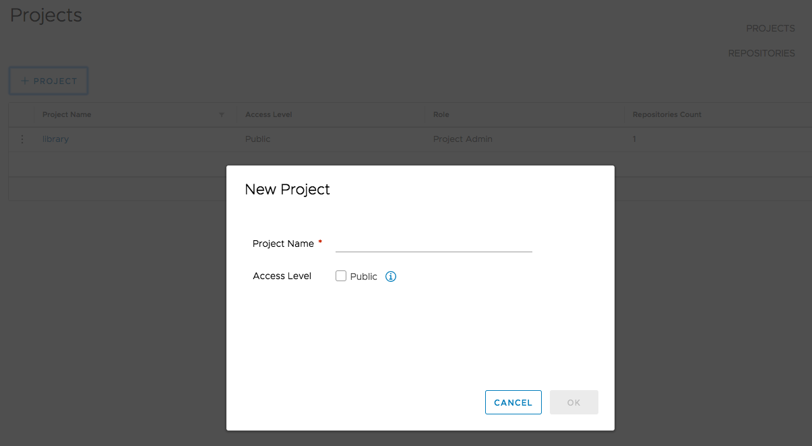  

After the project is created, you can browse repositories, members, logs, replication and configuration using the navigation tab.

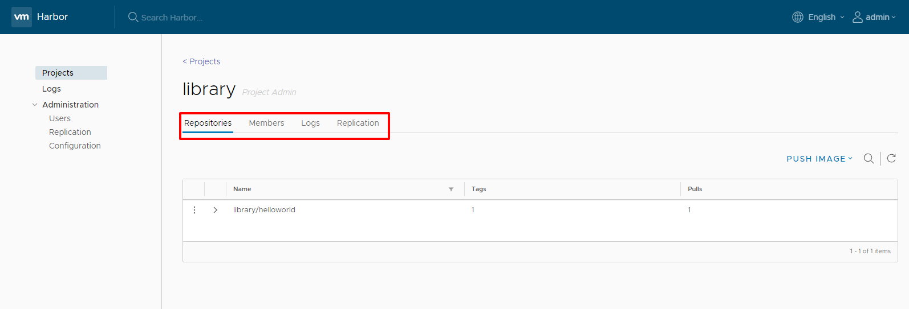

There are two views to show repositories, list view and card view, you can switch between them by clicking the corresponding icon.

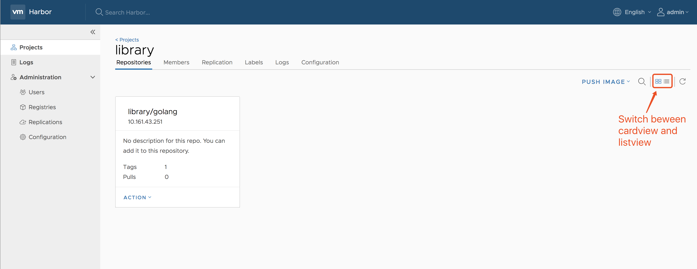

All logs can be listed by clicking "Logs". You can apply a filter by username, or operations and dates under "Advanced Search".  

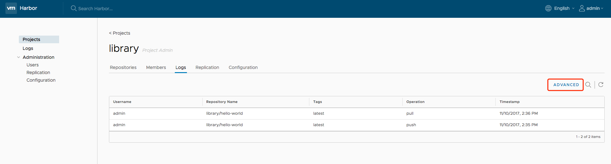

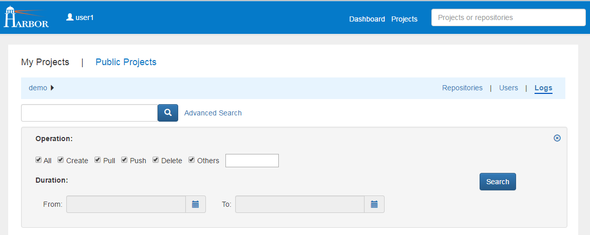  

Project properties can be changed by clicking "Configuration".

* To make all repositories under the project accessible to everyone, select the `Public` checkbox.

* To prevent un-signed images under the project from being pulled, select the `Enable content trust` checkbox.

* To prevent vulnerable images under the project from being pulled, select the `Prevent vulnerable images from running` checkbox and change the severity level of vulnerabilities. Images cannot be pulled if their level equals to or higher than the currently selected level.

* To activate an immediate vulnerability scan on new images that are pushed to the project, select the `Automatically scan images on push` checkbox.

 

## Managing members of a project  
### Adding members  
You can add members with different roles to an existing project. You can add a LDAP/AD user to project members under LDAP/AD authentication mode. 

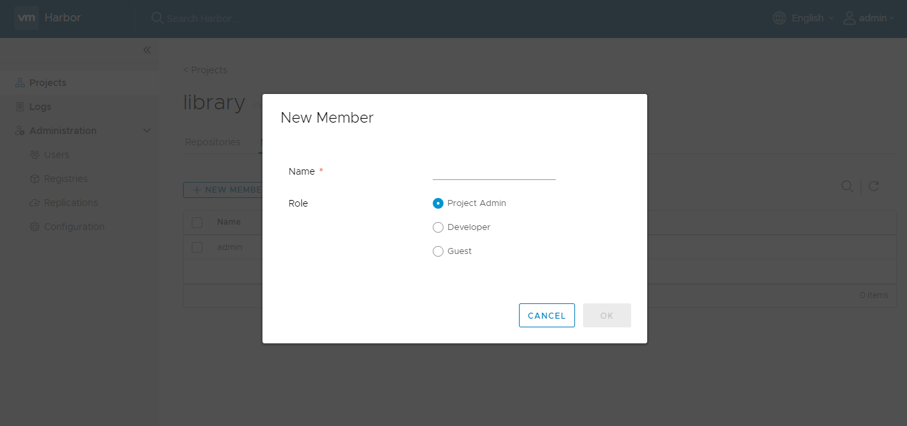

### Updating and removing members
You can check one or more members, then click `ACTION`, choose one role to batch switch checked members' roles or remove them from the project.

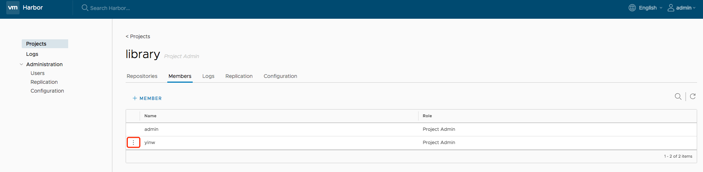

## Replicating resources  
Replication allows users to replicate resources(images/charts) between Harbor and non-Harbor registries in both pull or push mode. Currently, the non-Harbor registries includes Docker Hub, Docker registry, Huawei SWR, and more registries will be supported in future.  

Once the system administrator has set a rule, all resources that match the defined [filter](#resource-filter) patterns will be replicated to the destination registry when the [triggering condition](#trigger-mode) is matched. Each resource will start a task to run. If the namespace does not exist on the destination registry, a new namespace will be created automatically. If it already exists and the user configured in policy has no write privilege to it, the process will fail. The member information will not be replicated.  

There may be a bit of delay during replication based on the situation of the network. If replication task fails, it will be re-scheduled a few minutes later and try 3 times.  

**Note:** Due to API changes, replication between different versions of Harbor may be broken.

### Creating a replication rule
Login as a system administrator user, click `NEW REPLICATION RULE` under `Administration->Replications` and fill in the necessary fields. You can choose different replication modes, [resource filters](#resource-filter) and [trigger modes](#trigger-mode) according to the different requirements. If there is no endpoint available in the list, you need to create one. Click `SAVE` to create a replication rule.  

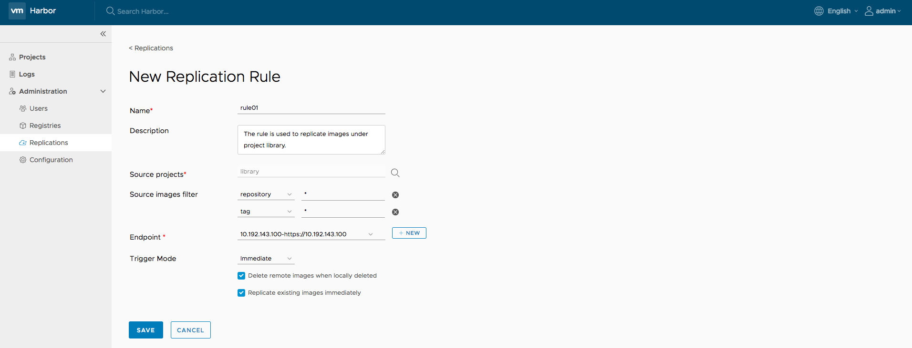

#### Resource filter
Three resource filters are supported:
* **Name**: Filter resources according to the name.
* **Tag**: Filter resources according to the tag.
* **Resource**: Filter images according to the resource type.

The terms supported in the pattern used by name filter and tag filter are as follows:
* **\***: Matches any sequence of non-separator characters `/`.
* **\*\***: Matches any sequence of characters, including path separators `/`.
* **?**: Matches any single non-separator character `/`.
* **{alt1,...}**: Matches a sequence of characters if one of the comma-separated alternatives matches.

**Note:** `library` must be added if you want to replicate the official images of Docker Hub. For example, `library/hello-world` matches the official hello-world images.  

Pattern | String(Match or not)
---------- | -------
`library/*`      | `library/hello-world`(Y)<br> `library/my/hello-world`(N)
`library/**`     | `library/hello-world`(Y)<br> `library/my/hello-world`(Y)
`{library,goharbor}/**` | `library/hello-world`(Y)<br> `goharbor/harbor-core`(Y)<br> `google/hello-world`(N)
`1.?`      | `1.0`(Y)<br> `1.01`(N)

#### Trigger mode
* **Manual**: Replicate the resources manually when needed. **Note**: The deletion operations are not replicated. 
* **Scheduled**: Replicate the resources periodically. **Note**: The deletion operations are not replicated. 
* **Event Based**: When a new resource is pushed to the project, it is replicated to the remote registry immediately. Same to the deletion operation if the `Delete remote resources when locally deleted` checkbox is selected.

### Starting a replication manually
Select a replication rule and click `REPLICATE`, the resources which the rule is applied to will be replicated from the source registry to the destination immediately.  

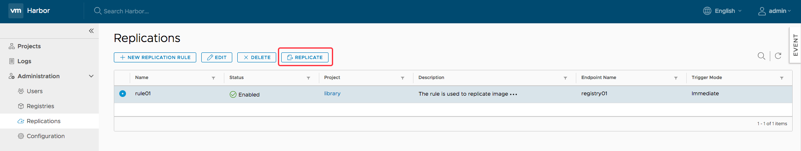

### Listing and stopping replication executions
Click a rule, the execution records which belong to this rule will be listed. Each record represents the summary of the once execution of the rule. Click `STOP` to stop the executions which are in progress.  


### Listing tasks
Click the ID of one execution, you can get the execution summary and the task list. Click the log icon can get the detail information for the replication progress.  
**Note**: The count of `IN PROGRESS` status in the summary includes both `Pending` and `In Progress` tasks.  


### Deleting the replication rule
Select the replication rule and click `DELETE` to delete it. Only rules which have no in progress executions can be deleted.  

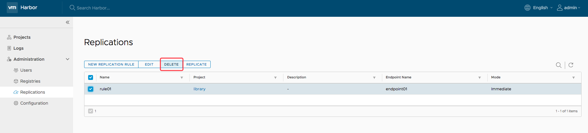

## Retag Images

Images retag helps users to tag images in Harbor, images can be tagged to  different repositories and projects, as long as the users have sufficient permissions. For example,

```
release/app:stg  -->  release/app:prd
develop/app:v1.0 --> release/app:v1.0
```
To retag an image, users should have read permission (guest role or above) to the source project and write permission (developer role or above) to the target project.

In Harbor portal, select the image you'd like to retag, and click the enabled `Retag` button to open the retag dialog.


In the retag dialog, project name, repository name and the new tag should be specified. On click the `CONFIRM` button, the new tag would be created instantly. You can check the new tag in the corresponding project. 

## Searching projects and repositories
Entering a keyword in the search field at the top lists all matching projects and repositories. The search result includes both public and private repositories you have access to.  

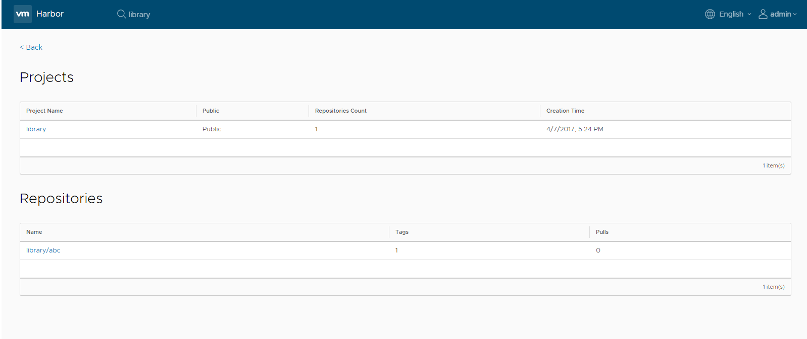

## Managing labels
Harbor provides two kinds of labels to isolate kinds of resources(only images for now):
* **Global Level Label**: Managed by system administrators and used to manage the images of the whole system. They can be added to images under any projects.
* **Project Level Label**: Managed by project administrators under a project and can only be added to the images of the project.

### Managing global level labels
The system administrators can list, create, update and delete the global level labels under `Administration->Configuration->Labels`:

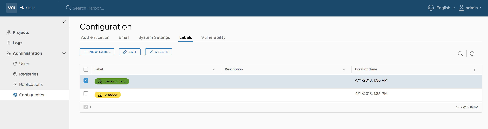

### Managing project level labels
The project administrators and system administrators can list, create, update and delete the project level labels under `Labels` tab of the project detail page:

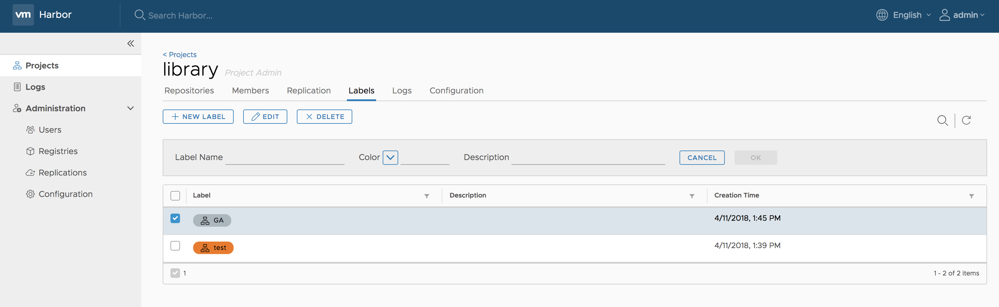

### Adding labels to/remove labels from images
Users who have system administrator, project administrator or project developer role can click the `ADD LABELS` button to add labels to or remove labels from images. The label list contains both globel level labels(come first) and project level labels:


### Filtering images by labels
The images can be filtered by labels:

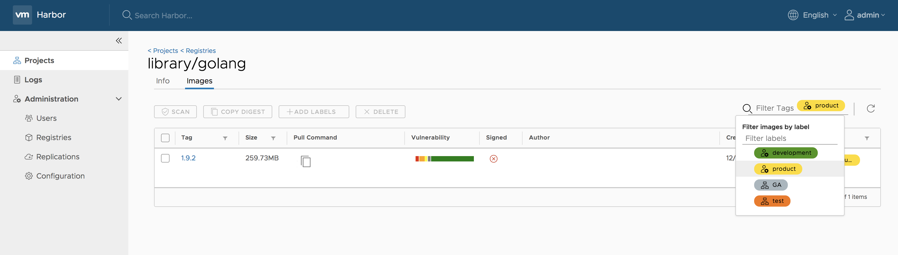

## Administrator options  
### Managing user  
Administrator can add "Administrator" role to one or more ordinary users by checking checkboxes and clicking `SET AS ADMINISTRATOR`. To delete users, checked checkboxes and select `DELETE`. Deleting user is only supported under database authentication mode.

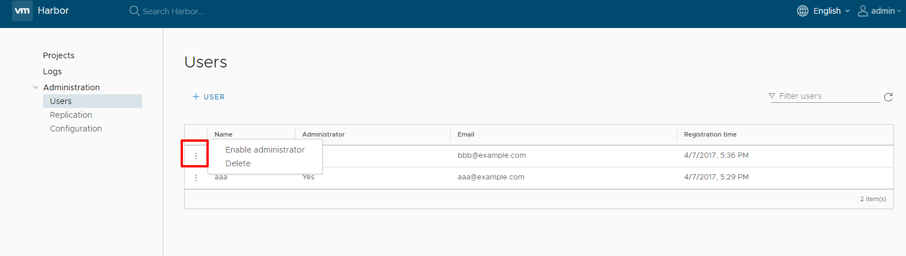

### Managing registry  
You can list, add, edit and delete registries under `Administration->Registries`. Only registries which are not referenced by any rules can be deleted.  


### Managing replication  
You can list, add, edit and delete rules under `Administration->Replications`.   

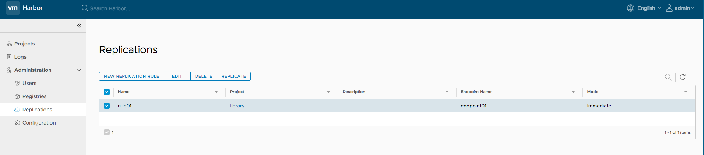

### Managing authentication
You can change authentication mode between **Database**(default) and **LDAP** before any user is added, when there is at least one user(besides admin) in Harbor, you cannot change the authentication mode.  
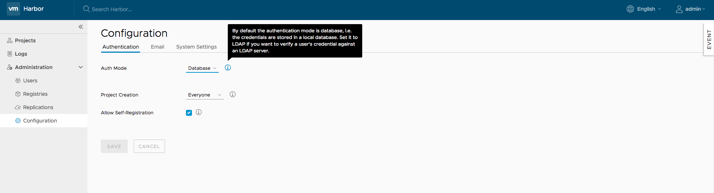
When using LDAP mode, user's self-registration is disabled. The parameters of LDAP server must be filled in. For more information, refer to [User account](#user-account).   
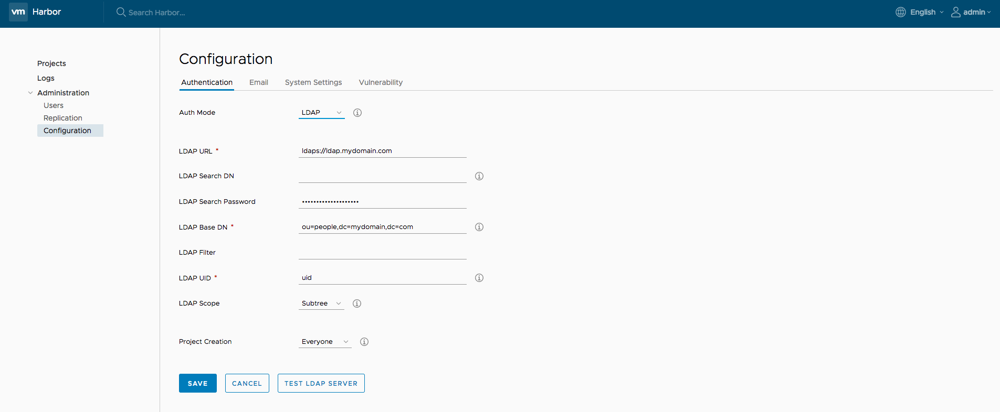

When using OIDC mode, user will login Harbor via OIDC based SSO.  A client has to be registered on the OIDC provider and Harbor's callback URI needs to be associated to that client as a redirectURI.
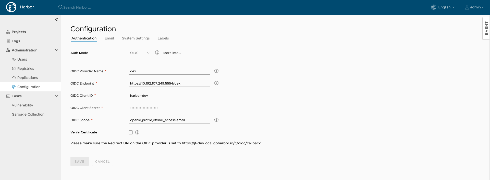

The settings of this auth mode:
* OIDC Provider Name: The name of the OIDC Provider.
* OIDC Provider Endpoint: The URL of the endpoint of the OIDC provider(a.k.a the Authorization Server in OAuth's terminology), 
which must service the "well-known" URI for its configuration, more details please refer to https://openid.net/specs/openid-connect-discovery-1_0.html#ProviderConfigurationRequest
* OIDC Client ID: The ID of client configured on OIDC Provider.
* OIDC Client Secret: The secret for this client.
* OIDC Scope: The scope values to be used during the authentication.  It is the comma separated string, which must contain `openid`.  
Normally it should also contain `profile` and `email`.  For getting the refresh token it should also contain `offline_access`.  Please check with the administrator of the OIDC Provider.
* Verify Certificate: Whether to check the certificate when accessing the OIDC Provider. if you are running the OIDC Provider with self-signed
certificate, make sure this value is set to false.


### Managing project creation
Use the **Project Creation** drop-down menu to set which users can create projects. Select **Everyone** to allow all users to create projects. Select **Admin Only** to allow only users with the Administrator role to create projects.  
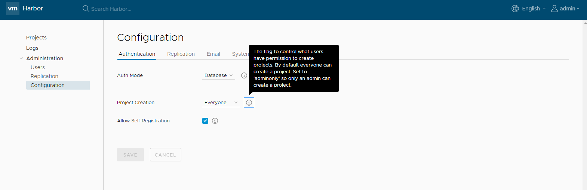

### Managing self-registration
You can manage whether a user can sign up for a new account. This option is not available if you use LDAP authentication.  
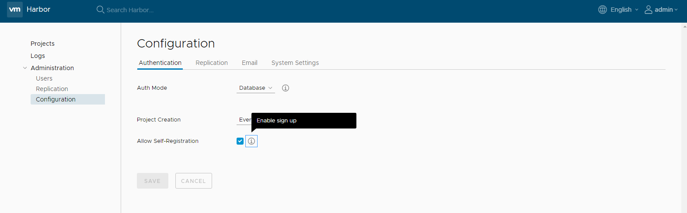

### Managing email settings
You can change Harbor's email settings, the mail server is used to send out responses to users who request to reset their password.  
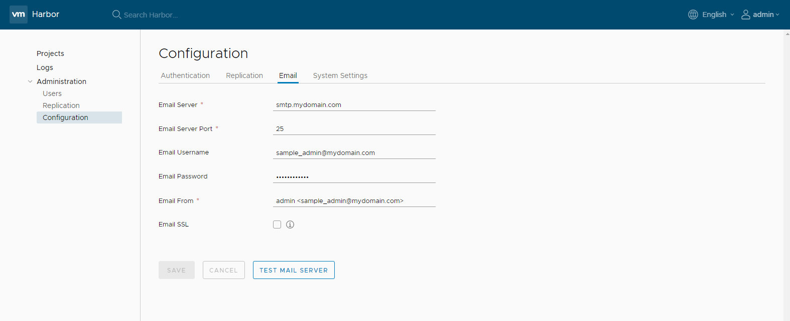

### Managing registry read only
You can change Harbor's registry read only settings, read only mode will allow 'docker pull' while preventing 'docker push' and the deletion of repository and tag.
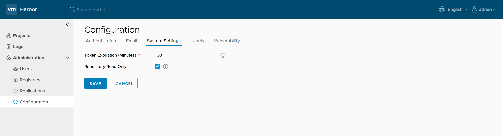

If it set to true, deleting repository, tag and pushing image will be disabled. 


```
$ docker push 10.117.169.182/demo/ubuntu:14.04  
The push refers to a repository [10.117.169.182/demo/ubuntu]
0271b8eebde3: Preparing 
denied: The system is in read only mode. Any modification is prohibited.  
```
### Managing role by LDAP group

If auth_mode is ldap_auth, you can manage project role by LDAP/AD group. please refer [manage role by ldap group guide](manage_role_by_ldap_group.md).

## Pulling and pushing images using Docker client  

**NOTE: Harbor only supports Registry V2 API. You need to use Docker client 1.6.0 or higher.**  

Harbor supports HTTP by default and Docker client tries to connect to Harbor using HTTPS first, so if you encounter an error as below when you pull or push images, you need to configure insecure registry. Please, read [this document](https://docs.docker.com/registry/insecure/) in order to understand how to do this. 

```Error response from daemon: Get https://myregistrydomain.com/v1/users/: dial tcp myregistrydomain.com:443 getsockopt: connection refused.```   

If this private registry supports only HTTP or HTTPS with an unknown CA certificate, please add   
`--insecure-registry myregistrydomain.com` to the daemon's start up arguments.  

In the case of HTTPS, if you have access to the registry's CA certificate, simply place the CA certificate at /etc/docker/certs.d/myregistrydomain.com/ca.crt .   

### Pulling images  
If the project that the image belongs to is private, you should sign in first:  

```sh
$ docker login 10.117.169.182  
```

You can now pull the image:  

```sh
$ docker pull 10.117.169.182/library/ubuntu:14.04  
```

**Note: Replace "10.117.169.182" with the IP address or domain name of your Harbor node. You cannot pull a unsigned image if you enabled content trust.**

### Pushing images  
Before pushing an image, you must create a corresponding project on Harbor web UI. 

First, log in from Docker client:  

```sh
$ docker login 10.117.169.182  
```

Tag the image:  

```sh
$ docker tag ubuntu:14.04 10.117.169.182/demo/ubuntu:14.04  
```

Push the image:

```sh
$ docker push 10.117.169.182/demo/ubuntu:14.04  
```

**Note: Replace "10.117.169.182" with the IP address or domain name of your Harbor node.**

###  Add description to repositories

After pushing an image, an Information can be added by project admin to describe this repository.

Go into the repository and select the "Info" tab, and click the "EDIT" button.  An textarea will appear and enter description here. Click "SAVE" button to save this information.


### Download the harbor certs

Users  can click the "registry certificate" link to download the registry certificate.

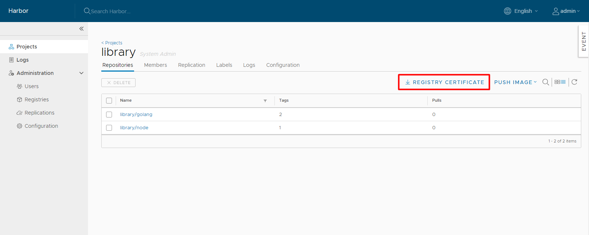

###  Deleting repositories  

Repository deletion runs in two steps.  

First, delete a repository in Harbor's UI. This is soft deletion. You can delete the entire repository or just a tag of it. After the soft deletion, 
the repository is no longer managed in Harbor, however, the files of the repository still remain in Harbor's storage.  

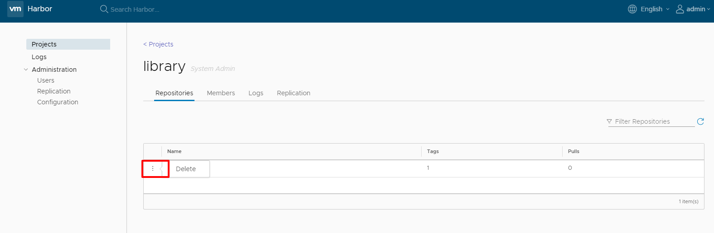
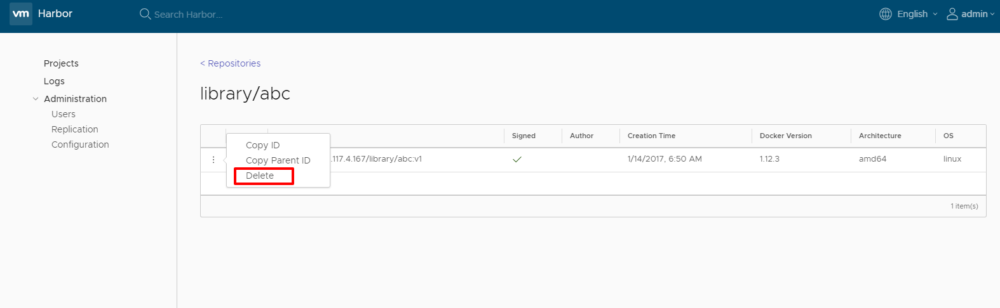

**CAUTION: If both tag A and tag B refer to the same image, after deleting tag A, B will also get deleted. if you enabled content trust, you need to use notary command line tool to delete the tag's signature before you delete an image.**  

Next, delete the actual files of the repository using the [garbage collection](#online-garbage-collection) in Harbor's UI. 

### Content trust  
**NOTE: Notary is an optional component, please make sure you have already installed it in your Harbor instance before you go through this section.**  
If you want to enable content trust to ensure that images are signed, please set two environment variables in the command line before pushing or pulling any image:
```sh
export DOCKER_CONTENT_TRUST=1
export DOCKER_CONTENT_TRUST_SERVER=https://10.117.169.182:4443
```
If you push the image for the first time, You will be asked to enter the root key passphrase. This will be needed every time you push a new image while the ``DOCKER_CONTENT_TRUST`` flag is set.  
The root key is generated at: ``/root/.docker/trust/private/root_keys``  
You will also be asked to enter a new passphrase for the image. This is generated at ``/root/.docker/trust/private/tuf_keys/[registry name] /[imagepath]``.  
If you are using a self-signed cert, make sure to copy the CA cert into ```/etc/docker/certs.d/10.117.169.182``` and ```$HOME/.docker/tls/10.117.169.182:4443/```. When an image is signed, it is indicated in the Web UI.  
**Note: Replace "10.117.169.182" with the IP address or domain name of your Harbor node. In order to use content trust, HTTPS must be enabled in Harbor.**  


When an image is signed, it has a tick shown in UI; otherwise, a cross sign(X) is displayed instead.  
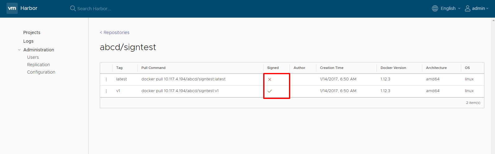

### Vulnerability scanning via Clair 
**CAUTION: Clair is an optional component, please make sure you have already installed it in your Harbor instance before you go through this section.**

Static analysis of vulnerabilities is provided through open source project [Clair](https://github.com/coreos/clair). You can initiate scanning on a particular image, or on all images in Harbor. Additionally, you can also set a policy to scan all the images at a specified time everyday.

**Vulnerability metadata** 

Clair depends on the vulnerability metadata to complete the analysis process. After the first initial installation, Clair will automatically start to update the metadata database from different vulnerability repositories. The updating process may take a while based on the data size and network connection. If the database has not been fully populated, there is a warning message at the footer of the repository datagrid view.
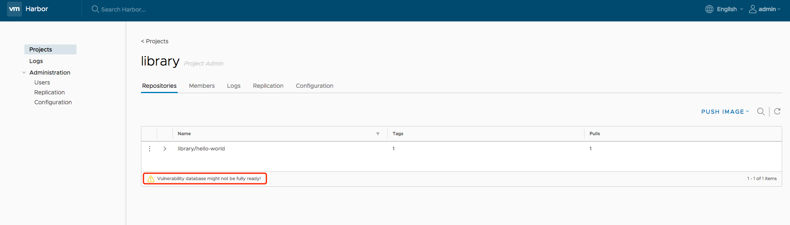

The 'database not fully ready' warning message is also displayed in the **'Vulnerability'** tab of **'Configuration'** section under **'Administration'** for your awareness.
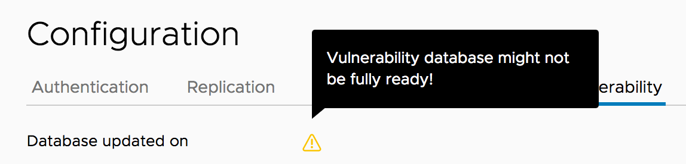

Once the database is ready, an overall database updated timestamp will be shown in the **'Vulnerability'** tab of **'Configuration'** section under **'Administration'**. 
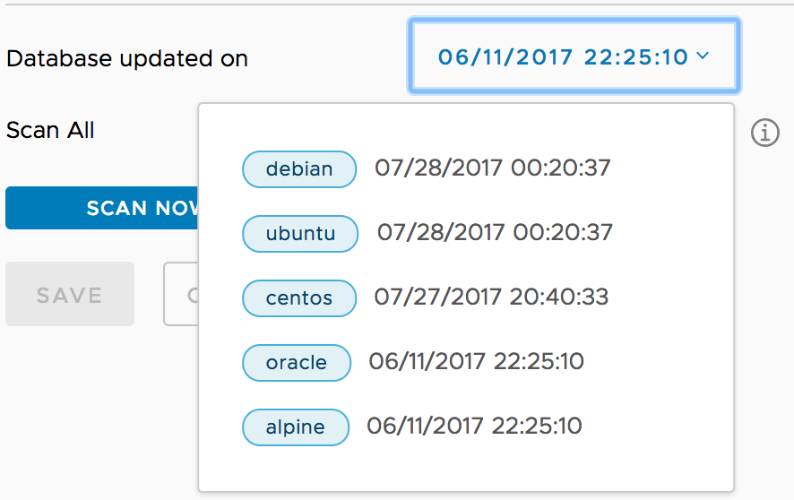

**Scanning an image** 

Enter your project, select the repository. For each tag there will be an 'Vulnerability' column to display vulnerability scanning status and related information. You can select the image and click the "SCAN" button to trigger the vulnerability scan process. 
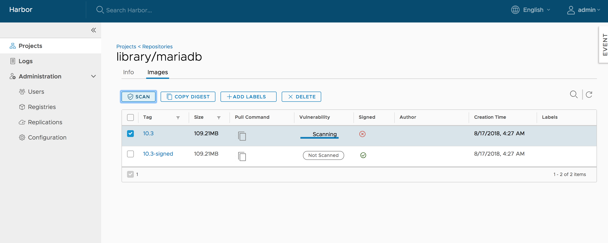
**NOTES: Only the users with 'Project Admin' role have the privilege to launch the analysis process.**

The analysis process may have the following status that are indicated in the 'Vulnerability' column:
* **Not Scanned:** The tag has never been scanned.
* **Queued:** The scanning task is scheduled but not executed yet.
* **Scanning:** The scanning process is in progress.
* **Error:** The scanning process failed to complete.
* **Complete:** The scanning process was successfully completed.

For the **'Not Scanned'** and **'Queued'** statuses, a text label with status information is shown. For the **'Scanning'**, a progress bar will be displayed.
If an error occurred, you can click on the **'View Log'** link to view the related logs.


If the process was successfully completed, a result bar is created. The width of the different colored sections indicates the percentage of features with vulnerabilities for a particular severity level.
* **Red:** **High** level of vulnerabilities
* **Orange:** **Medium** level of vulnerabilities
* **Yellow:** **Low** level of vulnerabilities
* **Grey:** **Unknown** level of vulnerabilities
* **Green:** **No** vulnerabilities
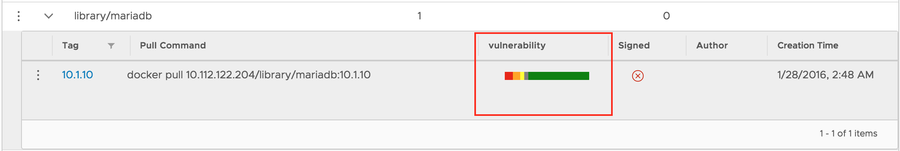

Move the cursor over the bar, a tooltip with summary report will be displayed. Besides showing the total number of features with vulnerabilities and the total number of features in the scanned image tag, the report also lists the counts of features with vulnerabilities of different severity levels. The completion time of the last analysis process is shown at the bottom of the tooltip.
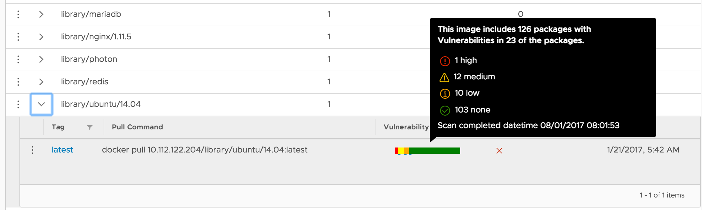

Click on the tag name link, the detail page will be opened. Besides the information about the tag, all the vulnerabilities found in the last analysis process will be listed with the related information. You can order or filter the list by columns.
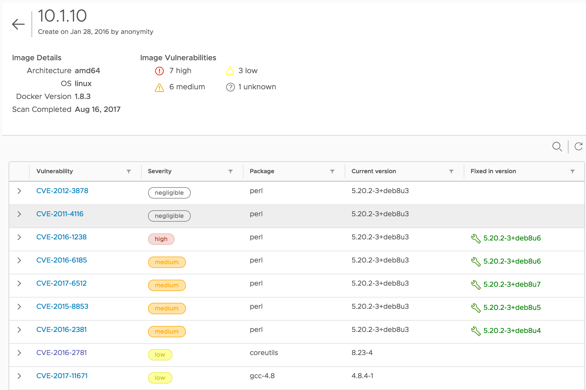

**NOTES: You can initiate the vulnerability analysis for a tag at anytime you want as long as the status is not 'Queued' or 'Scanning'.** 

**Scanning all images**

In the **'Vulnerability'** tab of **'Configuration'** section under **'Administration'**, click on the **'SCAN NOW'** button to start the analysis process for all the existing images. 

**NOTES: The scanning process is executed via multiple concurrent asynchronous tasks. There is no guarantee on the order of scanning or the returned results.** 
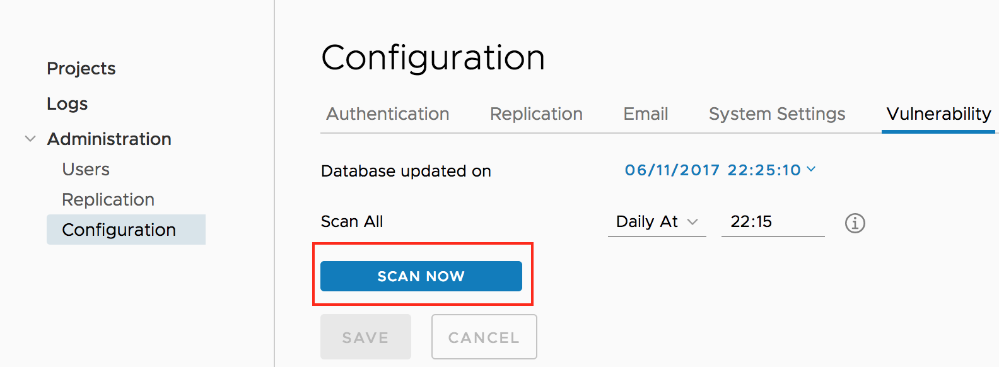

To avoid frequently triggering the resource intensive scanning process, the availability of the button is restricted. It can be only triggered once in a predefined period. The next available time will be displayed besides the button.
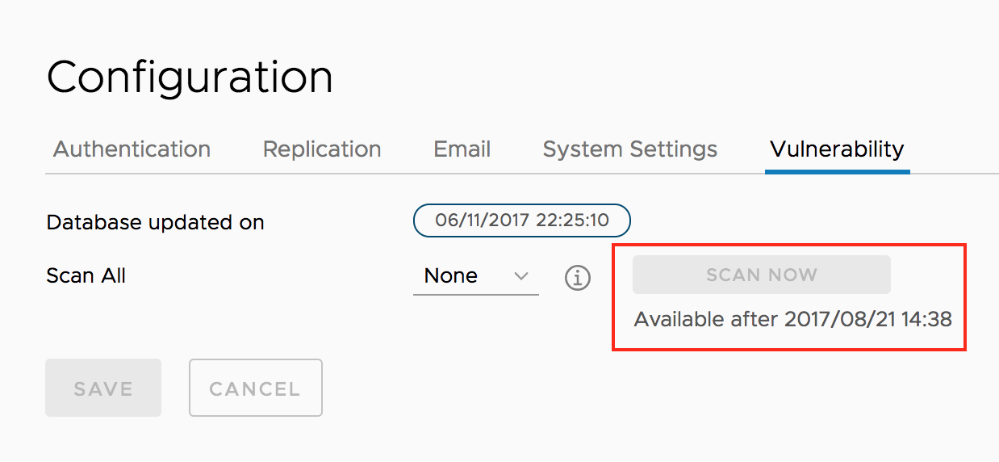

**Scheduled Scan by Policy** 

You can set policies to control the vulnerability analysis process. Currently, two options are available:
* **None:** No policy is selected.
* **Daily:** Policy is activated daily. It means an analysis job is scheduled to be executed at the specified time everyday. The scheduled job will scan all the images in Harbor.
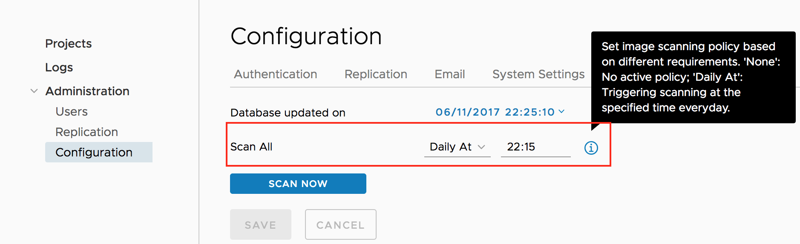

**NOTES: Once the scheduled job is executed, the completion time of scanning all images will be updated accordingly. Please be aware that the completion time of the images may be different because the execution of analysis for each image may be carried out at different time.**

### Pull image from Harbor in Kubernetes
Kubernetes users can easily deploy pods with images stored in Harbor.  The settings are similar to that of another private registry.  There are two major issues:

1. When your Harbor instance is hosting http and the certificate is self signed.  You need to modify daemon.json on each work node of your cluster, for details please refer to: https://docs.docker.com/registry/insecure/#deploy-a-plain-http-registry
2. If your pod references an image under private project, you need to create a secret with the credentials of user who has permission to pull image from this project, for details refer to: https://kubernetes.io/docs/tasks/configure-pod-container/pull-image-private-registry/

## Manage Helm Charts
[Helm](https://helm.sh) is a package manager for [Kubernetes](https://kubernetes.io). Helm uses a packaging format called [charts](https://docs.helm.sh/developing_charts). Since version 1.6.0 Harbor is now a composite cloud-native registry which supports both container image management and Helm charts management. Access to Helm charts in Harbor is controlled by [role-based access controls (RBAC)](https://en.wikipedia.org/wiki/Role-based_access_control) and is restricted by projects.

### Manage Helm Charts via portal
#### List charts
Click your project to enter the project detail page after successful logging in. The existing helm charts will be listed under the tab `Helm Charts` which is beside the image `Repositories` tab with the following information:
* Name of helm chart
* The status of the chart: Active or Deprecated
* The count of chart versions
* The created time of the chart


You can click the icon buttons on the top right to switch views between card view and list view.

#### Upload new chart
Click the `UPLOAD` button on the top left to open the chart uploading dialog. Choose the uploading chart from your filesystem. Click the `UPLOAD` button to upload it to the chart repository server.

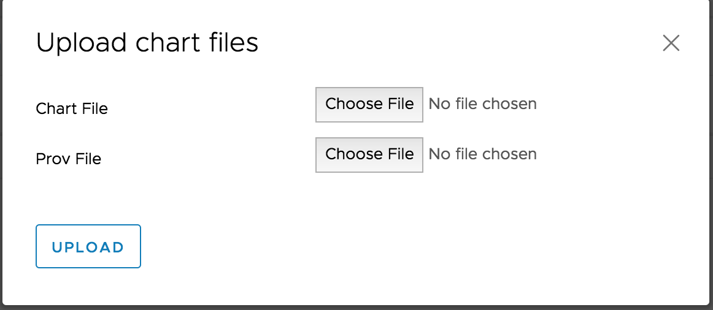

If the chart is signed, you can choose the corresponding provenance file from your filesystem and Click the `UPLOAD` button to upload them together at once.

If the chart is successfully uploaded, it will be displayed in the chart list at once.

#### List chart versions
Clicking the chart name from the chart list will show all the available versions of that chart with the following information:
* the chart version number
* the maintainers of the chart version
* the template engine used (default is gotpl)
* the created timestamp of the chart version

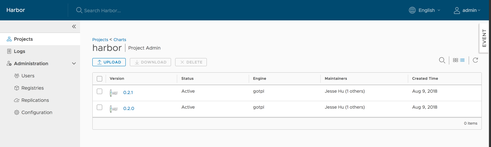

Obviously, there will be at least 1 version for each of the charts in the top chart list. Same with chart list view, you can also click the icon buttons on the top right to switch views between card view and list view.

Check the checkbox at the 1st column to select the specified chart versions:
* Click the `DELETE` button to delete all the selected chart versions from the chart repository server. Batch operation is supported.
* Click the `DOWNLOAD` button to download the chart artifact file. Batch operation is not supported.
* Click the `UPLOAD` button to upload the new chart version for the current chart

#### Adding labels to/remove labels from chart versions
Users who have system administrator, project administrator or project developer role can click the `ADD LABELS` button to add labels to or remove labels from chart versions.


#### Filtering chart versions by labels
The chart versions can be filtered by labels:


#### View chart version details
Clicking the chart version number link will open the chart version details view. You can see more details about the specified chart version here. There are three content sections:
* **Summary:**
  * readme of the chart
  * overall metadata like home, created timestamp and application version
  * related helm commands for reference, such as `helm add repo` and `helm install` etc.
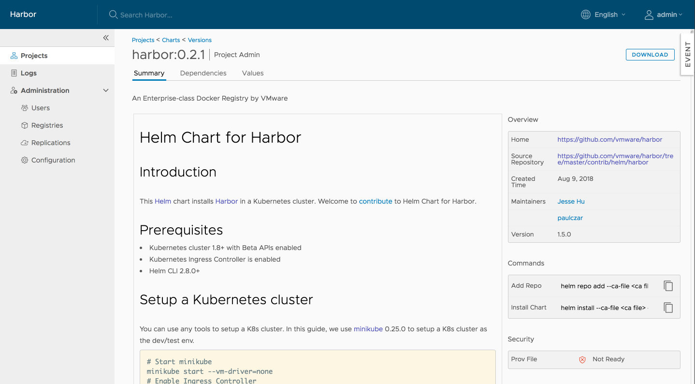
* **Dependencies:**
  * list all the dependant sun charts with 'name', 'version' and 'repository' fields

* **Values:**
  * display the content from `values.yaml` file with highlight code preview
  * clicking the icon buttons on the top right to switch the yaml file view to k-v value pair list view
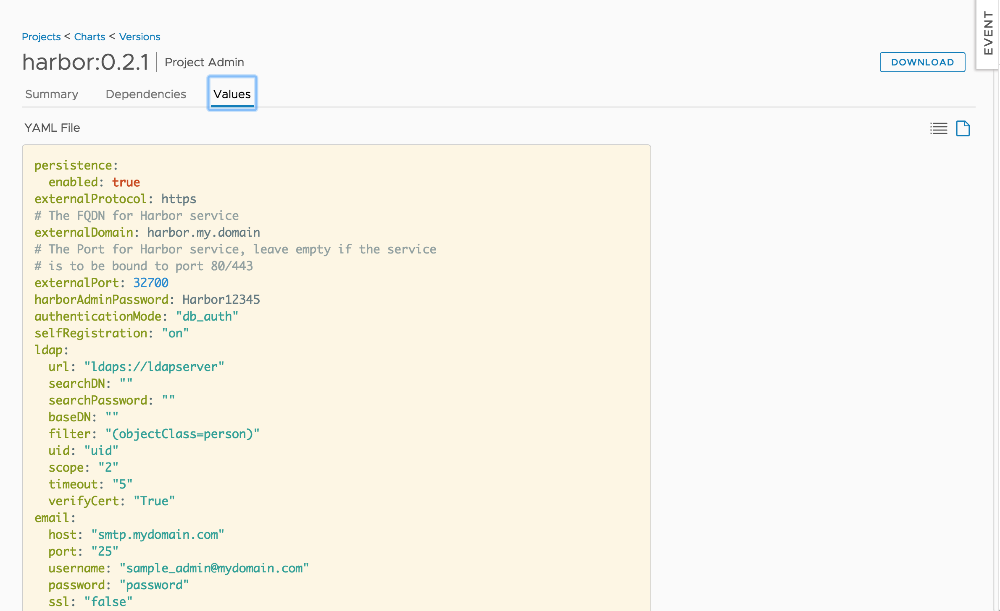

Clicking the `DOWNLOAD` button on the top right will start the downloading process.

### Working with Helm CLI
As a helm chart repository, Harbor can work smoothly with Helm CLI. About how to install Helm CLI, please refer [install helm](https://docs.helm.sh/using_helm/#installing-helm). Run command `helm version` to make sure the version of Helm CLI is v2.9.1+.
```
helm version

#Client: &version.Version{SemVer:"v2.9.1", GitCommit:"20adb27c7c5868466912eebdf6664e7390ebe710", GitTreeState:"clean"}
#Server: &version.Version{SemVer:"v2.9.1", GitCommit:"20adb27c7c5868466912eebdf6664e7390ebe710", GitTreeState:"clean"}
```
#### Add harbor to the repository list
Before working, Harbor should be added into the repository list with `helm repo add` command. Two different modes are supported.
* Add Harbor as a unified single index entry point

With this mode Helm can be made aware of all the charts located in different projects and which are accessible by the currently authenticated user.
```
helm repo add --ca-file ca.crt --username=admin --password=Passw0rd myrepo https://xx.xx.xx.xx/chartrepo
```
**NOTES:** Providing both ca file and cert files is caused by an issue from helm.

* Add Harbor project as separate index entry point

With this mode, helm can only pull charts in the specified project.
```
helm repo add --ca-file ca.crt --username=admin --password=Passw0rd myrepo https://xx.xx.xx.xx/chartrepo/myproject
```

#### Push charts to the repository server by CLI
As an alternative, you can also upload charts via the CLI. It is not supported by the native helm CLI. A plugin from the community should be installed before pushing. Run `helm plugin install` to install the `push` plugin first.
```
helm plugin install https://github.com/chartmuseum/helm-push
```
After a successful installation,  run `push` command to upload your charts:
```
helm push --ca-file=ca.crt --username=admin --password=passw0rd chart_repo/hello-helm-0.1.0.tgz myrepo
```
**NOTES:** `push` command does not support pushing a prov file of a signed chart yet.

#### Install charts
Before installing, make sure your helm is correctly initialized with command `helm init` and the chart index is synchronized with command `helm repo update`.

Search the chart with the keyword if you're not sure where it is:
```
helm search hello

#NAME                            CHART VERSION   APP VERSION     DESCRIPTION                
#local/hello-helm                0.3.10          1.3             A Helm chart for Kubernetes
#myrepo/chart_repo/hello-helm    0.1.10          1.2             A Helm chart for Kubernetes
#myrepo/library/hello-helm       0.3.10          1.3             A Helm chart for Kubernetes
```
Everything is ready, install the chart to your kubernetes:
```
helm install --ca-file=ca.crt --username=admin --password=Passw0rd --version 0.1.10 repo248/chart_repo/hello-helm
```

For other more helm commands like how to sign a chart, please refer to the [helm doc](https://docs.helm.sh/helm/#helm).

## Online Garbage Collection
Online Garbage Collection enables user to trigger docker registry garbage collection by clicking button on UI.

**NOTES:** The space is not freed when the images are deleted from Harbor, Garbage Collection is the task to free up the space by removing blobs from the filesystem when they are no longer referenced by a manifest.

For more information about Garbage Collection, please see [Garbage Collection](https://github.com/docker/docker.github.io/blob/master/registry/garbage-collection.md).  

### Setting up Garbage Collection
If you are a system admin, you can trigger garbage collection by clicking "GC Now" in the **'Garbage Collection'** tab of **'Configuration'** section under **'Administration'**.

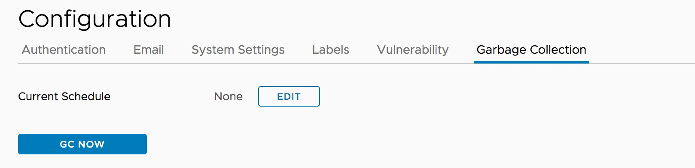
**NOTES:** Harbor is put into read-only mode when to execute Garbage Collection, and any modification on docker registry is prohibited.

To avoid frequently triggering the garbage collection process, the availability of the button is restricted. It can be only triggered once in one minute.


**Scheduled Garbage Collection by Policy**
* **None:** No policy is selected.
* **Daily:** Policy is activated daily. It means an analysis job is scheduled to be executed at the specified time everyday. The scheduled job will do garbage collection in Harbor.
* **Weekly:** Policy is activated weekly. It means an analysis job is scheduled to be executed at the specified time every week. The scheduled job will do garbage collection in Harbor.
Once the policy has been configured, you have the option to save the schedule.


### Garbage Collection history
If you are a system admin, you can view the latest 10 records of garbage collection execution.
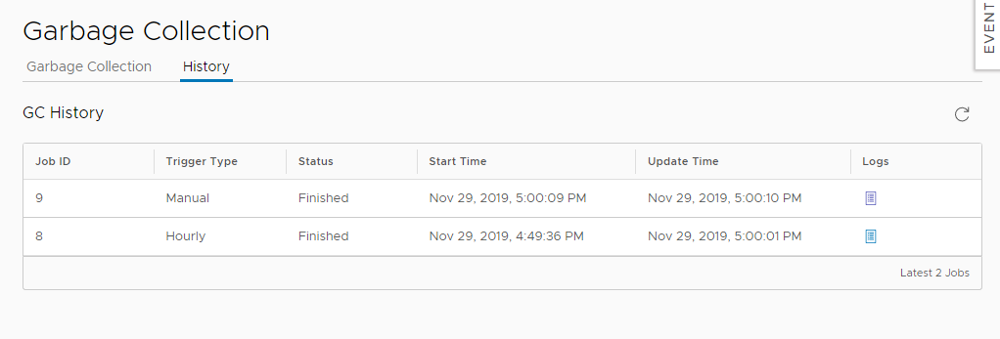

You can click on the 'details' link to view the related logs.


## Build history

Build history make it easy to see the contents of a container image, find the code which bulids an image, or locate the image for a source repository.

In Harbor portal, enter your project, select the repository, click on the link of tag name you'd like to see its build history, the detail page will be opened. Then switch to `Build History` tab, you can see the build history information.


## Using OIDC CLI secret

Having authenticated via OIDC SSO and onboarded to Harbor, you can use Docker/Helm CLI to access Harbor to read/write the artifacts.
As the CLI cannot handle redirection for SSO, we introduced `CLI secret`, which is only available when Harbor's authentication mode 
is configured to OIDC based.  
After logging into Harbor, click the drop down list to view user's profile:
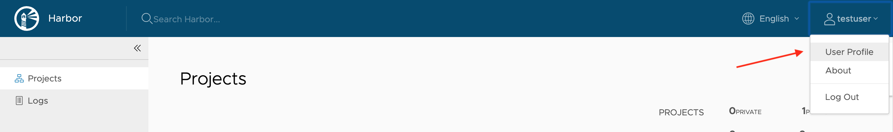

You can copy your CLI secret via the dialog of profile:
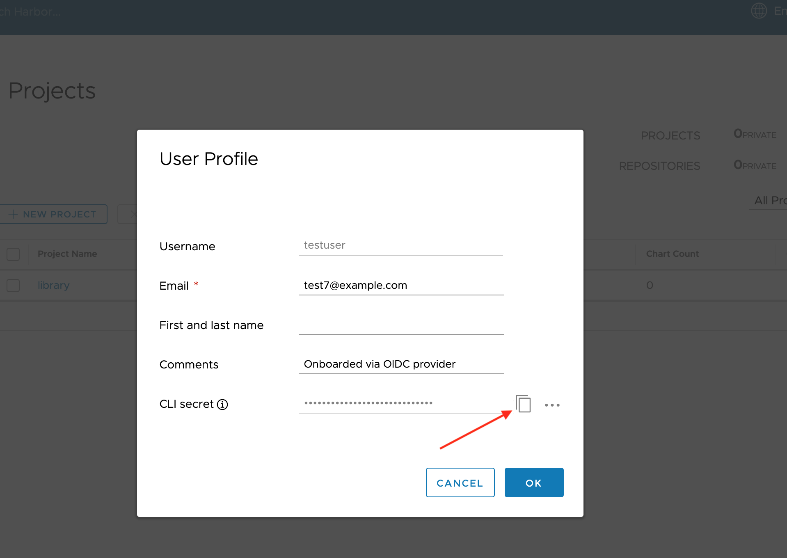

After that you can authenticate using your user name in Harbor that you set during onboard process, and CLI secret as the password
with Docker/Helm CLI, for example:
```sh
docker login -u testuser -p xxxxxx jt-test.local.goharbor.io

``` 

When you click the "..." icon in the profile dialog, a button for generating new CLI secret will appear, and you can generate a new 
CLI secret by clicking this button.  Please be reminded one user can only have one CLI secret, so when a new secret is generated, the
old one becomes invalid at once.

**NOTE**:
Under the hood the CLI secret is associated with the ID token, and Harbor will try to refresh the token, so the CLI secret will
be valid after th ID token expires. However, if the OIDC Provider does not provide refresh token or the refresh fails for some 
reason, the CLI secret will become invalid.  In that case you can logout and login Harbor via SSO flow again so Harbor can get a 
new ID token and the CLI secret will work again.


## Robot Account
Robot Accounts are accounts created by project admins that are intended for automated operations. They have the following limitations:

1. Robot Accounts cannot login Harbor portal
2. Robot Accounts can only perform `docker push`/`docker pull` operations with a token.

### Add a Robot Account
If you are a project admin, you can create a Robot Account by clicking "New Robot Account" in the `Robot Accounts` tab of a project, and enter a name, a description and permission.
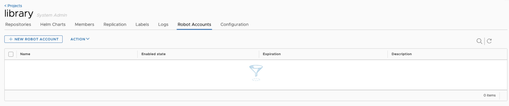

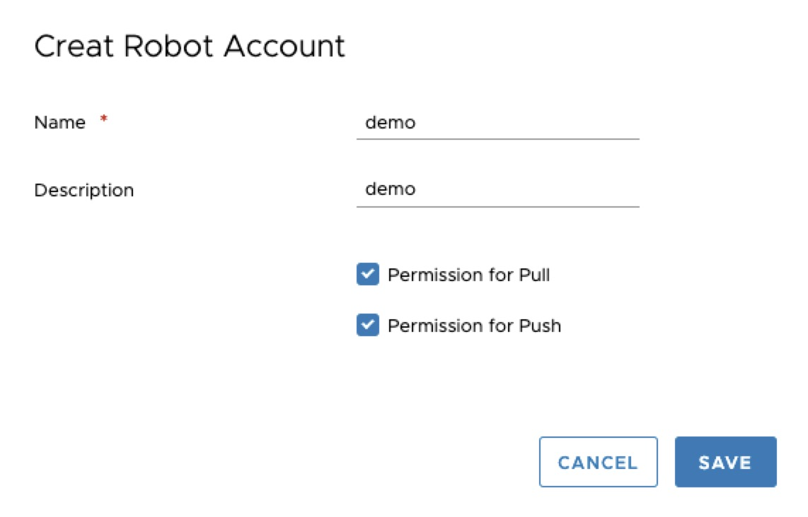

> **NOTE:** The name will become `robot$<accountname>` and will be used to distinguish a robot account from a normal harbor user.

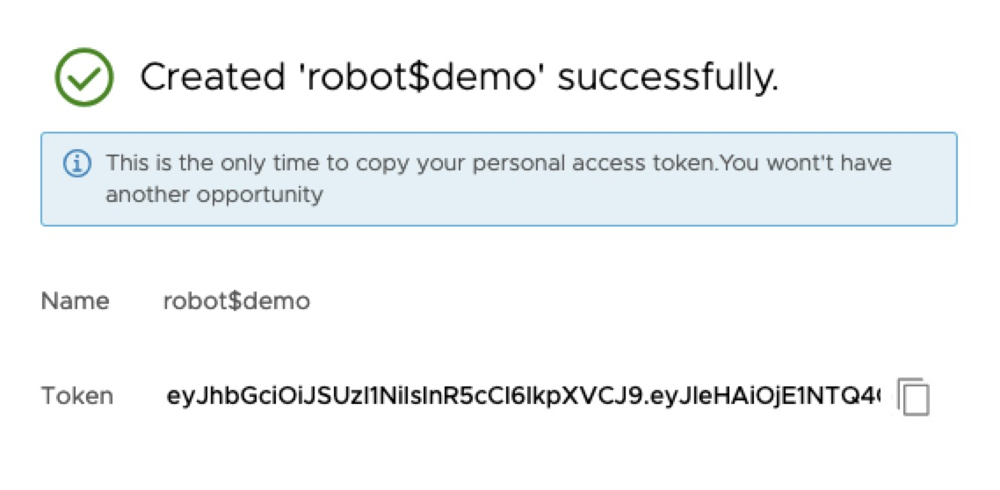
As Harbor doesn't store your account token, please make sure to copy it in the pop up dialog after creating, otherwise, there is no way to get it from Harbor.

### Configure duration of robot account
If you are a system admin, you can configure the robot account token duration in days. 
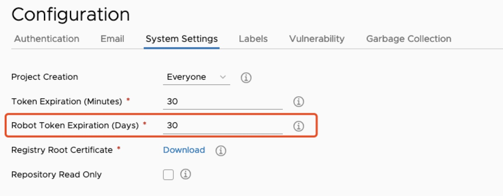

### Authenticate with a robot account
To authenticate with a Robot Account, use `docker login` as below,

```
docker login harbor.io
Username: robot$accountname
Password: Thepasswordgeneratedbyprojectadmin
```

### Disable a robot account
If you are a project admin, you can disable a Robot Account by clicking "Disable Account" in the `Robot Accounts` tab of a project.
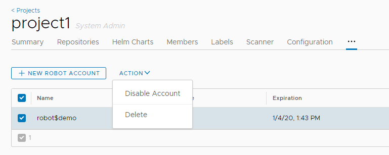

### Delete a robot account
If you are a project admin, you can delete a Robot Account by clicking "Delete" in the `Robot Accounts` tab of a project.


## Tag Retention Rules

A repository can rapidly accumulate a large number of image tags, many of which might not be required after a given time or once they have been superseded by a subsequent image build. These excess tags can obviously consume large quantities of storage capacity. As a system administrator, you can define rules that govern how many tags of a given repository to retain, or for how long to retain certain tags. 

### How Tag Retention Rules Work

You define tag retention rules on repositories, not on projects. This allows for greater granularity when defining your retention rules. As the name suggests, when you define a retention rule for a repository, you are identifying which tags to retain. You do not define rules to explicitly remove tags. Rather, when you set a rule, any tags in a repository that are not identified as being eligible for retention are discarded. 

A tag retention rule has 3 filters that are applied sequentially, as described in the following table.

|Order|Filter|Description|
|---|---|---|
|First|Repository or repositories|Identify the repository or repositories on which to apply the rule. You can identify repositories that either have a certain name or name fragment, or that do not have that name or name fragment. Wild cards (for example `*repo`, `repo*`, and `**`) are permitted. The repository filter is applied first to mark the repositories to which to apply the retention rule. The identified repositories are earmarked for further matching based on the tag criteria. No action is taken on the nonspecified repositories at this stage.|
|Second|Quantity to retain|Set which tags to retain either by specifying a maximum number of tags, or by specifying a maximum period for which to retain tags.|
|Third|Tags to retain|Identify the tag or tags on which to apply the rule. You can identify tags that either have a certain name or name fragment, or that do not have that name or name fragment. Wild cards (for example `*tag`, `tag*`, and `**`) are permitted.|

For information about how the `**` wildcard is applied, see https://github.com/bmatcuk/doublestar#patterns.

#### Example 1

- You have 5 repositories in a project, repositories A to E.
  - Repository A has 100 image tags, all of which have been pulled in the last week.
  - Repositories B to E each have 6 images, none of which have been pulled in the last month.
- You set the repository filter to `**`, meaning that all repositories in the project are included.
- You set the retention policy to retain the 10 most recently pulled images in each repository.
- You set the tag filter to `**`, meaning that all tags in the repository are included.

In this example the rule retains the 10 most recently pulled images in repository A, and all of the images in repositories B to E, retaining a total of 34 image tags in the project. In other words, the rule does not treat all of the images in repositories A to E as a single pool from which to choose the 10 most recent images. So, even if the 11th to 100th tags in repository A have been pulled more recently than any of the tags in repositories B to E, all of the tags in repositories B to E are retained, because each of those repositories has fewer than 10 tags.

#### Example 2

This example uses the same project and repositories as example 1, but sets the retention policy to retain the images in each repository that have been pulled in the last 7 days.

In this case, all of the images in repository A are retained because they have been pulled in the last 7 days. None of the images in repositories B to E are retained, because none of them has been pulled in the last week. In this example, 100 images are retained, as opposed to 34 images in example 1.

### Combining Rules on a Respository

You can define up to 15 rules per project. You can apply multiple rules to a repository or set of repositories. When you apply multiple rules to a repository, they are applied with `OR` logic rather than with `AND` logic. In this way, there is no prioritization of application of the rules on a given repository. Rules run concurrently in the background, and the resulting sets from each rule are combined at the end of the run.

#### Example 3

This example uses the same project and repositories as examples 1 and 2, but sets two rules:

- Rule 1: Retain all of the images in each repository that have been pulled in the last 7 days.
- Rule 2: Retain a maximum number of 10 images in each repository.

In this case, repository A only retains the 10 most recent images, even though images 11 to 100 have been pulled in the last week. Repositories B to E retain no images, because none of those images have been pulled in the last week. In this example, 10 images are retained, as opposed to 34 images in example 1 and 100 in example 2.


#### Example 4

This example uses a different repository to the previous examples.

- You have a repository that has 12 tags:

  |Production|Release Candidate|Release|
  |---|---|---|
  |`2.1-your_repo-prod`|`2.1-your_repo-rc`|`2.1-your_repo-release`|
  |`2.2-your_repo-prod`|`2.2-your_repo-rc`|`2.2-your_repo-release`|
  |`3.1-your_repo-prod`|`3.1-your_repo-rc`|`3.1-your_repo-release`|
  |`4.4-your_repo-prod`|`4.4-your_repo-rc`|`4.4-your_repo-release`| 

- You define three tag retention rules on this repository:
  - Retain the 10 most recently pushed image tags that start with `2`.
  - Retain the 10 most recently pushed image tags that end with `-prod`.
  - Exclude the image tag `2.1-your_repo-prod` from the list of tags to retain.

In this example, the rules are applied to the following 7 tags:

- `2.1-your_repo-rc`
- `2.1-your_repo-release`
- `2.2-your_repo-prod`
- `2.2-your_repo-rc`
- `2.2-your_repo-release`
- `3.1-your_repo-prod`
- `4.4-your_repo-prod`

### How Tag Retention Rules Interact with Project Quotas

The system administrator can set a maximum on the number of artifacts that a project can contain and the amount of storage that it can consume. For information about project quotas, see [Configure Project Quotas](LINK). 

Project quota settings take precedence over tag retention rules. If you set a tag retention rule to keep the 5 most recent images in a repository, but the 5th image takes the total amount of storage consumed by the project above the project quota for storage, the 5th image will be deleted.  

### Configure Tag Retention Rules

1. Select a project and go to the **Tag Retention** tab.
  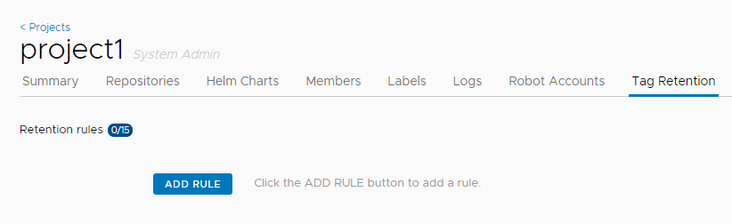
1. Click **Add Rule** to add a rule.
1. In the **For the repositories** drop-down menu, select **matching** or **excluding**.
  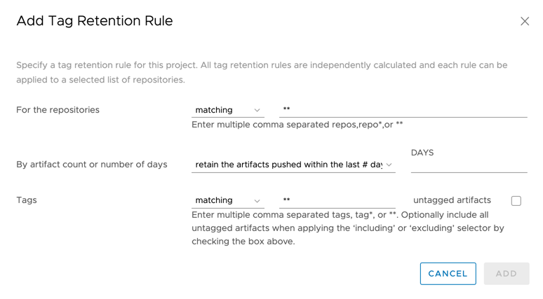
1. Identify the repositories on which to apply the rule.
  
  You can define the repositories on which to apply the rule by entering the following information:
  
  - A repository name, for example `my_repo_1`.
  - A comma-separated list of repository names, for example `my_repo_1,my_repo_2,your_repo_3`.
  - A partial repository name with wildcards, for example `my_*`, `*_3`, or `*_repo_*`.
  - `**` to apply the rule to all of the repositories in the project. 
  
  If you selected **matching**, the rule is applied to the repositories you identified. If you selected **excluding**, the rule is applied to all of the repositories in the project except for the ones that you identified.
1. Define how many tags to retain or how the period to retain tags.
  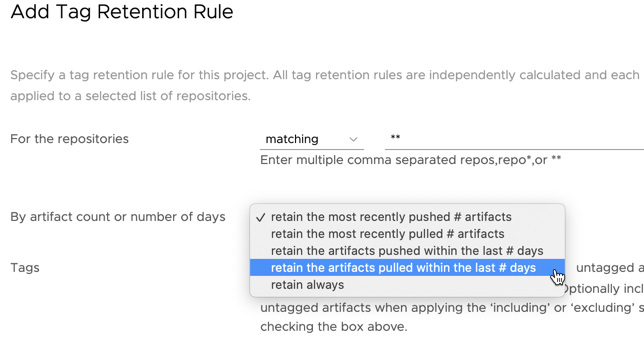
  
  |Option|Description|
  |---|---|
  |**retain the most recently pushed # images**|Enter the maximum number of images to retain, keeping the ones that have been pushed most recently. There is no maximum age for an image.|
  |**retain the most recently pulled # images**|Enter the maximum number of images to retain, keeping only the ones that have been pulled recently. There is no maximum age for an image.|
  |**retain the images pushed within the last # days**|Enter the number of days to retain images, keeping only the ones that have been pushed during this period. There is no maximum number of images.|
  |**retain the images pulled within the last # days**|Enter the number of days to retain images, keeping only the ones that have been pulled during this period. There is no maximum number of images.|
  |**retain always**|Always retain the images identified by this rule.| 

1. In the **Tags** drop-down menu, select **matching** or **excluding**.
1. Identify the tags on which to apply the rule.
  
  You can define the tags on which to apply the rule by entering the following information:
  
  - A tag name, for example `my_tag_1`.
  - A comma-separated list of tag names, for example `my_tag_1,my_tag_2,your_tag_3`.
  - A partial tag name with wildcards, for example `my_*`, `*_3`, or `*_tag_*`.
  - `**` to apply the rule to all of the tags in the project. 
  
  If you selected **matching**, the rule is applied to the tags you identified. If you selected **excluding**, the rule is applied to all of the tags in the repository except for the ones that you identified.
1. Click **Add** to save the rule.
1. (Optional) Click **Add Rule** to add more rules, up to a maximum of 15 per project.
1. (Optional) Under Schedule, click **Edit** and select how often to run the rule.
  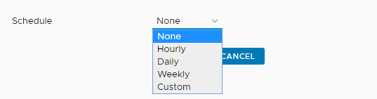
  If you select **Custom**, enter a cron job command to schedule the rule. 
  
  **NOTE**: If you define multiple rules, the schedule is applied to all of the rules. You cannot schedule different rules to run at different times. 
1. (Optional) Click **Dry Run** to test the rule or rules that you have defined.
1. (Optional) Click **Run Now** to run the rule immediately.

To modify an existing rule, click the three vertical dots next to a rule to disable, edit, or delete that rule.

## Webhook Notifications

If you are a project administrator, you can configure a connection from a project in Harbor to a webhook endpoint. If you configure webhooks, Harbor notifies the webhook endpoint of certain events that occur in the project. Webhooks allow you to integrate Harbor with other tools to streamline continuous integration and development processes. 

The action that is taken upon receiving a notification from a Harbor project depends on your continuous integration and development processes. For example, by configuring Harbor to send a `POST` request to a webhook listener at an endpoint of your choice, you can trigger a build and deployment of an application whenever there is a change to an image in the repository.

### Supported Events

You can define one webhook endpoint per project. Webhook notifications provide information about events in JSON format and are delivered by `HTTP` or `HTTPS POST` to an existing webhhook endpoint URL that you provide. The following table describes the events that trigger notifications and the contents of each notification.

|Event|Webhook Event Type|Contents of Notification|
|---|---|---|
|Push image to registry|`IMAGE PUSH`|Repository namespace name, repository name, resource URL, tags, manifest digest, image name, push time timestamp, username of user who pushed image|
|Pull manifest from registry|`IMAGE PULL`|Repository namespace name, repository name, manifest digest, image name, pull time timestamp, username of user who pulled image|
|Delete manifest from registry|`IMAGE DELETE`|Repository namespace name, repository name, manifest digest, image name, image size, delete time timestamp, username of user who deleted image|
|Upload Helm chart to registry|`CHART PUSH`|Repository name, chart name, chart type, chart version, chart size, tag, timestamp of push, username of user who uploaded chart|
|Download Helm chart from registry|`CHART PULL`|Repository name, chart name, chart type, chart version, chart size, tag, timestamp of push, username of user who pulled chart|
|Delete Helm chart from registry|`CHART DELETE`|Repository name, chart name, chart type, chart version, chart size, tag, timestamp of delete, username of user who deleted chart|
|Image scan completed|`IMAGE SCAN COMPLETED`|Repository namespace name, repository name, tag scanned, image name, number of critical issues, number of major issues, number of minor issues, last scan status, scan completion time timestamp, vulnerability information (CVE ID, description, link to CVE, criticality, URL for any fix), username of user who performed scan|
|Image scan failed|`IMAGE SCAN FAILED`|Repository namespace name, repository name, tag scanned, image name, error that occurred, username of user who performed scan|

#### JSON Payload Format

The webhook notification is delivered in JSON format. The following example shows the JSON notification for a push image event:

```
{
 "event_type": "pushImage"
    "events": [
               {
                "project": "prj",
                "repo_name": "repo1",
                "tag": "latest",
                "full_name": "prj/repo1",
                "trigger_time": 158322233213,
                "image_id": "9e2c9d5f44efbb6ee83aecd17a120c513047d289d142ec5738c9f02f9b24ad07",
                "project_type": "Private"
               }
             ]
}
```

### Webhook Endpoint Recommendations

The endpoint that receives the webhook should ideally meet the following requirements:

- Have a webhook listener that is capable of interpreting the payload and acting upon the information it contains. For example, running a shell script.
- Support queues and retry configurations, so that failed webhook notifications are queued and retried until the request succeeds or number of retries exceeds the configured maximum.

### Example Use Cases

You can configure your continuous integration and development infrastructure so that it performs the following types of operations when it receives a webhook notification from Harbor.

- Image push: 
  - Trigger a new build immediately following a push on selected repositories s or tags.
  - Notify services or applications that use the image that a new image is available and pull it.
  - Scan the image using Clair.
  - Replicate the image to remote registries.
- Image scanning:
  - If a vulnerability is found, rescan the image or replicate it to another registry.
  - If the scan passes, deploy the image.

### Configure Webhooks

1. Select a project and go to the Webhooks tab.
  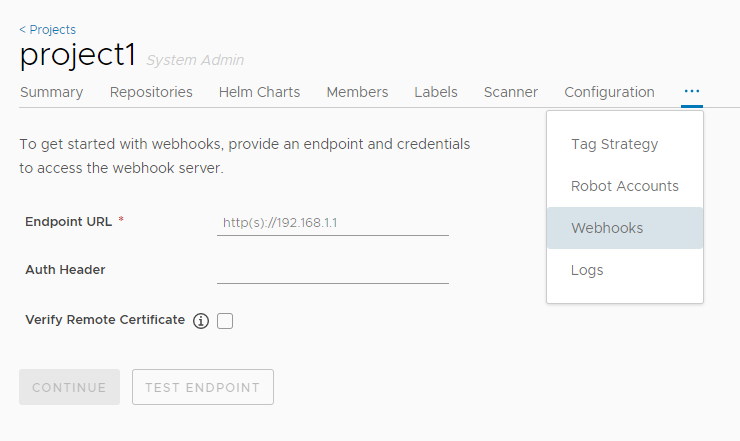  
1. Enter the URL for your webhook endpoint listener.
  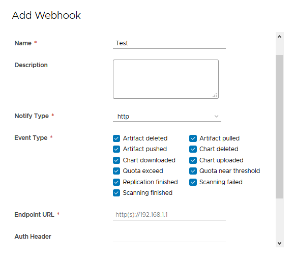
1. If your webhook listener implements authentication, enter the authentication header. 
1. To implement `HTTPS POST` instead of `HTTP POST`, select the **Verifiy Remote Certficate** check box.
1. Click **Test Endpoint** to make sure that Harbor can connect to the listener.
1. Click **Continue** to create the webhook.

When you have created the webhook, you see the status of the different notifications and the timestamp of the last time each notification was triggered. You can click **Disable** to disable notifications.

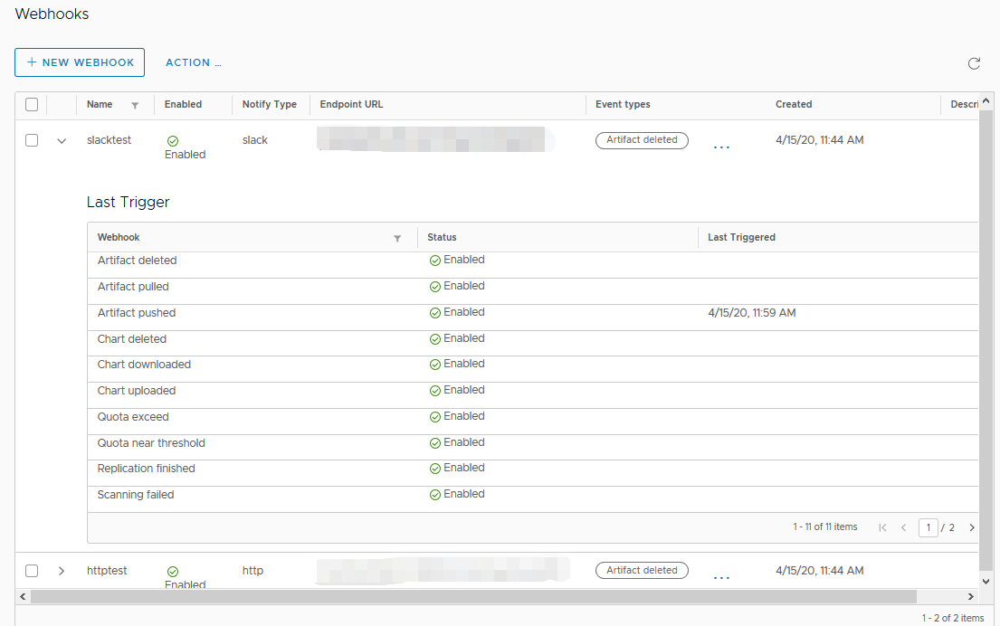

**NOTE**: You can only disable and reenable all notifications. You cannot disable and enable selected notifications.

If a webhook notification fails to send, or if it receives an HTTP error response with a code other than `2xx`, the notification is re-sent based on the configuration that you set in `harbor.yml`. 

### Globally Enable and Disable Webhooks

As a system administrator, you can enable and disable webhook notifications for all projects.

1. Go to **Configuration** > **System Settings**.
1. Scroll down and check or uncheck the **Webhooks enabled** check box.

  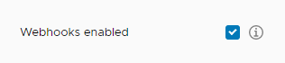

## API Explorer

Harbor integrated swagger UI from 1.8. That means all apis can be invoked through UI. Normally, user have 2 ways to navigate to API Explorer. 

1. User can login harbor, and click the "API EXPLORER" button.All apis will be invoked with current user authorization.                         
  


2. User can navigate to swagger page by ip address by router "devcenter". For example: https://10.192.111.118/devcenter. After go to the page, need to click "authorize" button to give basic authentication to all apis. All apis will be invoked with the authorized user authorization. 


