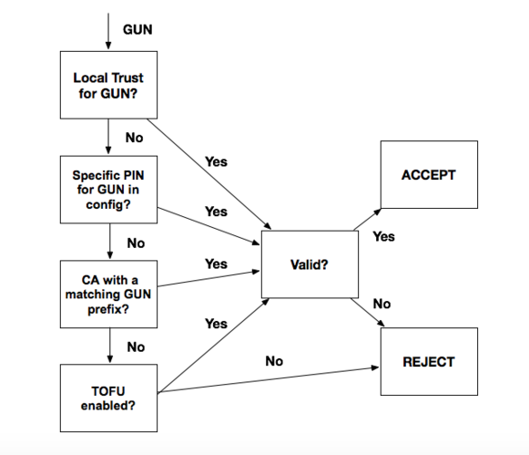

<!--[metadata]>
+++
title = "Client Configuration"
description = "Configuring the Notary client, server and signer."
keywords = ["docker, notary, notary-client, notary-server, notary server, notary-signer, notary signer"]
[menu.main]
parent="mn_notary_config"
weight=4
+++
<![end-metadata]-->

# Notary client configuration file

This document is for power users of the [Notary client](../advanced_usage.md)
who want to facilitate CLI interaction or specify custom options.

The configuration file for Notary client normally resides at `~/.notary/config.json`,
but the path to a different configuration file can be specified using the
`-c` or `--configFile` command line flag.

## Overview of the file

In addition to the configuration file format, please see the optional password
[environment variables](#environment-variables-optional) that the Notary client
can take for ease of use.

Here is a full client configuration file example; please click on the top level
JSON keys to learn more about the configuration section corresponding to that key:


<pre><code class="language-json">{
  <a href="#trust_dir-section-optional">"trust_dir"</a> : "~/.docker/trust",
  <a href="#remote_server-section-optional">"remote_server"</a>: {
    "url": "https://my-notary-server.my-private-registry.com",
    "root_ca": "./fixtures/root-ca.crt",
    "tls_client_cert": "./fixtures/secure.example.com.crt",
    "tls_client_key": "./fixtures/secure.example.com.crt"
  },
  <a href="#trust_pinning-section-optional">"trust_pinning"</a>: {
    "certs": {
      "docker.com/notary": ["49cf5c6404a35fa41d5a5aa2ce539dfee0d7a2176d0da488914a38603b1f4292"]
    }
  }
}
</code></pre>

## trust_dir section (optional)

The `trust_dir` specifies the location (as an absolute path or a path
relative to the directory of the configuration file) where the TUF metadata
and private keys will be stored.

This is normally defaults to `~/.notary`, but specifying `~/.docker/trust`
facilitates interoperability with content trust.

Note that this option can be overridden with the command line flag `--trustDir`.

## remote_server section (optional)

The `remote_server` specifies how to connect to a Notary server to download
metadata updates and publish metadata changes.

Remote server example:

```json
"remote_server": {
  "url": "https://my-notary-server.my-private-registry.com",
  "root_ca": "./fixtures/root-ca.crt",
  "tls_client_cert": "./fixtures/secure.example.com.crt",
  "tls_client_key": "./fixtures/secure.example.com.crt"
}
```

<table>
	<tr>
		<th>Parameter</th>
		<th>Required</th>
		<th>Description</th>
	</tr>
	<tr>
		<td valign="top"><code>url</code></td>
		<td valign="top">no</td>
		<td valign="top">URL of the Notary server: defaults to https://notary.docker.io
			This configuration option can be overridden with the command line flag
			`-s` or `--server`.</td>
	</tr>
	<tr>
		<td valign="top"><code>root_ca</code></td>
		<td valign="top">no</td>
		<td valign="top"><p>The path to the file containing the root CA with which to verify
			the TLS certificate of the Notary server, for example if it is self-signed.
			The path is relative to the directory of the configuration file.</p>
			<p>This configuration option can overridden with the command line flag
			`--tlscacert`, which would specify a path relative to the current working
			directory where the Notary client is invoked.</p></td>
	</tr>
	<tr>
		<td valign="top"><code>tls_client_cert</code></td>
		<td valign="top">no</td>
		<td valign="top"><p>The path to the client certificate to use for mutual TLS with
			the Notary server.  Must be provided along with <code>tls_client_key</code>
			or not provided at all.  The path is relative to the directory of the
			configuration file.</p>
			<p>This configuration option can overridden with the command line flag
			`--tlscert`, which would specify a path relative to the current working
			directory where the Notary client is invoked.</p></td>
	</tr>
	<tr>
		<td valign="top"><code>tls_client_key</code></td>
		<td valign="top">no</td>
		<td valign="top"><p>The path to the client key to use for mutual TLS with
			the Notary server. Must be provided along with <code>tls_client_cert</code>
			or not provided at all.  The path is relative to the directory of the
			configuration file.</p>
			<p>This configuration option can overridden with the command line flag
			`--tlskey`, which would specify a path relative to the current working
			directory where the Notary client is invoked.</p></td>
	</tr>
</table>

## trust_pinning section (optional)

The `trust_pinning` specifies how to bootstrap trust for the root of a
Notary client's trusted collection.

This section is optional, Notary will use TOFU over HTTPS by default and
trust certificates in the downloaded root file.

In this section, one can provide specific certificates to pin to, or a CA
to pin to as a root of trust for a GUN.  Multiple sections can be specified,
but the pinned certificates will take highest priority for validation, followed
by the pinned CA, followed by TOFUS (TOFU over HTTPS).  The diagram below
describes this validation flow:

<center>

</center>

Only one trust pinning option will be used to validate a GUN even if multiple
sections are specified, and any validation failure will result in a failed
bootstrapping of the repo.

<table>
	<tr>
		<th>Parameter</th>
		<th>Required</th>
		<th>Description</th>
	</tr>
	<tr>
		<td valign="top"><code>certs</code></td>
		<td valign="top">no</td>
		<td valign="top"><p>Mapping of GUN to certificate IDs to pin to.
		    Both are strings in the JSON object.</p></td>
	</tr>
	<tr>
		<td valign="top"><code>ca</code></td>
		<td valign="top">no</td>
		<td valign="top"><p>Mapping of GUN prefixes to filepaths containing
		    the root CA file with which to verify the certificates in the root file.
		    This file can contain multiple root certificates, bundled in separate
		    PEM blocks.
			The path is relative to the directory of the configuration file.</p></td>
	</tr>
	<tr>
		<td valign="top"><code>disable_tofu</code></td>
		<td valign="top">no</td>
		<td valign="top"><p>Boolean value determining whether to use trust
		    on first use when bootstrapping validation on a collection's
		    root file.  This keeps TOFUs on by default.</p></td>
	</tr>
</table>

## Environment variables (optional)

The following environment variables containing signing key passphrases can
be used to facilitate [Notary client CLI interaction](../advanced_usage.md).
If provided, these passwords will be used initially to sign TUF metadata.
If the passphrase is incorrect, you will be prompted to enter the correct
passphrase.


| Environment Variable          | Description                               |
| ----------------------------- | ----------------------------------------- |
|`NOTARY_ROOT_PASSPHRASE`       | The root/offline key passphrase           |
|`NOTARY_TARGETS_PASSPHRASE`    | The targets (an online) key passphrase    |
|`NOTARY_SNAPSHOT_PASSPHRASE`   | The snapshot (an online) key passphrase   |
|`NOTARY_DELEGATION_PASSPHRASE` | The delegation (an online) key passphrase |


Please note that if provided, the passphrase in `NOTARY_DELEGATION_PASSPHRASE`
will be attempted for all delegation roles that notary attempts to sign with.
